# Solution & System Design Document — Enterprise AI Governance Layer

**Team idk????** · Pushp Raj Panth · Aryan Jain

> **Program:** American Express CodeStreet 2026
> **Product:** Enterprise AI Governance Layer — _A Governance Platform for Autonomous Financial Agents_

---

# PART A — ARCHITECTURE FOUNDATIONS

## Chapter 1 — Executive Technical Overview

### 1.1 Purpose

This chapter orients a senior engineer to the entire system before any detail. It states the technical problem in engineering terms, presents the architecture in a single diagram, and names the defining decisions that the rest of the document elaborates. It is not a product summary — that is the PRD's job.

### 1.2 Technical problem framing

The platform must intercept every sensitive action an Agent attempts and return a governed Decision _before_ the action takes effect, satisfying two forces that pull in opposite directions: it sits on the **critical path of money movement** (so it must be fast and highly available, per NFR-1.1, NFR-2.1) yet must be **fail-safe** (so it must refuse to let a high-risk action through when it cannot decide confidently, per P8, NFR-7.1). Every Decision must additionally be **reproducible and explainable** long after the fact (P5, P6). The architecture is fundamentally shaped by holding these three forces — speed, safety, and provability — simultaneously true.

### 1.3 The architecture in one diagram

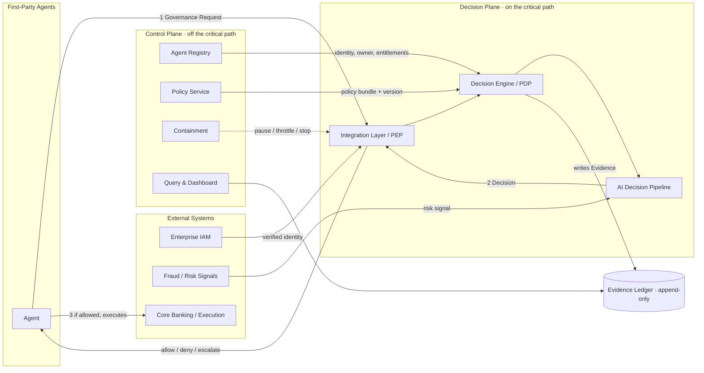

**Why this diagram exists.** It illustrates the single most important structural decision: the split between a **Decision Plane** on the critical path (kept minimal, fast, and fail-safe) and a **Control Plane** off it (registry, policy authoring, containment, query). Containment reaches the Decision Plane _out-of-band_ (dashed) so an Agent can be stopped even if the Control Plane is degraded — the architectural expression of P9.

### 1.4 Defining technical decisions

These decisions frame the whole document; each is justified where it is elaborated (chapter noted) and, where pivotal, recorded as an ADR (Ch 17).

| #   | Decision                                                                                                         | Rationale (short)                                                                        | Elaborated  |
| --- | ---------------------------------------------------------------------------------------------------------------- | ---------------------------------------------------------------------------------------- | ----------- |
| D1  | **PEP/PDP separation** — enforcement (Integration Layer) is distinct from decision-making (Decision Engine)      | Lets enforcement be embedded near the Agent while decisions stay centrally governed (P1) | Ch 5        |
| D2  | **Hybrid enforcement** — inline blocking for high-risk Governance Requests, asynchronous governance for low-risk | Balances the speed/safety forces without one uniform cost (P4, P8)                       | Ch 5, ADR   |
| D3  | **Governance Request as the unit of work** — each sensitive action is one request, decided in isolation          | Realizes "govern the decision, not the Agent" (P2)                                       | Ch 5, Ch 9  |
| D4  | **AI Decision Pipeline** — Policy → Risk → Confidence → Explainability → Approval → Composition                  | Makes the AI-governed decision a first-class, inspectable pipeline (P4, P6, P8)          | Ch 9        |
| D5  | **Append-only Evidence Ledger** — decisions are events, never mutated                                            | Reproducibility and tamper-evidence by construction (P5)                                 | Ch 11       |
| D6  | **Fail-closed default on the high-risk path** — uncertainty resolves to deny/escalate                            | Safety is the tie-breaker on consequential actions (P8)                                  | Ch 9, Ch 14 |
| D7  | **Runtime authority evaluation** — no cached _allow_; entitlements and policy resolved per request               | An Agent's authority is decided at the moment of action (P3)                             | Ch 9, Ch 10 |
| D8  | **Platform decides, never mutates** — the Decision Engine returns a verdict on the action as proposed            | Preserves neutrality as a control point (P10)                                            | Ch 9, Ch 12 |

### 1.5 Technical scope boundary

The platform **governs** actions; it does not **perform** them. It consumes verified identity from Enterprise IAM, consumes signals from Fraud/Risk systems, and returns a Decision to the Agent — which, if allowed, executes against Core Banking. The platform never moves money, never computes the business value of an action, and never hosts the Agent. This boundary (PRD §5) is load-bearing for the security and data models and is honored in every later chapter.

---

## Chapter 2 — Design Goals, Quality Attributes & Architecture Principles

### 2.1 Purpose

This chapter is the yardstick the rest of the SDD is measured against. It converts the PRD's non-functional requirements into concrete, engineering-actionable **quality-attribute scenarios** with architectural tactics, states the **decision-path latency budget**, and defines the **architecture principles** that constrain every subsequent choice.

### 2.2 Quality attributes — scenarios, targets, and tactics

Each attribute is expressed as a stimulus→response scenario so it is testable, not aspirational. Targets trace to PRD NFRs (bracketed values are the PRD's proposed defaults, to be ratified).

| Quality attribute | Scenario (stimulus → response)                                             | Target (NFR)                     | Primary architectural tactic                                                                      |
| ----------------- | -------------------------------------------------------------------------- | -------------------------------- | ------------------------------------------------------------------------------------------------- |
| **Availability**  | Decision Plane under normal ops → serves Decisions continuously            | [99.95%] monthly (NFR-1.1)       | Stateless decision path, N+ redundancy, no hard Control-Plane dependency on the critical path     |
| **Performance**   | Low/medium-risk Governance Request → Decision returned                     | Added ≤ [50 ms] P95 (NFR-2.1)    | In-process policy bundle, cached entitlements, no synchronous external call on the automated path |
| **Scalability**   | Fleet grows 10× → targets hold                                             | Dozens→thousands (NFR-2.2)       | Horizontal, shared-nothing decision nodes; partitioned Evidence write path                        |
| **Fail-safety**   | Dependency/risk signal unavailable on high-risk request → deny or escalate | No fail-open (NFR-7.1)           | Fail-closed default; timeouts resolve to safe outcome (D6)                                        |
| **Auditability**  | Any past Decision queried → reconstructed exactly                          | 100% reproducible (NFR-5.2)      | Append-only Evidence Ledger; captured inputs + Policy version (D5)                                |
| **Security**      | Unauthenticated caller → rejected                                          | Verified identity only (NFR-3.1) | Zero-trust; identity bound per request from IAM                                                   |
| **Operability**   | Misbehaving Agent detected → contained                                     | Seconds (NFR-8.1)                | Out-of-band Containment reaching the PEP (P9)                                                     |

**Why a scenario table.** An architecture is only as good as its worst quality-attribute response under stress; expressing each as a concrete scenario makes the tactics testable at review time rather than assertions.

### 2.3 Decision-path latency budget

The automated (non-escalated) path must add ≤ [50 ms] P95. The budget allocates that ceiling across the in-path steps; anything requiring a synchronous external call or human judgment is, by design, kept _off_ this path.

| Step (automated path)             | Budget (P95) | Note                                                                          |
| --------------------------------- | ------------ | ----------------------------------------------------------------------------- |
| PEP overhead + identity binding   | ~8 ms        | Identity pre-verified/cached from IAM                                         |
| Entitlement resolution            | ~6 ms        | Cached per-Agent entitlement set (runtime-checked, D7)                        |
| Policy Evaluation                 | ~12 ms       | In-process Policy bundle, versioned                                           |
| Risk Evaluation (signal-cached)   | ~10 ms       | External Fraud signal consumed async/cached; absence → fail-safe, not a stall |
| Confidence + Decision Composition | ~8 ms        | In-memory                                                                     |
| Evidence write (async-committed)  | ~6 ms        | Durable enqueue on the path; full persistence off-path (NFR-1.2 preserved)    |
| **Total added latency**           | **~50 ms**   | High-risk/escalated paths intentionally exceed this and are excluded          |

**Trade-off.** Keeping the external Fraud signal off the synchronous path (consumed as a cached/asynchronous input) is what makes the budget achievable; the cost is that a _stale-signal_ window exists, which the fail-safe rule (D6) and Risk-Evaluation design (Ch 9) explicitly account for.

### 2.4 Architecture principles

These are _engineering_ principles — distinct from the PRD's product principles (P1–P10), which they operationalize. Each names the product principle it enforces.

| ID        | Architecture principle                                                                    | Operationalizes | Consequence                                                  |
| --------- | ----------------------------------------------------------------------------------------- | --------------- | ------------------------------------------------------------ |
| **AP-1**  | Enforcement is externalized into the PEP; Agents carry no governance logic                | P1              | An un-integrated Agent cannot obtain a Decision              |
| **AP-2**  | Each Governance Request is decided statelessly and in isolation                           | P2              | Horizontal scale; no cross-request coupling                  |
| **AP-3**  | Authority (policy + entitlement) is resolved at request time; no cached _allow_           | P3              | Revocation and policy change take effect on the next request |
| **AP-4**  | Processing path is selected by risk tier                                                  | P4              | High-risk pays for preventive control; low-risk stays cheap  |
| **AP-5**  | Reproducibility by construction: capture inputs + Policy version; Evidence is append-only | P5              | Any Decision replays to the same outcome                     |
| **AP-6**  | Explainability is a mandatory output of every Decision, not an add-on                     | P6              | No Decision can be emitted without a reason                  |
| **AP-7**  | Every Governance Request is identity-bound and owner-attributed                           | P7              | No ownerless Decision can exist                              |
| **AP-8**  | The high-risk path is fail-closed; no hard dependency may fail it open                    | P8              | Degradation reduces throughput, never safety                 |
| **AP-9**  | Containment is out-of-band, independent of the Agent and the Control Plane's health       | P9              | An Agent is stoppable even mid-incident                      |
| **AP-10** | The platform emits a verdict on the action as proposed; it never mutates it               | P10             | Neutrality preserved; the platform is not itself an Agent    |

**Why principles precede design.** Stated up front, AP-1–AP-10 let every later chapter be checked against a fixed rule set — and let a reviewer reject a component that violates one, exactly as the PRD's principles govern the product.

### 2.5 Constraints

| Constraint                                             | Source       | Architectural impact                                       |
| ------------------------------------------------------ | ------------ | ---------------------------------------------------------- |
| Enterprise IAM is the identity authority               | PRD D-1, §5  | Platform consumes identity; never issues it (shapes Ch 13) |
| Fraud/risk signals are external and may be unavailable | PRD D-2, A-4 | Risk Evaluation must degrade fail-safe, not block (Ch 9)   |
| Execution belongs to Core Banking                      | PRD D-3, §5  | Platform returns a verdict; never executes (Ch 1.5)        |
| First-party Agents only (v1)                           | PRD §5       | Trust boundary assumes internal Agents (Ch 13)             |

---

## Chapter 3 — Requirements-to-Architecture Traceability

### 3.1 Purpose

This chapter is the bridge from the frozen PRD to this architecture. It demonstrates that every architectural element exists to satisfy a stated requirement — nothing is arbitrary — and that no requirement is left without a home. It is a _mapping_, not a restatement; the full cross-reference is Appendix A.

### 3.2 Capability → subsystem

Each PRD capability (CAP) is realized by a named subsystem introduced in Part B/C.

| Capability (PRD §9)                     | Realizing subsystem                                   | Chapter |
| --------------------------------------- | ----------------------------------------------------- | ------- |
| CAP-1 Action Decisioning                | Decision Engine + AI Decision Pipeline                | 5, 9    |
| CAP-2 Enterprise Policy Management      | Policy Service                                        | 6, 10   |
| CAP-3 Contextual Risk Evaluation        | Risk Evaluation (pipeline stage)                      | 9       |
| CAP-4 Human Oversight & Approval        | Approval subsystem                                    | 9, 10   |
| CAP-5 Decision Explainability           | Explainability generation (pipeline stage)            | 9       |
| CAP-6 Immutable Audit & Reproducibility | Evidence Ledger                                       | 11      |
| CAP-7 Accountable Ownership             | Agent Registry (ownership)                            | 10      |
| CAP-8 Agent Onboarding & Registry       | Agent Registry                                        | 10      |
| CAP-9 Authorization & Entitlement       | Registry (definition) + Decision Engine (enforcement) | 9, 10   |
| CAP-10 Operational Containment          | Containment subsystem                                 | 8, 10   |
| CAP-11 Fleet Visibility & Monitoring    | Query & Dashboard                                     | 10, 15  |
| CAP-12 Governance Integration           | Integration Layer (PEP)                               | 7       |

### 3.3 Functional requirement → component (summary)

Representative mapping; the complete FR→component matrix is Appendix A.

| FR group (PRD §10)                                                                        | Primary component          | Chapter |
| ----------------------------------------------------------------------------------------- | -------------------------- | ------- |
| FR-1.x Decisioning (allow/deny/escalate, current policy, fail-safe, no mutation)          | Decision Engine            | 5, 9    |
| FR-2.x Policy (single source, versioning, propagation, version binding)                   | Policy Service + Evidence  | 10, 11  |
| FR-3.x Risk (classification, proportionate treatment, external signals)                   | Risk Evaluation            | 9       |
| FR-4.x Approval (routing, gating, approver recorded)                                      | Approval subsystem         | 9, 10   |
| FR-5.x Explainability (reason per outcome)                                                | Explainability stage       | 9       |
| FR-6.x / 7.x Evidence & ownership (tamper-evident, reproducible, owner-bound)             | Evidence Ledger + Registry | 10, 11  |
| FR-8.x / 9.x Registry & entitlement (register, inventory, least-privilege, runtime check) | Registry + Decision Engine | 9, 10   |
| FR-10.x Containment (pause/throttle/stop, independent, selective)                         | Containment                | 8, 10   |
| FR-11.x Visibility (aggregate view, posture, anomalies)                                   | Query & Dashboard          | 10, 15  |
| FR-12.x Integration (one front door, no embedded governance)                              | Integration Layer (PEP)    | 7       |

### 3.4 Non-functional requirement → architectural mechanism

| NFR group (PRD §13)              | Architectural mechanism                                        | Chapter |
| -------------------------------- | -------------------------------------------------------------- | ------- |
| Availability / Reliability (1.x) | Stateless decision nodes, redundancy, durable evidence enqueue | 14      |
| Performance / Scalability (2.x)  | Latency budget, in-process policy, horizontal scale            | 2, 14   |
| Security (3.x)                   | Zero-trust, IAM-bound identity, separation of duties           | 13      |
| Privacy (4.x)                    | Data minimization, protection in transit/at rest               | 11, 13  |
| Auditability (5.x)               | Append-only Evidence Ledger, version binding                   | 11      |
| Explainability (6.x)             | Mandatory explanation output (AP-6)                            | 9       |
| Resilience (7.x)                 | Fail-closed high-risk path, RTO/RPO design                     | 14      |
| Operability (8.x)                | Out-of-band containment, observability                         | 15      |
| Maintainability (9.x)            | Config-driven policy/risk, extension seams                     | 10, 18  |
| Interoperability (10.x)          | One integration contract, degrade-safe external calls          | 7, 12   |

---

---

# PART B — HIGH-LEVEL DESIGN (HLD)

_Part B presents the system through multiple architectural views (per the frozen ToC). It stays at the level of structure, responsibility, and interaction — internal algorithms, data internals, API payloads, and component internals are intentionally reserved for Part C._

## Chapter 4 — System Context & Boundaries

**View:** Context View · introduces the Security Trust-Boundary View.

### 4.1 Purpose

This chapter fixes what the platform is responsible for at its outer edge — the actors and external systems it interacts with, and the trust boundaries between them — before any internal decomposition. Getting the boundary right is a precondition for the security model (Ch 13) and the integration model (Ch 7).

### 4.2 The architectural problem this view solves

An AI governance layer is only trustworthy if its edge is unambiguous: what it consumes, what it emits, what it must never do. Ambiguity at the boundary is where scope creep and security gaps enter. This view therefore draws a hard black-box line and names every crossing.

### 4.3 System context

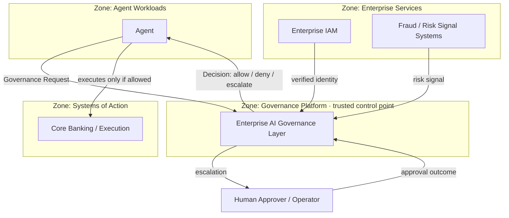

> **Diagram — System Context (C4 Level 1).**
> **Purpose.** Establish the platform as one black box among four trust zones and enumerate every boundary crossing.
> **Decisions illustrated.** D1 (the platform is a distinct control point, not part of the Agent), D8 (it emits a Decision, never an executed action), AP-1 (enforcement is external to the Agent), AP-10 (verdict only).
> **Key insight.** The Agent — not the platform — calls Core Banking, and only after an _allow_. The platform is never in the money-movement path itself; it is in the _decision_ path. This is what lets it be fail-safe without being able to cause a settlement error.
> **Trade-off.** Because execution stays with the Agent, the platform cannot _guarantee_ an allowed action executes exactly as proposed; it guarantees only that an un-allowed action should not proceed. That residual is accepted and revisited in the threat model (Ch 13).

### 4.4 External systems and boundary responsibilities

| External system           | Direction     | The platform relies on it for                         | The platform never does               |
| ------------------------- | ------------- | ----------------------------------------------------- | ------------------------------------- |
| Agent                     | in/out        | Submitting a Governance Request; receiving a Decision | Host or run the Agent                 |
| Enterprise IAM            | in            | Verified identity for Agents and humans               | Issue or authenticate identity itself |
| Fraud / Risk signals      | in            | Risk signals as inputs to Risk Evaluation             | Compute fraud scores                  |
| Core Banking / Execution  | (none direct) | — (the Agent executes)                                | Move money or post entries            |
| Human Approver / Operator | in/out        | Resolving escalations; operating containment          | Make the business decision            |

### 4.5 Trust boundaries

The context diagram is partitioned into four **trust zones**. The platform treats every zone outside itself as untrusted at the boundary (zero-trust, developed in Ch 13): Agent Workloads are authenticated but never assumed benign (an Agent may be compromised or malfunctioning); Enterprise Services are integrated but may be unavailable; Systems of Action are downstream of the Decision and outside the platform's control.

### 4.6 Alternatives considered

| Alternative                                              | Why rejected                                                                  |
| -------------------------------------------------------- | ----------------------------------------------------------------------------- |
| Governance embedded in each Agent (no external boundary) | Recreates fragmentation; violates AP-1/P1; no consistent boundary to secure   |
| Platform also executes the action (owns settlement)      | Violates D8/AP-10/P10; makes the platform an Agent needing its own governance |

### 4.7 Architectural Decisions Realized

| Decision   | How this chapter realizes it                                                           |
| ---------- | -------------------------------------------------------------------------------------- |
| D1         | The platform is drawn as a distinct control point separate from Agents                 |
| D8 / AP-10 | The only outbound artifact to the Agent is a Decision, never an action                 |
| AP-1       | Enforcement lives at the platform boundary, not inside the Agent                       |
| AP-7       | Every inbound Governance Request crosses the boundary already identity-bound (via IAM) |

---

## Chapter 5 — High-Level Architecture

**View:** Logical View.

### 5.1 Purpose

This chapter presents the logical architecture — the arrangement every component slots into — and the central pattern that gives the system its speed/safety balance: the **two-plane model** and **hybrid enforcement**.

### 5.2 The architectural problem this view solves

The system must be simultaneously fast on the critical path and safe under failure (Ch 2). A single monolithic decision service cannot optimize both: everything it depends on becomes a critical-path dependency that can slow or fail it. The design therefore separates concerns into a plane that must be fast and fail-safe, and a plane that must be rich but can tolerate latency.

### 5.3 Logical architecture

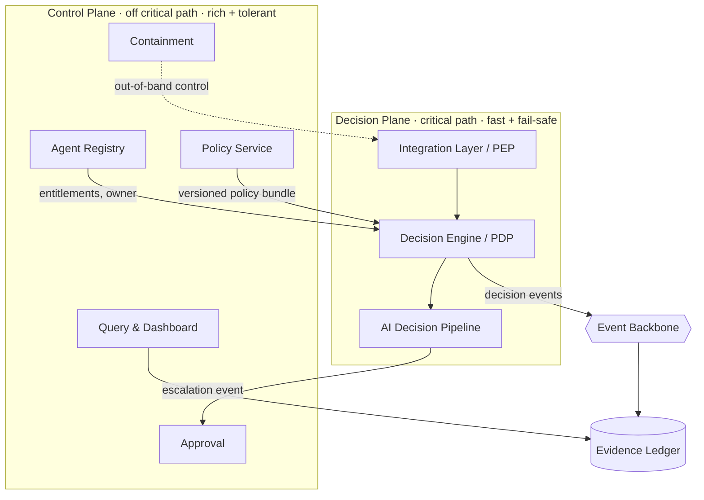

> **Diagram — Logical Architecture (two-plane model).**
> **Purpose.** Show the separation of the fast, fail-safe Decision Plane from the rich, latency-tolerant Control Plane, joined by an event backbone.
> **Decisions illustrated.** D1 (PEP/PDP), D2 (hybrid enforcement lives in the Decision Plane), D5 (decision events flow to the Evidence Ledger), AP-2 (stateless decisioning), AP-8 (fail-closed path), AP-9 (out-of-band containment, dashed).
> **Key insight.** The Control Plane feeds the Decision Plane _asynchronously_ (policy bundles, entitlements are pushed/cached), so no Control-Plane component is a synchronous critical-path dependency. This is what makes NFR-1.1 availability attainable — the decision path can keep deciding even if policy authoring or the dashboard is down.
> **Trade-off.** Pushing policy/entitlements to the Decision Plane introduces a propagation delay (bounded, and required to be effective on the next decision per FR-2.3); the design accepts eventual-consistency of _distribution_ while keeping _evaluation_ strictly at request time (AP-3).

### 5.4 Hybrid enforcement

Enforcement mode is selected per Governance Request by a fast intake classification (action type → provisional risk tier), then confirmed by full Risk Evaluation inside the pipeline.

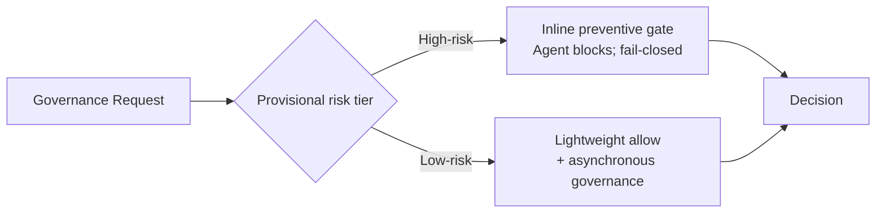

> **Diagram — Hybrid enforcement path selection.**
> **Purpose.** Show how risk tier routes a request to inline (blocking) vs. asynchronous (non-blocking) governance.
> **Decisions illustrated.** D2, D6, AP-4 (risk-tiered path), AP-8 (inline path is fail-closed).
> **Key insight.** Only high-risk requests pay the full inline latency and fail-closed cost; low-risk requests get a lightweight allow with governance completed asynchronously, keeping their latency minimal. This is the architectural realization of the PRD's "preventive for high-risk, proportionate for low-risk" stance.
> **Trade-off.** A low-risk action may execute before its asynchronous governance fully completes — accepted because such actions are, by classification, low-consequence and reversible; every high-risk action is always gated first. Misclassification risk is mitigated by conservative tiering (a request defaults to the higher tier when the provisional tier is uncertain — AP-8).

### 5.5 How this satisfies the Chapter 2 quality attributes

| Quality attribute      | Satisfied by                                                 |
| ---------------------- | ------------------------------------------------------------ |
| Availability (NFR-1.1) | No synchronous Control-Plane dependency on the decision path |
| Performance (NFR-2.1)  | Low-risk async path; in-plane policy/entitlements            |
| Fail-safety (NFR-7.1)  | Inline fail-closed high-risk path (AP-8)                     |
| Auditability (NFR-5.2) | Every decision emitted as an event to the Evidence Ledger    |
| Operability (NFR-8.1)  | Out-of-band Containment into the PEP (AP-9)                  |

### 5.6 Alternatives considered

| Alternative                                         | Why rejected                                                                                   |
| --------------------------------------------------- | ---------------------------------------------------------------------------------------------- |
| Pure inline enforcement for all requests            | Uniform latency/fail-closed cost throttles low-risk volume; violates proportionality (P4)      |
| Pure asynchronous (observe-and-veto)                | Cannot _prevent_ a high-risk action before it executes; fails the core preventive promise (P8) |
| Single monolithic decision service (no plane split) | Every dependency becomes critical-path; availability and fail-safety cannot both be met        |

### 5.7 Architectural Decisions Realized

| Decision  | How realized                                                       |
| --------- | ------------------------------------------------------------------ |
| D1        | PEP and PDP are separate elements of the Decision Plane            |
| D2        | Hybrid enforcement is the plane's path-selection rule              |
| D3        | The Governance Request is the atomic unit routed through the plane |
| D6 / AP-8 | The inline path is fail-closed                                     |
| AP-2      | Decision nodes are stateless and horizontally scalable             |
| AP-9      | Containment is modeled out-of-band                                 |

---

## Chapter 6 — Component Architecture

**View:** Functional View · Logical View.

### 6.1 Purpose

This chapter decomposes the two planes into named components, fixes each component's responsibilities and boundaries, and shows how they collaborate. It maps components to PRD features F-1–F-9 so the functional coverage is visible.

### 6.2 Component decomposition

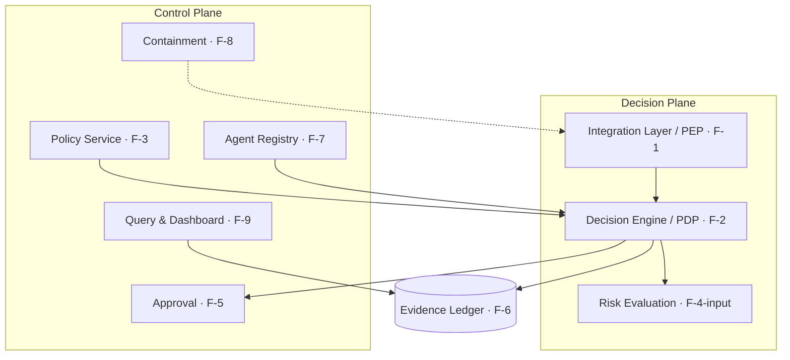

> **Diagram — Component Architecture (C4 Level 2).**
> **Purpose.** Show the nine components, their plane placement, and their PRD-feature mapping.
> **Decisions illustrated.** D1, D3, D4 (the Decision Engine hosts the AI pipeline components), D5 (Evidence Ledger as the decision sink).
> **Key insight.** Only three components sit on the Decision Plane (PEP, Decision Engine, Risk Evaluation input); everything else is Control Plane. Minimizing the Decision Plane's component count is deliberate — fewer components on the critical path means fewer things that can slow or fail a Decision.
> **Trade-off.** Placing Risk Evaluation partly on the Decision Plane adds a component to the critical path; justified because risk tier drives enforcement (D2) and must be resolved in-path, with external signals kept async (Ch 2 latency budget).

### 6.3 Component responsibilities and boundaries

| Component               | Feature     | Core responsibility                                                 | Explicit non-responsibility                      |
| ----------------------- | ----------- | ------------------------------------------------------------------- | ------------------------------------------------ |
| Integration Layer (PEP) | F-1         | Receive Governance Requests, enforce the Decision at the Agent edge | Does not decide; does not run the Agent          |
| Decision Engine (PDP)   | F-2         | Orchestrate the AI Decision Pipeline; emit the Decision             | Does not author policy; does not execute actions |
| Policy Service          | F-3         | Author, version, and distribute Policy bundles                      | Does not evaluate a specific request             |
| Risk Evaluation         | F-4 (input) | Classify a request's risk; ingest external signals                  | Does not produce fraud scores                    |
| Approval                | F-5         | Route escalations to accountable humans; capture outcomes           | Does not decide low-risk requests                |
| Evidence Ledger         | F-6         | Persist decision events immutably; serve reconstruction             | Does not mutate or re-decide                     |
| Agent Registry          | F-7         | Register Agents; hold owner and entitlements                        | Does not evaluate policy                         |
| Containment             | F-8         | Pause/throttle/stop Agents out-of-band                              | Does not decide individual requests              |
| Query & Dashboard       | F-9         | Aggregate visibility over Evidence                                  | Does not participate in decisioning              |

### 6.4 Subsystem qualities (critical components)

| Component       | Failure behavior                                                 | Scalability                        | Security posture                                 |
| --------------- | ---------------------------------------------------------------- | ---------------------------------- | ------------------------------------------------ |
| PEP             | On uncertainty for high-risk → fail-closed (AP-8)                | Scales with Agent fleet; stateless | Identity-binds every request (AP-7)              |
| Decision Engine | Degrades to deny/escalate on dependency loss                     | Stateless, horizontal (AP-2)       | No standing authority; runtime evaluation (AP-3) |
| Evidence Ledger | Append-only; durable enqueue guarantees no silent loss (NFR-1.2) | Partitioned write path             | Tamper-evident (Ch 13)                           |
| Containment     | Independent of Agent and Control-Plane health (AP-9)             | Fleet-wide, selective              | Privileged, separated duty (Ch 13)               |

### 6.5 Architectural Decisions Realized

| Decision    | How realized                                                                    |
| ----------- | ------------------------------------------------------------------------------- |
| D3          | Each component operates on a single Governance Request at a time                |
| D4          | The Decision Engine is the host for the AI Decision Pipeline (detailed in Ch 9) |
| D5          | The Evidence Ledger is the single decision sink                                 |
| AP-2 / AP-8 | Decision-Plane components are stateless and fail-closed                         |

---

## Chapter 7 — Integration Architecture

**View:** Functional View (integration surface) · contributes to Deployment View.

### 7.1 Purpose

This chapter specifies _how_ Agents connect to governance and how the platform integrates with external systems — at the architectural level. Because adoption is a top PRD risk (R-1) and the "one front door" is F-1, the integration pattern is a first-class architectural concern, not a detail.

### 7.2 The architectural problem this view solves

Governance must be adoptable across heterogeneous Agents without each team rebuilding it (AP-1, NFR-10.1), and it must degrade fail-safe when an external dependency is unavailable (AP-8, NFR-10.2). The integration design must therefore offer a uniform contract while accommodating different Agent runtimes.

### 7.3 Agent integration patterns

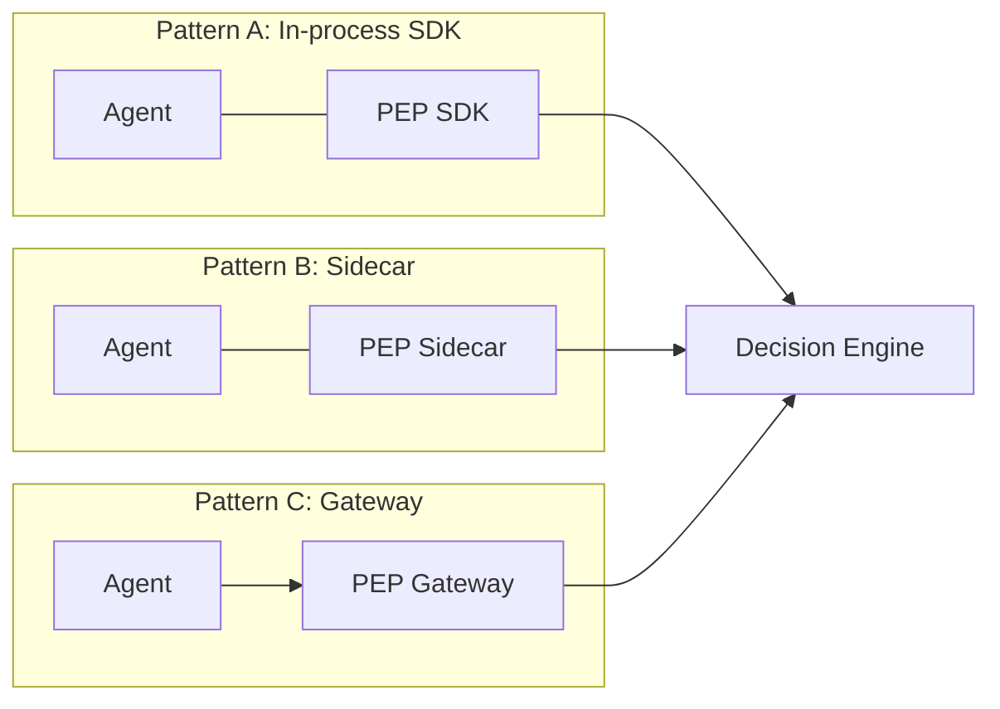

> **Diagram — Agent integration patterns.**
> **Purpose.** Present the three PEP deployment patterns an Agent may use to reach a Decision through one contract.
> **Decisions illustrated.** D1 (PEP is separable from the PDP), AP-1 (enforcement external to Agent logic).
> **Key insight.** All three patterns speak the _same_ governance contract to the Decision Engine; the pattern is an Agent-side deployment choice, not a different governance model. This is what keeps governance uniform (NFR-10.1) while meeting Agents where they run.
> **Trade-off.** Latency and isolation trade against each other across patterns (below); the platform supports all three rather than forcing one, at the cost of maintaining three enforcement front-ends.

| Pattern        | Latency | Isolation from Agent          | Best for                                          |
| -------------- | ------- | ----------------------------- | ------------------------------------------------- |
| In-process SDK | Lowest  | Lowest (shares Agent process) | Latency-sensitive, trusted first-party Agents     |
| Sidecar        | Low     | Medium (separate process)     | Most first-party Agents; balanced                 |
| Gateway        | Higher  | Highest (network boundary)    | Agents that cannot embed code; strongest boundary |

### 7.4 External system integration and failure handling

External integrations are modeled as boundary interactions with explicit degrade-safe behavior. Internals (protocols, payloads) are Part C.

| External system      | Interaction                                 | If unavailable                                                                                 |
| -------------------- | ------------------------------------------- | ---------------------------------------------------------------------------------------------- |
| Enterprise IAM       | Identity verification at the PEP            | Requests cannot be identity-bound → reject (fail-closed; AP-7)                                 |
| Fraud / Risk signals | Signal input to Risk Evaluation             | Signal treated as absent → high-risk fails safe (AP-8); low-risk proceeds on internal criteria |
| Core Banking         | None inbound; the Agent executes post-allow | Out of platform scope (Ch 4)                                                                   |

> **Design note.** The asymmetry is deliberate: loss of _identity_ fails everything closed (an unidentifiable request cannot be governed), while loss of a _risk signal_ fails only high-risk closed and lets low-risk proceed on internal criteria. This matches the proportionality principle (AP-4) rather than treating all dependency loss identically.

### 7.5 Architectural Decisions Realized

| Decision | How realized                                                |
| -------- | ----------------------------------------------------------- |
| D1       | The PEP is deployable independently of the Decision Engine  |
| AP-1     | Every pattern keeps governance outside Agent business logic |
| AP-7     | Identity binding is a precondition at the integration edge  |
| AP-8     | Dependency loss resolves to fail-safe per risk tier         |

---

## Chapter 8 — Runtime Behavior: Workflows, Sequences & State Machines

**View:** Process / Runtime View.

### 8.1 Purpose

This chapter shows how the components collaborate _over time_ for the critical flows, and the lifecycle states the key entities move through. It is where the static structure of Chapters 5–7 becomes observable behavior — including, explicitly, the fail-safe path.

### 8.2 Flow: high-risk decision with escalation

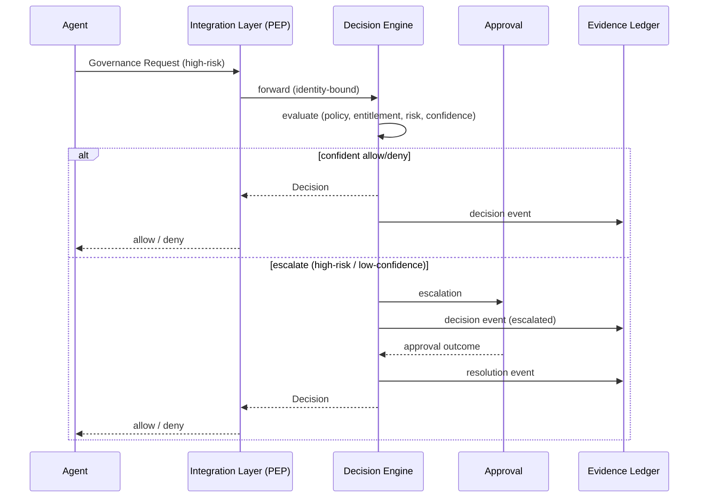

> **Diagram — High-risk decision + escalation.**
> **Purpose.** Show the inline (blocking) path and the escalation branch to an accountable human.
> **Decisions illustrated.** D2 (inline), D4 (pipeline evaluation), D6 (low-confidence → escalate), D5 (every branch writes Evidence).
> **Key insight.** The Agent blocks until the Decision resolves — including across a human Approval — which is exactly what "preventive governance" requires for high-risk actions. Evidence is written on _every_ branch, not just the terminal one, preserving reproducibility of escalations.
> **Trade-off.** Blocking through human Approval can add significant latency for high-risk requests; accepted by design (these requests are outside the automated latency budget, Ch 2) because prevention outranks speed here.

### 8.3 Flow: low-risk asynchronous governance

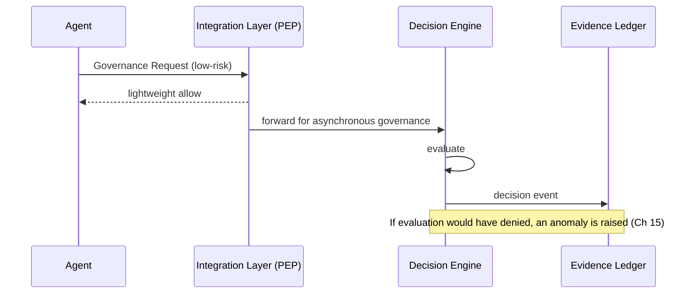

> **Diagram — Low-risk asynchronous governance.**
> **Purpose.** Show the non-blocking path where governance completes after the Agent proceeds.
> **Decisions illustrated.** D2, AP-4 (proportionate treatment).
> **Key insight.** Governance still happens and is still recorded; only the _blocking_ is removed. This keeps low-risk latency minimal while preserving the complete Evidence record (NFR-5.2).
> **Trade-off.** A retrospective deny cannot un-execute a low-risk action; it surfaces as an anomaly for operations rather than a prevention — an accepted consequence of proportionality confined to low-consequence actions.

### 8.4 Flow: emergency containment

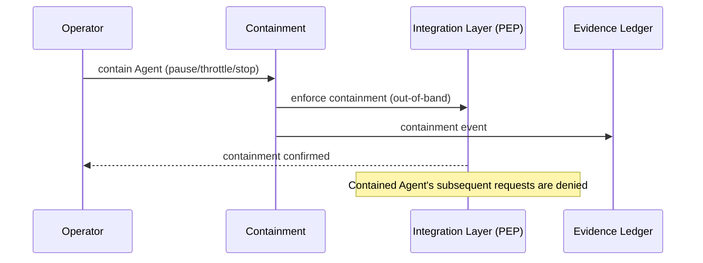

> **Diagram — Emergency containment.**
> **Purpose.** Show operator-initiated containment reaching the PEP independently of the Agent and the decision flow.
> **Decisions illustrated.** AP-9 (out-of-band), D5 (containment is Evidence).
> **Key insight.** Containment acts at the PEP — the enforcement edge — so it takes effect regardless of the Agent's cooperation or the Control Plane's health, satisfying the "seconds" operability target (NFR-8.1).
> **Trade-off.** Making containment a privileged, always-available control raises its own security stakes; addressed by separation of duties in Ch 13.

### 8.5 Lifecycle state machines

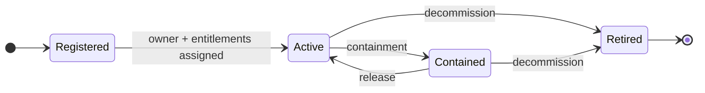

> **Diagram — Agent lifecycle state machine.**
> **Purpose.** Define the states an Agent occupies and the legal transitions.
> **Decisions illustrated.** AP-7 (an Agent cannot become Active without owner + entitlements), AP-9 (Contained is reachable from Active out-of-band).
> **Key insight.** _Registered_ is not _Active_: an Agent that lacks an owner or entitlements cannot obtain an allow — the state model enforces "no ownerless decision" structurally, not by policy alone.
> **Trade-off.** Requiring the full Registered→Active gate adds onboarding steps; accepted as the structural guarantee of accountability.

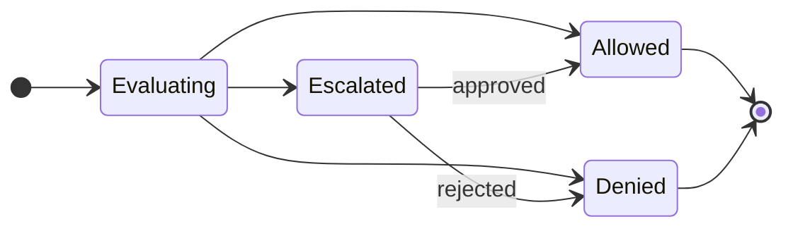

> **Diagram — Decision state machine.**
> **Purpose.** Define the terminal and intermediate states of a single Decision.
> **Decisions illustrated.** D6 (Escalated is a first-class state), D5 (each state transition is an Evidence event).
> **Key insight.** _Escalated_ is an explicit state with its own recorded transitions, not a side-effect — which is why an escalation can be reconstructed and explained as faithfully as an automated allow/deny.
> **Trade-off.** Modeling escalation as a durable state (vs. an ephemeral wait) costs additional Evidence writes; required for reproducibility (P5).

### 8.6 Additional flows

Onboarding, policy propagation, and audit-retrieval sequences follow the same conventions and are catalogued in Appendix B to keep this chapter focused on the decision-critical flows.

### 8.7 Architectural Decisions Realized

| Decision | How realized                                     |
| -------- | ------------------------------------------------ |
| D2       | Distinct inline and asynchronous runtime flows   |
| D5       | Every flow writes Evidence on every branch       |
| D6       | Escalation modeled as an explicit decision state |
| AP-9     | Containment flow is out-of-band and independent  |

---

---

# PART C — LOW-LEVEL DESIGN (LLD)

_Part C answers "how is each subsystem engineered internally?" — not "how is it coded." Each major subsystem is presented through a consistent **Subsystem Design Record** (the fifteen engineering dimensions), an internal module-decomposition and, where useful, an internal sequence diagram showing module collaboration. No class diagrams, language, framework, or source-code organization appears; the design stays implementation-agnostic._

## Chapter 9 — AI Decision Architecture (the Decision Pipeline)

**Applies the common LLD template to the platform's defining subsystem.**

### 9.1 Purpose

The AI Decision Pipeline is the engine that turns a Governance Request into a Decision. This chapter specifies how its internal stages are decomposed, how they collaborate, how AI-backed components are bounded, and how the whole pipeline behaves under failure — realizing CAP-1, CAP-3, CAP-5 and decisions D3, D4, D6, D7, D8.

### 9.2 Subsystem Design Record — AI Decision Pipeline

| Dimension                    | Design                                                                                                                                                        |
| ---------------------------- | ------------------------------------------------------------------------------------------------------------------------------------------------------------- |
| Architectural responsibility | Evaluate one Governance Request and produce a Decision (allow / deny / escalate) with an explanation                                                          |
| Internal modules             | Intake & Classification · Policy Evaluation · Risk Evaluation · Confidence Assessment · Explainability Generation · Approval Trigger · Decision Composition   |
| Internal data flow           | A request-scoped **Decision Context** accumulates results as it passes through the stages (an in-memory accumulator, discarded after the Decision is emitted) |
| Public interfaces            | `evaluate(GovernanceRequest) → Decision` (invoked by the Decision Engine host)                                                                                |
| Internal interfaces          | A uniform `Stage.process(DecisionContext)` contract every stage implements                                                                                    |
| Dependencies                 | Policy bundle (from Policy Service, cached), entitlements (Registry, cached), risk signals (async-cached), model-backed strategies (risk, explanation)        |
| State ownership              | Stateless across requests; the Decision Context is request-scoped and owns no durable state                                                                   |
| Configuration ownership      | Risk thresholds, confidence thresholds, and tier definitions are configuration owned by the Control Plane and pushed to the pipeline                          |
| Failure behavior             | Fail-closed on the high-risk path: any stage that cannot complete confidently forces deny/escalate (AP-8, D6)                                                 |
| Retry strategy               | The whole evaluation is idempotent and safely re-runnable; individual model-strategy calls use bounded retry with a fail-safe fallback                        |
| Idempotency                  | Keyed by Governance Request id → at-most-once Evidence emission (a re-evaluated request cannot double-write a Decision)                                       |
| Concurrency model            | Shared-nothing; each request evaluated independently, enabling unbounded horizontal parallelism (AP-2)                                                        |
| Scalability                  | Horizontal across stateless Decision Engine nodes (Ch 14)                                                                                                     |
| Security                     | Operates only on an identity-bound, owner-attributed request (AP-7); holds no standing authority (AP-3)                                                       |
| Operational                  | Per-stage latency and outcome metrics feed the SLOs in Ch 15                                                                                                  |

### 9.3 Internal module decomposition

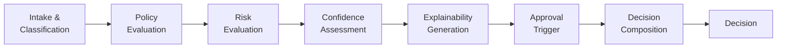

> **Diagram — Decision Pipeline internal decomposition.**
> **Purpose.** Show the ordered stages a Decision Context traverses inside the Decision Engine.
> **Decisions illustrated.** D4 (the pipeline), D6 (Confidence → Approval Trigger), AP-6 (Explainability is a mandatory stage, not optional).
> **Key insight.** Explainability is generated _before_ composition and independently of the outcome, so an explanation exists for allow, deny, and escalate alike — explainability cannot be skipped for "simple" allows.
> **Trade-off.** A fixed linear order is simpler to reason about and reproduce than a dynamic graph, at the cost of always running every stage; justified because reproducibility (P5) outweighs saving a stage on some requests.

### 9.4 Design patterns and why they fit

| Pattern                     | Where                                                                                | Why it fits / which principle it serves                                                                            |
| --------------------------- | ------------------------------------------------------------------------------------ | ------------------------------------------------------------------------------------------------------------------ |
| **Pipeline**                | Stage ordering                                                                       | Each stage transforms the Decision Context; makes the decision inspectable and reproducible (AP-5)                 |
| **Chain of Responsibility** | Fail-fast short-circuit                                                              | A hard policy deny or a fail-closed condition can terminate the chain early without later stages (AP-8)            |
| **Strategy**                | Policy Evaluation (per action type), Risk Evaluation & Explainability (model-backed) | Lets model-backed logic vary behind a stable interface without changing the pipeline (AP-4; extensibility NFR-9.x) |

### 9.5 Internal collaboration (sequence)

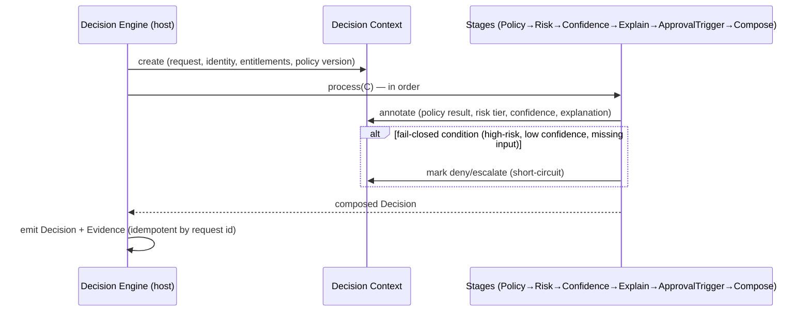

> **Diagram — Internal pipeline collaboration.**
> **Purpose.** Show how the host, the request-scoped Decision Context, and the stages collaborate — an internal, subsystem-only view.
> **Decisions illustrated.** D6, D7 (evaluation at request time), AP-8 (short-circuit to safe outcome).
> **Key insight.** Stages never call each other; they only annotate the shared Decision Context. This keeps stages independent and independently testable, and means adding a stage cannot break another.
> **Trade-off.** A shared context is a mutable object passed through the chain; the design constrains each stage to _append_ to it (never overwrite prior stages' results), preserving reproducibility.

### 9.6 Stage engineering summary

| Stage                     | Responsibility                                                             | Failure behavior                                                          |
| ------------------------- | -------------------------------------------------------------------------- | ------------------------------------------------------------------------- |
| Intake & Classification   | Bind identity/owner; assign provisional risk tier; select enforcement mode | Unclassifiable → treat as high-risk (AP-8)                                |
| Policy Evaluation         | Evaluate the request against the versioned Policy bundle                   | Bundle unavailable → fail-closed (deny/escalate)                          |
| Risk Evaluation           | Confirm risk tier; fold in cached external signals                         | Signal absent → high-risk fails safe; low-risk uses internal criteria     |
| Confidence Assessment     | Quantify decision confidence                                               | Low confidence on high-risk → escalate (D6)                               |
| Explainability Generation | Produce a human-readable reason (AP-6)                                     | Cannot explain → the outcome cannot be _allow_ on high-risk               |
| Approval Trigger          | Route to Approval when policy/risk/confidence require a human              | Approval unavailable → request remains escalated/held, never auto-allowed |
| Decision Composition      | Assemble the final Decision + explanation                                  | — (deterministic given the context)                                       |

### 9.7 Model governance (architectural view)

Model-backed components (risk classification, explanation drafting) are wrapped behind the **Strategy** interface and are strictly bounded:

- A model influences the **risk tier** and the **explanation text**; it **never** holds the allow/deny authority — that authority belongs to Policy Evaluation and Decision Composition (deterministic), preserving D8/AP-10.
- The exact **model version** used is captured in the Decision Context and written to Evidence, so a model-influenced Decision is reproducible (AP-5).
- **Confidence** gates model influence: below threshold on a high-risk request, the pipeline escalates rather than trusting the model (D6, AP-8).

_(How models are trained, tuned, or evaluated is out of scope for the SDD — this is an architectural boundary, not a modeling document.)_

### 9.8 Architectural Decisions Realized

| Decision   | How realized                                                             |
| ---------- | ------------------------------------------------------------------------ |
| D4         | The pipeline is the named subsystem, decomposed into stages              |
| D6         | Confidence Assessment + Approval Trigger implement escalation            |
| D7         | Policy and entitlement are evaluated at request time within the pipeline |
| D8 / AP-10 | Model-backed stages never hold allow/deny authority                      |
| AP-6       | Explainability is a mandatory stage                                      |
| AP-8       | Chain-of-Responsibility short-circuit enforces fail-closed               |

---

## Chapter 10 — Detailed Component Design

**Applies the common LLD template to the remaining subsystems.**

### 10.1 Purpose & approach

This chapter designs the interiors of the seven remaining components from Ch 6. Each is presented as a Subsystem Design Record; the three most structurally interesting (Policy Service, Approval, Evidence Ledger) also carry an internal sequence diagram. Design patterns are named where a subsystem intentionally follows one.

### 10.2 Integration Layer (PEP)

| Dimension           | Design                                                                                                           |
| ------------------- | ---------------------------------------------------------------------------------------------------------------- |
| Responsibility      | Receive Governance Requests at the Agent edge; enforce the Decision; apply containment                           |
| Internal modules    | Request adapter · Identity binder · Decision cache-none (pass-through) · Enforcement gate · Containment listener |
| Internal data flow  | Request → identity-bound → forwarded to Decision Engine → Decision enforced at the gate                          |
| Public interfaces   | Agent-facing `submit(GovernanceRequest) → Decision`; Containment control-in                                      |
| Internal interfaces | Decision Engine client; IAM verification client                                                                  |
| Dependencies        | IAM (identity), Decision Engine, Containment channel                                                             |
| State ownership     | Minimal, ephemeral (current containment state per Agent)                                                         |
| Configuration       | Enforcement mode defaults; timeouts                                                                              |
| Failure behavior    | Decision Engine/identity unavailable → fail-closed for high-risk (AP-8)                                          |
| Retry / Idempotency | Forwards a request id; safe single retry; enforcement is idempotent per request                                  |
| Concurrency         | Stateless per request; scales with Agent fleet                                                                   |
| Security            | Identity binding is mandatory (AP-7); zero-trust to the Agent                                                    |
| Operational         | Emits per-Agent request/decision metrics                                                                         |
| **Patterns**        | **Adapter** (three integration patterns behind one contract), **Circuit Breaker** (external IAM call)            |

### 10.3 Policy Service

| Dimension           | Design                                                                                                                                               |
| ------------------- | ---------------------------------------------------------------------------------------------------------------------------------------------------- |
| Responsibility      | Author, version, and distribute immutable Policy bundles to the Decision Plane                                                                       |
| Internal modules    | Authoring · Validation · Versioned bundle builder · Distribution/publisher                                                                           |
| Internal data flow  | Draft → validate → seal as an immutable versioned bundle → publish to Decision Engine caches                                                         |
| Public interfaces   | Authoring API (Control Plane); bundle-distribution feed (to Decision Engine)                                                                         |
| Internal interfaces | Bundle repository; publish channel                                                                                                                   |
| Dependencies        | Evidence (policy-change events), event backbone                                                                                                      |
| State ownership     | The authoritative Policy and all historical versions                                                                                                 |
| Configuration       | Validation rules; distribution targets                                                                                                               |
| Failure behavior    | Distribution failure → Decision Plane keeps last-known-good bundle (never blocks decisions)                                                          |
| Retry / Idempotency | Version ids make redistribution idempotent                                                                                                           |
| Concurrency         | Authoring serialized per policy; distribution fan-out parallel                                                                                       |
| Security            | Authoring is a separated, privileged duty (NFR-3.3)                                                                                                  |
| Operational         | Publishes version + propagation metrics                                                                                                              |
| **Patterns**        | **Repository** (versioned bundles), **Publish/Subscribe** (distribution), **Copy-on-write / Immutable Snapshot** (a version is sealed, never edited) |

```mermaid
sequenceDiagram
  participant A as Author (Control Plane)
  participant PV as Validation
  participant BB as Bundle Builder
  participant DE as Decision Engine caches
  participant EV as Evidence
  A->>PV: submit policy change
  PV->>BB: validated change
  BB->>BB: seal immutable version Vn
  BB->>DE: publish Vn (effective)
  BB->>EV: policy-change event (Vn)
  Note over DE: next Decision uses Vn (FR-2.3); prior decisions remain bound to their version
```

> **Diagram — Policy versioning & distribution (internal).**
> **Purpose.** Show how a policy change becomes a sealed version and propagates to the Decision Plane.
> **Decisions illustrated.** D7 (evaluation at request time against the current version), AP-5 (immutable versions enable reproducibility).
> **Key insight.** Distribution is asynchronous but _evaluation_ binds to a specific version at decision time; a decision can therefore always be replayed against the exact version that governed it.
> **Trade-off.** Last-known-good on distribution failure trades absolute freshness for availability — accepted because a stale-but-valid policy is safer than a blocked decision path (AP-8 still governs uncertainty within that policy).

### 10.4 Approval

| Dimension           | Design                                                                                                                                        |
| ------------------- | --------------------------------------------------------------------------------------------------------------------------------------------- |
| Responsibility      | Manage the lifecycle of an escalated Decision until an accountable human resolves it                                                          |
| Internal modules    | Escalation intake · Routing · Approval state manager · Outcome capture                                                                        |
| Internal data flow  | Escalation → routed to approver → awaits outcome → resolution returned to the Decision Engine                                                 |
| Public interfaces   | Escalation-in (from pipeline); approver interface; resolution-out                                                                             |
| Internal interfaces | State store for in-flight approvals; notification channel                                                                                     |
| Dependencies        | Evidence (escalation + resolution events), Registry (approver authority)                                                                      |
| State ownership     | The state of every in-flight escalation                                                                                                       |
| Configuration       | Routing rules; timeout/expiry policy                                                                                                          |
| Failure behavior    | No approver / timeout → the request stays held (never auto-allowed) (AP-8)                                                                    |
| Retry / Idempotency | Escalation keyed by request id; duplicate escalations coalesce                                                                                |
| Concurrency         | Many independent escalations in parallel                                                                                                      |
| Security            | Only an authorized, distinct approver may resolve (separation of duties)                                                                      |
| Operational         | Escalation volume/latency feed M-8/M-9 (PRD)                                                                                                  |
| **Patterns**        | **State Machine** (the Decision escalation states from Ch 8), **Saga** (long-running, human-in-the-loop lifecycle with compensating "expire") |

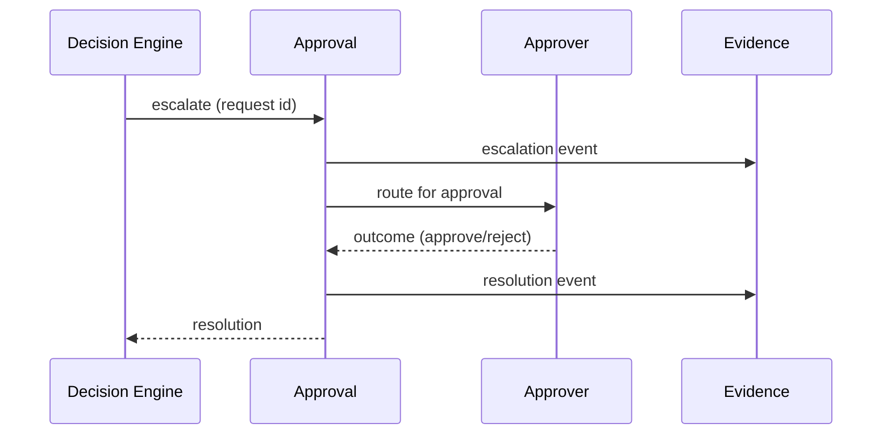

> **Diagram — Approval flow (internal).**
> **Purpose.** Show the escalation lifecycle between pipeline, Approval, and the human approver.
> **Decisions illustrated.** D6 (escalation), AP-7 (approver identity recorded).
> **Key insight.** Approval is modeled as a long-running Saga: the "held" state persists across an unbounded human wait and can only terminate via an explicit outcome or a compensating expiry — never a silent auto-allow.
> **Trade-off.** Durable held-state for potentially long human waits costs storage and lifecycle management; required so an escalation is as reproducible as any automated Decision.

### 10.5 Evidence Ledger

| Dimension           | Design                                                                                                                               |
| ------------------- | ------------------------------------------------------------------------------------------------------------------------------------ |
| Responsibility      | Persist every Decision and governance event immutably; serve reconstruction                                                          |
| Internal modules    | Append writer · Integrity/sequence stamper · Reconstruction reader · Retention manager                                               |
| Internal data flow  | Decision/governance event → durably enqueued on the decision path → appended → available for reconstruction                          |
| Public interfaces   | Append (internal, from Decision Engine); reconstruct/query (to Query subsystem)                                                      |
| Internal interfaces | Append-only store; integrity chain                                                                                                   |
| Dependencies        | Event backbone (ingest)                                                                                                              |
| State ownership     | The authoritative, immutable record of all Decisions                                                                                 |
| Configuration       | Retention periods; integrity parameters                                                                                              |
| Failure behavior    | Durable enqueue on the path guarantees no silent loss (NFR-1.2); append is retried until committed                                   |
| Retry / Idempotency | Event id → append exactly once (duplicate appends are no-ops)                                                                        |
| Concurrency         | High-throughput parallel append; ordering per partition                                                                              |
| Security            | Tamper-evident (integrity chain); WORM semantics; access-restricted (Ch 13)                                                          |
| Operational         | Append lag and completeness (M-15) monitored                                                                                         |
| **Patterns**        | **Event Sourcing** (the ledger _is_ the source of truth), **Outbox** (reliable decision→ledger hand-off), **Append-only Log / WORM** |

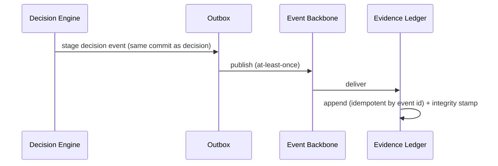

> **Diagram — Evidence recording via Outbox (internal).**
> **Purpose.** Show the reliable hand-off from a Decision to the immutable ledger.
> **Decisions illustrated.** D5 (append-only Evidence), AP-5 (reproducibility by construction).
> **Key insight.** The Outbox stages the decision event atomically with the decision itself, so a Decision can never exist without its Evidence being guaranteed to follow — closing the "no decision silently lost" requirement (NFR-1.2) without a synchronous durable write on the latency-critical path.
> **Trade-off.** At-least-once delivery means duplicates are possible; idempotent append by event id makes them harmless, trading a little dedup effort for guaranteed durability.

### 10.6 Agent Registry

| Dimension           | Design                                                                                                          |
| ------------------- | --------------------------------------------------------------------------------------------------------------- |
| Responsibility      | Register Agents; hold owner and least-privilege entitlements; serve fast lookups to the Decision Plane          |
| Internal modules    | Registration · Ownership · Entitlement manager · Lookup/projection                                              |
| Internal data flow  | Onboarding writes → projected into a fast entitlement lookup consumed at decision time                          |
| Public interfaces   | Admin API (Control Plane); entitlement lookup feed (to Decision Engine)                                         |
| Internal interfaces | Registry store; entitlement projection/cache                                                                    |
| Dependencies        | Evidence (registration/entitlement change events), IAM (identity linkage)                                       |
| State ownership     | The authoritative Agent inventory, ownership, entitlements (effective-dated)                                    |
| Configuration       | Onboarding requirements; entitlement schemas                                                                    |
| Failure behavior    | Lookup uses last-known-good cache; a missing entitlement resolves to deny (AP-8)                                |
| Retry / Idempotency | Effective-dated writes are idempotent by (agent, version)                                                       |
| Concurrency         | Read-heavy; cached projections scale reads                                                                      |
| Security            | Onboarding and entitlement changes are privileged, separated duties                                             |
| Operational         | Fleet inventory metrics (M-2)                                                                                   |
| **Patterns**        | **Repository**, **Cache-Aside** (entitlement projection), **Temporal / Effective-Dating** (entitlement history) |

### 10.7 Containment

| Dimension           | Design                                                                                             |
| ------------------- | -------------------------------------------------------------------------------------------------- |
| Responsibility      | Pause/throttle/stop Agents out-of-band, selectively, independent of Agent and Control-Plane health |
| Internal modules    | Command intake · Scope resolver (agent/class) · Enforcement propagator · State recorder            |
| Internal data flow  | Operator command → scoped → propagated to PEP(s) → recorded                                        |
| Public interfaces   | Operator control API; enforcement signal to PEP                                                    |
| Internal interfaces | Containment state store; PEP control channel                                                       |
| Dependencies        | PEP (enforcement point), Evidence (containment events)                                             |
| State ownership     | Current containment state per Agent/class                                                          |
| Configuration       | Scope definitions; propagation timeouts                                                            |
| Failure behavior    | Designed to _stop_, so its failure mode biases toward containment, not release                     |
| Retry / Idempotency | Idempotent by (agent, containment action)                                                          |
| Concurrency         | Fleet-wide fan-out; per-Agent authoritative state                                                  |
| Security            | Highly privileged; separated duty; every action attributed and recorded                            |
| Operational         | Containment latency (M-12) monitored                                                               |
| **Patterns**        | **Out-of-band Control Channel**, **Kill-Switch / Circuit-Breaker** semantics at the PEP            |

### 10.8 Query & Dashboard

| Dimension           | Design                                                                            |
| ------------------- | --------------------------------------------------------------------------------- |
| Responsibility      | Provide aggregate, read-only visibility and reconstruction over Evidence          |
| Internal modules    | Projection builder · Read models · Query API · Aggregation/posture views          |
| Internal data flow  | Evidence events → projected into denormalized read models → served to consumers   |
| Public interfaces   | Query/reporting API; dashboard feed                                               |
| Internal interfaces | Read-model store; projection consumers                                            |
| Dependencies        | Evidence Ledger (event source)                                                    |
| State ownership     | Derived read models only (never authoritative)                                    |
| Configuration       | Projection definitions; retention of read models                                  |
| Failure behavior    | Read-model outage never affects decisioning or Evidence (NFR-7.3)                 |
| Retry / Idempotency | Projections are rebuildable from Evidence (idempotent replay)                     |
| Concurrency         | Read-scaled; projections updated asynchronously                                   |
| Security            | Read access role-restricted; access logged (NFR-4.3)                              |
| Operational         | Projection lag monitored                                                          |
| **Patterns**        | **CQRS** (read models separate from the write-side ledger), **Materialized View** |

### 10.9 Architectural Decisions Realized (chapter)

| Decision | How realized                                                                    |
| -------- | ------------------------------------------------------------------------------- |
| D5       | Evidence Ledger uses Event Sourcing + Outbox + WORM                             |
| D7       | Registry entitlements evaluated at decision time via last-known-good projection |
| AP-8     | PEP, Registry, Approval all fail toward the safe outcome                        |
| AP-9     | Containment is an independent out-of-band channel                               |
| NFR-7.3  | Query/Dashboard is fully decoupled from the decision path                       |

---

## Chapter 11 — Data Architecture & Database Design

### 11.1 Purpose

This chapter specifies the platform's complete data architecture — from conceptual model to physical design — at the architecture level. Because the platform's value rests on reproducibility (P5) and auditability, the data design is load-bearing, not incidental. No SQL or exhaustive field lists appear; the focus is structure, ownership, and strategy.

### 11.2 Conceptual model

At the conceptual level the platform records **who** (Agent, Owner) is permitted to do **what** (Entitlement, Policy) and, for each attempt, **what was decided and why** (Governance Request, Decision, Evidence). These three concept groups — _identity/authority_, _policy_, and _decision/evidence_ — map onto three data-ownership domains with very different characteristics, which drives the physical design (11.5).

### 11.3–11.4 Domain model & logical data model (ER)

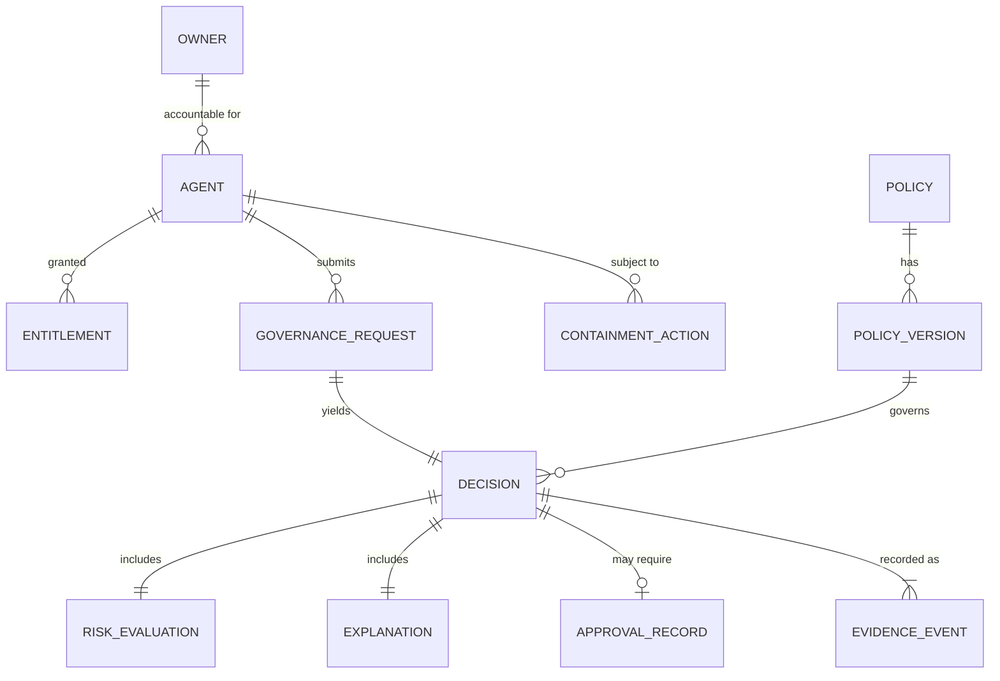

> **Diagram — Logical ER model.**
> **Purpose.** Show the core entities and relationships that make a Decision reproducible and accountable.
> **Decisions illustrated.** D5 (Decision → Evidence Event), D7 (Decision → Policy Version), AP-5 (every Decision links its inputs), AP-7 (Agent → Owner is mandatory).
> **Key insight.** A Decision is the hub: it references the exact Policy Version that governed it, its Risk Evaluation and Explanation, and (if escalated) its Approval Record — so reconstruction requires no re-computation, only reading linked, immutable rows/events.
> **Trade-off.** Denormalizing the governing inputs onto each Decision costs storage and write volume, but it is what guarantees a Decision can be reproduced even if reference data later changes.

**Keys & constraints (architectural).** Every entity has a stable primary identifier; `AGENT` carries a mandatory foreign key to `OWNER` (no ownerless Agent — enforced structurally, AP-7); `DECISION` carries mandatory foreign keys to `GOVERNANCE_REQUEST` and `POLICY_VERSION`; `POLICY_VERSION` and `DECISION` and `EVIDENCE_EVENT` are **immutable** (insert-only, no update/delete within retention); `ENTITLEMENT` is **effective-dated** (temporal validity rather than in-place mutation).

### 11.5 Physical database design — polyglot persistence

The three domains have incompatible access profiles, so the platform uses **polyglot persistence** rather than one store.

| Data class                                              | Store type                  | Rationale                                                           |
| ------------------------------------------------------- | --------------------------- | ------------------------------------------------------------------- |
| Evidence (Decisions, events)                            | **Append-only event store** | Immutable, ordered, high-write, tamper-evident (D5, Event Sourcing) |
| Identity/authority & Policy (Registry, Policy versions) | **Transactional store**     | Strong consistency, relational integrity, effective-dating          |
| Query/visibility                                        | **Denormalized read store** | Fast aggregate reads; rebuildable projections (CQRS)                |

> **Design note.** This separation is the physical expression of the two-plane model and CQRS: the write-side truth (Evidence) is optimized for immutable append and reproduction; the read-side (Query) is optimized for aggregate visibility and can be rebuilt from Evidence at any time.

### 11.6 Indexing strategy (by access pattern)

| Access pattern                       | Indexed by                          |
| ------------------------------------ | ----------------------------------- |
| Reconstruct a specific Decision      | Decision id / Governance Request id |
| All Decisions for an Agent over time | (Agent id, time)                    |
| Evidence for audit within a window   | (time, Agent id)                    |
| Resolve current entitlements         | (Agent id, effective-date)          |
| Resolve a Policy version             | (Policy id, version)                |

### 11.7 Partitioning strategy

Evidence is partitioned by **time** (natural for append and retention tiering) and sub-keyed by **Agent** (isolates a single Agent's history and supports selective query). Registry and Policy are partitioned by **Agent id** and **Policy id** respectively. This keeps write and read hotspots bounded as the fleet scales (NFR-2.2).

### 11.8 Versioning strategy

Policy is **versioned and immutable** — a change seals a new version (Ch 10.3); a Decision binds to the version that governed it. Decisions and Evidence Events are **immutable** once written. Entitlements are **effective-dated** so historical authority is reconstructable. Nothing that governs a past Decision is ever mutated in place — the architectural precondition for reproducibility (AP-5).

### 11.9 Data lifecycle & retention

| Stage             | Behavior                                                                                                                  |
| ----------------- | ------------------------------------------------------------------------------------------------------------------------- |
| Active (hot)      | Recent Evidence and read models, low-latency access                                                                       |
| Warm/cold tiering | Older Evidence migrated to cheaper tiers while remaining reconstructable (NFR-5.1)                                        |
| Retention         | Evidence retained ≥ [configured obligation]; immutable throughout; deletion blocked within retention and under legal hold |
| Read models       | Rebuildable and independently retained; may be pruned without affecting Evidence                                          |

> **Design note.** Retention applies asymmetrically: Evidence is sacrosanct within its retention window, while derived read models are disposable — reflecting that only the write-side is the source of truth.

### 11.10 Representative data dictionary (key entities)

_Architecture-level; representative attributes only._

| Entity             | Representative attributes                                | Notes                  |
| ------------------ | -------------------------------------------------------- | ---------------------- |
| Agent              | id, owner ref, status, entitlement ref                   | Owner mandatory (AP-7) |
| Policy Version     | id, policy ref, version, effective range                 | Immutable              |
| Governance Request | id, agent ref, action type, risk tier                    | The unit of work (D3)  |
| Decision           | id, request ref, outcome, policy-version ref, confidence | Immutable hub (AP-5)   |
| Explanation        | id, decision ref, reason                                 | Mandatory (AP-6)       |
| Approval Record    | id, decision ref, approver ref, outcome                  | Present iff escalated  |
| Evidence Event     | id, decision/entity ref, type, sequence, integrity stamp | Append-only (D5)       |

### 11.11 Architectural Decisions Realized & review

| Decision  | How realized                                                         |
| --------- | -------------------------------------------------------------------- |
| D5 / AP-5 | Immutable, append-only Evidence; Decision binds its governing inputs |
| D7        | Decision→Policy Version binding; effective-dated entitlements        |
| AP-7      | Mandatory Agent→Owner integrity constraint                           |
| NFR-2.2   | Time+Agent partitioning for scale                                    |

**Patterns:** Event Sourcing, CQRS, Repository, Temporal/Effective-Dating.

---

## Chapter 12 — API & Interface Contracts

### 12.1 Purpose & contract principles

This chapter specifies the contracts by which the platform is used and integrated. Contracts are **contract-first, versioned, and fail-safe by construction**: a contract's behavior under error is part of its definition, not an afterthought. Payload-level detail is kept representative here and consolidated in Appendix B.

### 12.2 The five contract surfaces

| Surface          | Purpose                                         | Primary consumers        | Mode                                       | Key operations (named)                   |
| ---------------- | ----------------------------------------------- | ------------------------ | ------------------------------------------ | ---------------------------------------- |
| Decision         | Submit a Governance Request; receive a Decision | Agents (via PEP)         | Sync (high-risk), async-capable (low-risk) | submit-request, get-decision             |
| Policy           | Author, version, distribute Policy              | Risk/Policy Officer      | Sync + distribution feed                   | author, version, publish                 |
| Registry / Admin | Onboard Agents; owners; entitlements            | Platform Admin           | Sync                                       | register, assign-owner, set-entitlements |
| Approval         | Deliver escalations; capture outcomes           | Approvers                | Sync + notification                        | list-escalations, resolve                |
| Query / Audit    | Reconstruct and aggregate over Evidence         | Analysts, Ops, Dashboard | Sync (read)                                | reconstruct-decision, query, posture     |

### 12.3 Contract semantics (cross-surface)

| Concern                         | Contract rule                                                                                                                                                          |
| ------------------------------- | ---------------------------------------------------------------------------------------------------------------------------------------------------------------------- |
| **Idempotency**                 | Every state-changing call carries a client-supplied id (e.g., Governance Request id); duplicates are safe no-ops (aligns with Evidence idempotent append)              |
| **Error / fail-safe semantics** | On platform error for a **high-risk** Decision, the contract returns deny/escalate, never a default allow (AP-8); errors are explicit outcomes, not ambiguous failures |
| **Versioning**                  | Additive, backward-compatible evolution; breaking changes ship as a new contract version with an overlap/deprecation window                                            |
| **AuthN/Z**                     | Every surface requires a verified identity (NFR-3.1); privileged surfaces (Policy, Registry, Approval, Containment) enforce separated duties                           |
| **Explainability**              | The Decision contract always returns a reason alongside the outcome (AP-6)                                                                                             |

### 12.4 Event contracts

Beyond request/response surfaces, the platform exposes **event contracts** on the backbone — principally decision events and containment events consumed by the Evidence Ledger and Query subsystem. These follow **at-least-once delivery with idempotent consumers** and the **Outbox** hand-off (Ch 10.5), so the event contract guarantees durability without coupling producers to consumers.

### 12.5 Representative contract — Decision surface

_Semantic (not schema) shape, to illustrate the fail-safe contract:_

- **Input (conceptual):** identity-bound Governance Request — agent ref, action type, action parameters (opaque to the platform, per AP-10), client request id.
- **Output (conceptual):** Decision — outcome (allow/deny/escalate), reason (mandatory), governing policy version, risk tier, confidence, decision id.
- **Error/fail-safe:** any inability to decide a high-risk request yields deny or escalate with a stated reason — never a silent failure or default allow.

> **Diagram — Decision contract interaction (representative).**

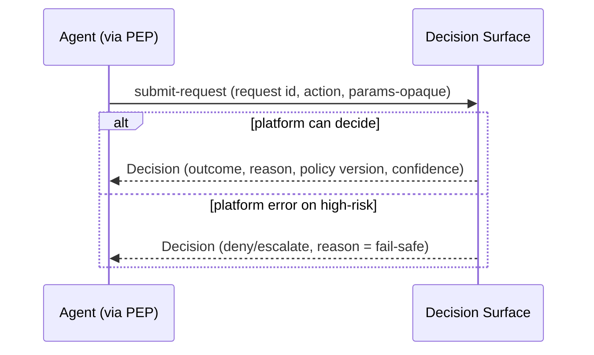

> **Purpose.** Show that the error branch of the contract is itself a governed, explained outcome.
> **Decisions illustrated.** D8/AP-10 (action params opaque; platform judges, never mutates), AP-8 (error → safe outcome), AP-6 (reason always present).
> **Key insight.** The contract has no "undefined failure" state for a high-risk request: even a platform error resolves to a safe, explained Decision. This makes fail-safety a property of the _interface_, not just the implementation.
> **Trade-off.** Treating errors as deny/escalate can add friction during platform incidents (legitimate high-risk actions blocked); accepted because a false block is recoverable while a false allow may not be.

### 12.6 Architectural Decisions Realized & review

| Decision   | How realized                                                                      |
| ---------- | --------------------------------------------------------------------------------- |
| D8 / AP-10 | Action parameters are opaque in the contract; the platform returns a verdict only |
| AP-8       | Fail-safe error semantics are part of the contract                                |
| AP-6       | Every Decision response carries a reason                                          |
| AP-7       | Every surface is identity-bound; privileged surfaces separated                    |

**Patterns:** Contract-first interface design, Idempotency Key, Outbox (events), semantic Versioning/compatibility, Adapter (PEP fronting the Decision surface).

---

---

# PART D — CROSS-CUTTING ARCHITECTURE

_Part D answers one question: how does this architecture **survive and operate in production**? It reads as a production-readiness review — security, resilience, and operations examined as architectural properties of this specific system, not as generic practice. NFRs are the targets; this Part shows the mechanisms that meet them._

## Chapter 13 — Security Architecture

### 13.1 Purpose

The platform is the enterprise's most trusted control point: it decides whether money-moving actions proceed. Its own compromise would be worse than having no governance at all. This chapter specifies the security architecture that makes the platform trustworthy — at the architecture level, without naming security technologies.

### 13.2 Security boundaries & trust assumptions

The four trust zones from Ch 4 are the platform's security boundaries. The posture is **zero-trust**: nothing across a boundary is assumed benign, including authenticated Agents.

| Boundary                 | Trust assumption                                                   | Consequence                                                                                                        |
| ------------------------ | ------------------------------------------------------------------ | ------------------------------------------------------------------------------------------------------------------ |
| Agent → Platform         | An Agent is authenticated but may be compromised or malfunctioning | Every Governance Request is re-authorized at request time (AP-3); the Agent is never trusted to self-govern (AP-1) |
| Platform → IAM           | IAM is authoritative for identity but external                     | The platform consumes verified identity; it never trusts an Agent-asserted identity                                |
| Platform → Fraud signals | Signals are advisory inputs, possibly stale/absent                 | A signal can never _raise_ trust enough to bypass policy; its absence fails high-risk safe (AP-8)                  |
| Platform → Execution     | Downstream and outside platform control                            | The platform's guarantee ends at the Decision; it secures the _decision_, not the settlement                       |

### 13.3 Defense in depth

Security is layered so that no single failure is catastrophic.

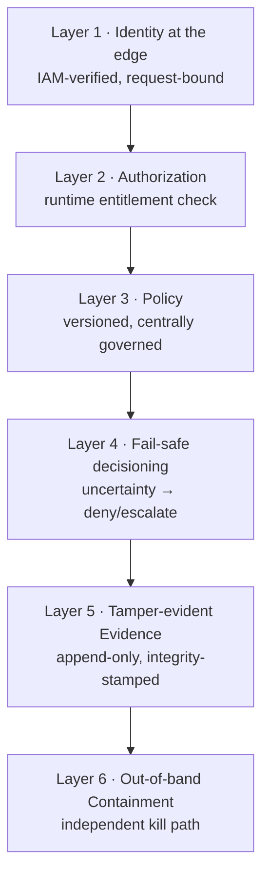

> **Diagram — Defense-in-depth layers.**
> **Purpose.** Show the independent security layers a malicious or malfunctioning action must pass, and the backstops if one fails.
> **Decisions illustrated.** AP-1, AP-3 (edge identity + runtime authz), AP-8 (fail-safe layer), D5 (tamper-evident record), AP-9 (containment backstop).
> **Key insight.** The layers are independent: even if policy is mis-authored (Layer 3), fail-safe (Layer 4), immutable Evidence (Layer 5), and out-of-band containment (Layer 6) still bound the blast radius. Security does not rest on any one control being perfect.
> **Trade-off.** Multiple independent layers add latency and operational surface; justified because the cost of a single bypassed control here is a wrongly-permitted financial action.

### 13.4 Identity propagation

Identity is established once at the edge and carried, unbroken, through the entire decision and Evidence chain.

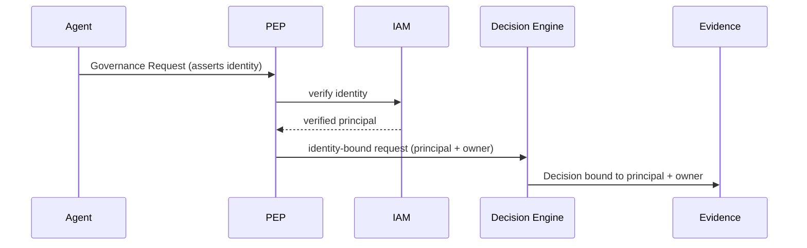

> **Diagram — Identity propagation.**
> **Purpose.** Show identity verified at the edge and propagated into the Decision and Evidence, never re-asserted internally.
> **Decisions illustrated.** AP-7 (owner-attributed), AP-3 (authority re-checked with the verified principal).
> **Key insight.** Internal components never re-derive identity from Agent-supplied data; they consume the _verified_ principal bound at the PEP. This removes an entire class of internal spoofing — an internal component cannot be tricked into trusting a forged identity because it never parses one.
> **Trade-off.** Binding identity at a single edge point makes the PEP security-critical; mitigated by making identity binding mandatory and fail-closed (an unverifiable request is rejected, per Ch 7).

### 13.5 Per-subsystem security responsibilities

| Subsystem         | Security responsibility                                               | Least-privilege posture                              |
| ----------------- | --------------------------------------------------------------------- | ---------------------------------------------------- |
| PEP               | Enforce identity binding; reject unverified requests                  | Holds no decision authority; cannot alter a Decision |
| Decision Engine   | Operate only on verified, owner-bound requests; no standing authority | Reads policy/entitlements; cannot author them        |
| Policy Service    | Restrict authoring to separated, privileged roles                     | Cannot decide a specific request                     |
| Registry          | Restrict onboarding/entitlement changes to admins                     | Cannot evaluate policy                               |
| Approval          | Ensure only authorized, _distinct_ approvers resolve                  | Cannot originate a Decision                          |
| Evidence Ledger   | Guarantee tamper-evidence and restricted access                       | Append + read only; never mutate                     |
| Containment       | Restrict to privileged operators; attribute every action              | Cannot decide individual requests                    |
| Query & Dashboard | Enforce role-restricted read; log access                              | Read-only; never authoritative                       |

### 13.6 Secrets management philosophy

The architecture minimizes standing secrets by design: Agents hold **no governance secrets** (they carry only an identity credential managed by IAM); inter-subsystem trust is established through **mutually authenticated channels** rather than shared static secrets; and any credential is **short-lived and brokered**, never long-lived and embedded. The guiding principle is that **a leaked secret should expire before it is useful and should never, by itself, grant decision authority** (which is always re-evaluated at request time, AP-3).

### 13.7 Least privilege & separation of duties

No principal holds more authority than its function requires, and the sensitive functions are held by _different_ principals (NFR-3.3): the Policy author cannot approve the escalations their policy generates; the Platform admin who onboards an Agent cannot act as its approver; the Operator who contains an Agent cannot author policy. This separation means no single compromised human role can both weaken a control and exploit it.

### 13.8 Secure communication assumptions

All boundary crossings are assumed to occur over **mutually authenticated, encrypted channels** with message integrity; no component trusts an unauthenticated peer. Data is protected **in transit and at rest** (NFR-4.2), and the Evidence integrity chain (Ch 10.5) provides tamper-evidence independent of transport security — so a compromised channel cannot silently alter the record.

### 13.9 Threat model (STRIDE — summary)

| Threat                     | System-specific risk                        | Primary mitigation                                                                          |
| -------------------------- | ------------------------------------------- | ------------------------------------------------------------------------------------------- |
| **Spoofing**               | An Agent forges or impersonates an identity | IAM-verified identity bound at the PEP (AP-7); zero-trust                                   |
| **Tampering**              | Altering a Decision, Policy, or Evidence    | Immutable policy versions; append-only, integrity-stamped Evidence (D5)                     |
| **Repudiation**            | Denying an action was decided/taken         | Reproducible Evidence + accountable owner (AP-5, AP-7)                                      |
| **Information disclosure** | Leaking sensitive request/customer data     | Data minimization (NFR-4.1); encryption; access-restricted, logged Evidence (NFR-4.3)       |
| **Denial of service**      | Flooding the decision path                  | Backpressure + rate limits; high-risk fails closed under overload (never fails open)        |
| **Elevation of privilege** | An Agent acting beyond its entitlements     | Runtime entitlement check (AP-3); least privilege; separation of duties on control surfaces |

_The full STRIDE analysis, with per-asset detail, is Appendix C._

### 13.10 Architectural Decisions Realized

| Decision    | How realized                                     |
| ----------- | ------------------------------------------------ |
| AP-1 / AP-3 | Edge identity + runtime authorization            |
| AP-7        | Unbroken identity propagation to Evidence        |
| AP-8        | DoS and dependency loss fail closed, never open  |
| D5          | Tamper-evidence as an independent security layer |
| AP-9        | Out-of-band containment as the final backstop    |

---

## Chapter 14 — Reliability, Resilience, Scalability & Performance

### 14.1 Purpose

This chapter shows how the architecture behaves under failure and load. It is structured around **failure**, because a governance layer on the critical path is judged by how it fails, not only how it runs. The governing rule from Ch 2 stands throughout: **degradation reduces throughput, never safety** (AP-8).

### 14.2 Failure-mode analysis

For each material failure, the architecture defines detection, immediate behaviour, safe degradation, recovery, and business impact. This is the core of the production-readiness review.

| Failure                             | Detection                                   | Immediate behaviour                              | Safe degradation                                                                                                                       | Recovery                                             | Business impact                                                              |
| ----------------------------------- | ------------------------------------------- | ------------------------------------------------ | -------------------------------------------------------------------------------------------------------------------------------------- | ---------------------------------------------------- | ---------------------------------------------------------------------------- |
| **Decision Engine unavailable**     | Decision-path SLO breach; health checks     | PEP cannot obtain a Decision                     | High-risk → fail-closed at PEP (deny/hold); low-risk async → queued                                                                    | Stateless nodes replaced/scaled; no state to restore | High-risk blocked (safe); low-risk delayed                                   |
| **Policy distribution unavailable** | Propagation-lag metric                      | No new Policy version reaches the Decision Plane | Decision Plane evaluates against last-known-good sealed version (Ch 10.3)                                                              | Distribution resumes; next version propagates        | Policy changes delayed (bounded); decisions still validly governed           |
| **Registry unavailable**            | Lookup error rate                           | Entitlement/owner lookup fails                   | Last-known-good entitlement cache; unknown → deny (AP-8)                                                                               | Registry restored; cache refreshes                   | Onboarding/entitlement changes paused; existing Agents keep cached authority |
| **Evidence unavailable**            | Outbox backlog; append lag (M-15)           | Cannot append synchronously                      | Durable Outbox buffers (no silent loss, NFR-1.2); if durable enqueue itself fails → high-risk fails closed to preserve reproducibility | Ledger drains Outbox in sequence order               | None if Outbox durable; else high-risk blocked to protect auditability       |
| **IAM unavailable**                 | Verification error rate                     | Cannot identity-bind a request                   | Reject / fail-closed for all requests (no ungoverned identity)                                                                         | IAM restored                                         | Strongest degradation — new requests blocked (safe)                          |
| **Fraud signal unavailable**        | Signal-staleness metric                     | Risk signal absent                               | High-risk fails safe (deny/escalate); low-risk proceeds on internal criteria (AP-4 asymmetry)                                          | Signal resumes; freshness restored                   | High-risk friction rises; low-risk unaffected                                |
| **Human approval unavailable**      | Approval-queue latency; no active approvers | Escalations not resolved                         | Requests remain **held** (never auto-allowed); compensating expiry per policy                                                          | Approvers return; queue drains                       | High-risk actions delayed; none wrongly allowed                              |
| **Event backbone unavailable**      | Publish-failure rate                        | Events not flowing to Evidence/Query             | Outbox retains; decisions continue; Query lags                                                                                         | Backbone restored; backlog drains                    | Visibility lag; audit eventually complete                                    |

> **Design insight.** Read the "safe degradation" column top to bottom: every failure resolves toward _blocking high-risk actions and preserving Evidence_, never toward permitting them. This is AP-8 expressed as an operational property — the system's worst day still produces safe, recorded outcomes.

### 14.3 High-availability topology

```mermaid
flowchart TB
  subgraph R1[Region A · active]
    P1[Decision Plane nodes · stateless N+]
    C1[Control Plane]
  end
  subgraph R2[Region B · active]
    P2[Decision Plane nodes · stateless N+]
    C2[Control Plane]
  end
  EVG[(Evidence · replicated, ordered)]
  P1 --> EVG
  P2 --> EVG
  C1 <-.-> C2
```

> **Diagram — HA topology (active-active).**
> **Purpose.** Show stateless Decision-Plane redundancy across regions over a replicated Evidence store.
> **Decisions illustrated.** AP-2 (stateless → trivially redundant), D5 (Evidence is the one stateful thing, replicated).
> **Key insight.** Because the Decision Plane is stateless (AP-2), availability is a matter of adding nodes; the only component needing careful replication is the Evidence Ledger, which concentrates the hard reliability problem in one place instead of spreading it across every service.
> **Trade-off.** Active-active across regions raises Evidence-replication and ordering complexity; accepted because decision-path availability is on the money-movement critical path.

### 14.4 Disaster recovery

| Objective         | Target                  | Mechanism                                                                                    |
| ----------------- | ----------------------- | -------------------------------------------------------------------------------------------- |
| Decision-path RTO | Minutes                 | Stateless nodes re-provisioned; no warm state needed                                         |
| Evidence RPO      | **Zero** committed loss | Durable enqueue + replicated append; a committed Decision's Evidence is never lost (NFR-7.2) |
| Read-model RPO    | Rebuildable             | Projections replayed from Evidence (CQRS)                                                    |

> **Design note.** The RPO asymmetry is deliberate: Evidence is the only data class with a zero-loss objective because it is the sole source of truth; read models tolerate loss because they are derivable.

### 14.5 Scalability

The Decision Plane scales horizontally and shared-nothing (AP-2); throughput grows by adding stateless nodes. The Evidence write path scales through time+Agent partitioning (Ch 11.7); read load scales through independently-scaled CQRS projections. Policy and entitlements are pushed to in-plane caches, so scaling the fleet does not increase synchronous Control-Plane load — governance cost stays sub-linear per Agent (the PRD's "hundredth Agent costs no more than the tenth").

### 14.6 Performance & backpressure

The decision-path latency budget (Ch 2.3) is held by keeping external and human steps off the synchronous path. Under overload, the platform applies **backpressure with a fail-safe bias**: it sheds load by throttling low-risk async processing first, and if the high-risk path itself is saturated it **fails those requests closed** rather than degrading their evaluation — throughput yields before safety does.

### 14.7 Architectural Decisions Realized

| Decision | How realized                                                         |
| -------- | -------------------------------------------------------------------- |
| AP-8     | Every failure mode degrades toward safe, recorded outcomes           |
| AP-2     | Stateless Decision Plane → HA and horizontal scale                   |
| D5       | Evidence is the single stateful concern; zero-RPO                    |
| AP-4     | Dependency-loss asymmetry (identity vs signal) is risk-proportionate |

---

## Chapter 15 — Deployment, Operations & Observability

### 15.1 Purpose

This chapter treats deployment and operations as **architecture**, not infrastructure documentation. It specifies how the two planes are deployed, how policy (a form of configuration) is promoted and rolled back, who operates what, and — most importantly — why **operational observability** and **business Evidence** are kept architecturally separate.

### 15.2 Environment separation

Environments (development, test, staging, production) are isolated, and **policy is promoted through them like code**: a Policy version is authored and validated in lower environments and promoted, unchanged and immutably versioned, toward production. No environment shares an Evidence store — production Evidence is a distinct, protected asset.

### 15.3 Deployment topology

```mermaid
flowchart LR
  subgraph PROD[Production]
    DPL[Decision Plane · scaled to fleet load]
    CPL[Control Plane · scaled to admin/author load]
    EVP[(Evidence · protected, replicated)]
  end
  DPL --> EVP
  CPL --> DPL
```

> **Diagram — Deployment topology (two-plane, independently scaled).**
> **Purpose.** Show the Decision Plane and Control Plane deployed and scaled independently.
> **Decisions illustrated.** D1 (plane separation carries into deployment), AP-2 (Decision Plane scales on its own axis).
> **Key insight.** The two planes have different scaling drivers — the Decision Plane scales with Agent request volume, the Control Plane with human authoring/administration — so deploying them independently lets each scale on its own axis without over-provisioning the other.
> **Trade-off.** Two independently-deployed planes add operational surface versus a monolith; justified by the availability isolation it buys (Control-Plane deployment activity cannot disturb the decision path).

### 15.4 Configuration lifecycle

The platform draws a sharp line between **code** and **policy-as-configuration**. Deploying new platform code follows the rollout/rollback discipline below. Changing governance behaviour, however, is a **policy publish, not a redeploy**: a new Policy version propagates to the Decision Plane and takes effect on the next Decision (FR-2.3, Ch 10.3) with no code deployment. This is why Risk can change governance at business speed without an engineering release.

### 15.5 Progressive rollout philosophy

| Change type                    | Rollout approach                                                                                                                                                            |
| ------------------------------ | --------------------------------------------------------------------------------------------------------------------------------------------------------------------------- |
| Platform code (Decision Plane) | Progressive (canary/blue-green) across stateless nodes; the fail-safe bias means a bad node degrades safe, not open                                                         |
| Policy version                 | **Shadow evaluation first** — a new Policy version can be evaluated alongside the active one without enforcing, so its effect is observed on real traffic before it governs |
| Entitlement/registry change    | Effective-dated, reversible                                                                                                                                                 |

> **Design note.** Shadow evaluation of policy is a governance-specific rollout tactic: because a policy change can silently alter who is allowed to move money, it is observed in shadow (decisions computed, not enforced, recorded for comparison) before promotion — a safety step generic DevOps canaries don't provide.

### 15.6 Rollback philosophy

Stateless Decision-Plane nodes roll back freely (no state to reconcile). A **policy rollback is a re-publish of a prior immutable version** — safe precisely because versions are immutable and a Decision always binds to the version that governed it (so rolling policy forward or back never rewrites history). **Evidence is never rolled back**; it is append-only by definition.

### 15.7 Operational ownership & boundaries

Operational responsibility mirrors the PRD §6 stakeholder model, drawn along plane and function:

| Domain                              | Operated by                                              |
| ----------------------------------- | -------------------------------------------------------- |
| Decision Plane availability & scale | Governance Platform Team                                 |
| Policy content & change             | Risk & Compliance (author), Platform Team (distribution) |
| Containment & incident response     | Operations                                               |
| Evidence integrity & retention      | Platform Team; audited by Internal Audit                 |

The boundary rule: **the team that authors policy does not operate containment, and neither operates the Evidence integrity controls** — operational separation of duties mirroring the security one (13.7).

### 15.8 Observability philosophy — two different things

The platform maintains two record streams that are **deliberately never merged**:

| Concern               | Operational Observability         | Business Evidence                           |
| --------------------- | --------------------------------- | ------------------------------------------- |
| Purpose               | Run and troubleshoot the platform | Prove and reconstruct governance Decisions  |
| Source                | Metrics, logs, traces             | The Evidence Ledger                         |
| Mutability            | Mutable, sampled, best-effort     | Immutable, complete, tamper-evident         |
| Audience              | Operators, SREs                   | Auditors, regulators, Risk                  |
| Retention             | Short, operational                | Long, obligation-driven                     |
| On the critical path? | No                                | Yes (its durability is guaranteed, Ch 10.5) |

> **Diagram — Two record streams.**

```mermaid
flowchart LR
  DE[Decision Engine] --> OBS[Operational telemetry<br/>metrics/logs/traces · mutable, sampled]
  DE --> EVID[(Business Evidence<br/>immutable, complete)]
  OBS --> OPS[Operators / SRE]
  EVID --> AUD[Auditors / Risk]
```

> **Purpose.** Show the two streams diverging at the source and never rejoining.
> **Decisions illustrated.** D5 (Evidence as an immutable stream distinct from telemetry), NFR-7.3 (telemetry/observability failure cannot affect Evidence or decisioning).
> **Key insight.** Merging the two would be a category error: audit evidence must be complete and immutable, while operational telemetry is deliberately sampled and mutable. Keeping them separate means an operational logging outage cannot create a gap in the audit record, and audit-grade guarantees never burden operational telemetry with cost.
> **Trade-off.** Two streams mean two systems to run; accepted because conflating them would compromise either audit integrity or operational agility — both unacceptable.

### 15.9 SLOs & alerting

SLOs derive from the Ch 2 quality attributes (decision-path availability, added latency, containment latency). Alerting prioritizes the governance-critical signals: decision-path health, **fail-safe rate** (how often the platform is erring closed — a rising rate signals dependency trouble), Evidence append completeness (M-15), and containment latency (M-12). These are operational signals; none is a substitute for the Evidence record.

### 15.10 Architectural Decisions Realized

| Decision  | How realized                                                     |
| --------- | ---------------------------------------------------------------- |
| D1 / AP-2 | Independent two-plane deployment and scaling                     |
| D5        | Evidence separated from operational telemetry; never rolled back |
| FR-2.3    | Policy change as publish, not redeploy                           |
| NFR-7.3   | Observability failure isolated from the decision path            |

---

---

# PART E — DECISIONS & EVOLUTION

_Part E is the engineering justification for the architecture in Parts A–D. Chapter 16 evaluates the technology class for each architectural element as a design review; Chapter 17 formalizes — without re-deriving — the decisions the document already made; Chapter 18 shows the architecture's extensibility against concrete seams. No new architecture is introduced._

## Chapter 16 — Technology Selection & Rationale

### 16.1 Approach

This chapter selects the **class of technology** for each architectural element on properties, not product names — vendors are named only where a class is best identified by an exemplar. Each element is the persistence or platform choice for an already-named subsystem, evaluated in a consistent format: _architectural requirement → evaluation criteria → candidate approaches → trade-off analysis → selection → why it best satisfies Chapters 2–15_.

### 16.2 Decision Engine (host of the AI Decision Pipeline)

- **Requirement.** Stateless, low-latency orchestration of the pipeline on the critical path.
- **Criteria.** Added latency; statelessness; horizontal scale; fail-safe control; testability.
- **Candidates.** (a) Stateless compute service hosting the pipeline in-process; (b) durable workflow/orchestration engine; (c) decisioning embedded in the PEP.
- **Trade-off analysis.** A workflow engine adds durable per-request state and latency (wrong for a ~50 ms hot path); embedding in the PEP couples enforcement to decisioning (violates D1); a stateless service is fastest and simplest to scale.
- **Selected.** Stateless decision service hosting the pipeline in-process.
- **Why.** Meets the Ch 2.3 latency budget, AP-2 horizontal scale, D1 plane separation, and AP-8 fail-safe control.

### 16.3 Policy Engine (evaluation core of the Policy stages)

- **Requirement.** Express governance rules; evaluate in-process at request time; policy externalized from code; versioned.
- **Criteria.** Expressiveness; in-process evaluation latency; policy-as-configuration; version immutability; evaluation auditability.
- **Candidates.** (a) Declarative in-process policy-decision engine (the class exemplified by OPA/Cedar) consuming versioned bundles; (b) bespoke rules embedded in code; (c) heavyweight BPM/decision-table platform.
- **Trade-off analysis.** Embedded-in-code violates policy-as-config (FR-2.x, Ch 15.4); a BPM platform adds latency and operational weight; a declarative in-process engine gives fast evaluation _and_ externalized, versionable policy.
- **Selected.** Declarative in-process policy-decision engine consuming immutable versioned Policy bundles.
- **Why.** Satisfies FR-2.x (single source, versioning, propagation), D7 runtime evaluation, the latency budget, and AP-5 reproducibility.

### 16.4 Evidence Store (persistence for the Evidence Ledger)

- **Requirement.** Append-only, immutable, ordered, tamper-evident, high-write, long-retention, reconstructable.
- **Criteria.** WORM/immutability; append throughput; ordering; integrity; retention tiering.
- **Candidates.** (a) Append-only event/log store with an integrity chain; (b) mutable relational store with application-enforced immutability; (c) full distributed-ledger/blockchain.
- **Trade-off analysis.** Relational-with-app-immutability leaves the substrate mutable (weak tamper-evidence); a blockchain overpays in latency and operational cost; an append-only event store with cryptographic chaining achieves immutability and throughput without ledger overhead.
- **Selected.** Append-only event store with cryptographic integrity chaining (WORM semantics).
- **Why.** Realizes D5/AP-5, NFR-5.x auditability, Ch 13 tamper-evidence, and the Ch 14 zero-RPO objective.

### 16.5 Registry (persistence for the Agent Registry)

- **Requirement.** Authoritative, strongly-consistent store of Agents, owners, and effective-dated entitlements with fast cached lookup.
- **Criteria.** Transactional integrity; temporal/effective-dating; read-scale via projection.
- **Candidates.** (a) Transactional relational store + cache-aside projection; (b) key-value store; (c) directory service.
- **Trade-off analysis.** A KV store is weak on relational integrity and temporal queries; a directory service fits identity, not entitlement semantics; a transactional store with a projection gives integrity plus read-scale.
- **Selected.** Transactional store with a cache-aside entitlement projection.
- **Why.** Enforces AP-7 (owner integrity), D7 (runtime entitlement), temporal reconstruction, and read-scale for the Decision Plane.

### 16.6 Read Models (persistence for Query & Dashboard)

- **Requirement.** Fast aggregate reads, rebuildable, fully decoupled from the write path.
- **Criteria.** Query performance; rebuildability; decoupling.
- **Candidates.** (a) CQRS projections in a denormalized read store; (b) querying the Evidence Store directly; (c) an analytics warehouse.
- **Trade-off analysis.** Querying Evidence directly couples read load to the source of truth and is slow for aggregates; a warehouse adds latency/complexity for operational visibility; CQRS projections give fast, rebuildable reads.
- **Selected.** CQRS projections into a denormalized read store.
- **Why.** Satisfies NFR-7.3 decoupling, F-9 visibility, and idempotent rebuild from Evidence.

### 16.7 Event Backbone

- **Requirement.** Reliable, ordered, at-least-once delivery decoupling decisioning from Evidence/read; supports the Outbox.
- **Criteria.** Durability; per-partition ordering; throughput; producer/consumer decoupling.
- **Candidates.** (a) Durable partitioned, ordered event log; (b) traditional message queue; (c) synchronous calls.
- **Trade-off analysis.** Synchronous coupling breaks the latency/availability budget; a plain queue lacks ordered replay (needed to rebuild read models); a durable partitioned log gives ordering, replay, and throughput.
- **Selected.** Durable, partitioned, ordered event log.
- **Why.** Underpins Outbox/Event Sourcing (Ch 10–11), NFR-1.2 no-loss, read-model replay, and decoupling.

### 16.8 API Layer

- **Requirement.** Contract-first, versioned, fail-safe, identity-bound surfaces plus governed event contracts.
- **Criteria.** Contract clarity; versioning/compatibility; idempotency; per-surface authorization.
- **Candidates.** (a) Contract-first synchronous request/response + event contracts; (b) purely event-driven; (c) ad hoc RPC.
- **Trade-off analysis.** Purely event-driven cannot serve the synchronous high-risk decision (D2); ad hoc RPC lacks contract governance; contract-first sync + events fits the hybrid model.
- **Selected.** Contract-first synchronous surfaces with governed event contracts.
- **Why.** Realizes Ch 12 semantics, D2 (sync high-risk), AP-8 fail-safe contract, and AP-6 reason-in-response.

### 16.9 Identity Integration

- **Requirement.** Consume verified identity; never issue it.
- **Criteria.** Standards-based federation; verifiability; fail-closed on unavailability.
- **Candidates.** (a) Federate enterprise IAM as the identity authority; (b) build platform-local identity; (c) trust Agent-asserted identity.
- **Trade-off analysis.** Building identity violates scope (§5) and duplicates IAM; trusting Agent assertions breaks zero-trust; federating IAM as authority is correct.
- **Selected.** Federated integration with enterprise IAM; identity bound at the PEP.
- **Why.** Honors §5 scope, AP-7, Ch 13 identity propagation, and the Ch 14 IAM-unavailable fail-closed behavior.

### 16.10 Containment Channel

- **Requirement.** Out-of-band control reaching the PEP independent of Agent and Control-Plane health; fast and selective.
- **Criteria.** Independence; propagation latency; selectivity; availability during incidents.
- **Candidates.** (a) Dedicated out-of-band control channel to the PEPs; (b) in-band via the decision path; (c) manual per-Agent shutdown.
- **Trade-off analysis.** In-band containment fails exactly when the decision path fails (defeats its purpose); manual shutdown is too slow and coarse; a dedicated out-of-band channel meets AP-9.
- **Selected.** Dedicated out-of-band control channel to the PEPs.
- **Why.** Realizes AP-9, the NFR-8.1 "seconds" target, the Ch 8 containment flow, and resilience during incidents.

### 16.11 Selection summary

| Element              | Selected class                            | Anchors          |
| -------------------- | ----------------------------------------- | ---------------- |
| Decision Engine      | Stateless in-process decision service     | D1, AP-2, AP-8   |
| Policy Engine        | Declarative in-process, versioned bundles | FR-2.x, D7, AP-5 |
| Evidence Store       | Append-only event store + integrity chain | D5, AP-5         |
| Registry             | Transactional + cache-aside projection    | AP-7, D7         |
| Read Models          | CQRS projections                          | NFR-7.3, F-9     |
| Event Backbone       | Durable partitioned ordered log           | NFR-1.2, Outbox  |
| API Layer            | Contract-first sync + event contracts     | D2, AP-8, AP-6   |
| Identity Integration | Federated IAM, edge-bound                 | §5, AP-7         |
| Containment Channel  | Out-of-band control channel               | AP-9, NFR-8.1    |

---

## Chapter 17 — Architecture Decision Records (ADRs)

_These ADRs formalize decisions already made in Parts A–D. They explain **why** the architecture looks as it does; they introduce nothing new. Format: Context · Problem · Decision · Alternatives · Consequences · Relationship to D/AP._

**ADR-1 — Two-plane separation (Decision Plane vs Control Plane).**
Context: the platform is on the money-movement critical path yet needs rich control functions. Problem: rich functions become critical-path dependencies. Decision: split a fast, fail-safe Decision Plane from a latency-tolerant Control Plane, coupled asynchronously. Alternatives: monolithic decision service (rejected — every dependency critical-path). Consequences: high availability and clean scaling; cost of asynchronous policy/entitlement propagation. Realizes **D1**, supports **AP-2, AP-8**.

**ADR-2 — Hybrid enforcement (inline high-risk, asynchronous low-risk).**
Context: preventive governance must not throttle low-risk volume. Problem: uniform enforcement is either too slow or too permissive. Decision: select enforcement mode by risk tier. Alternatives: pure inline (throttles), pure async (cannot prevent). Consequences: proportionate latency/safety; a low-risk action may execute before async governance completes. Realizes **D2**, supports **AP-4, AP-8**.

**ADR-3 — Governance Request as the stateless unit of decisioning.**
Context: an Agent may attempt many different actions. Problem: trusting an Agent wholesale cannot catch a specific bad action. Decision: decide each Governance Request independently and statelessly. Alternatives: session/agent-level trust (rejected — coarse, non-reproducible). Consequences: horizontal scale, per-action reproducibility; more evaluations. Realizes **D3**, supports **AP-2**.

**ADR-4 — Staged AI Decision Pipeline with models behind Strategy.**
Context: decisions blend deterministic policy with model-based risk/explanation. Problem: model logic must be swappable and bounded without destabilizing decisions. Decision: a fail-fast Pipeline/Chain-of-Responsibility of stateless stages; model logic behind a Strategy interface, never holding allow/deny authority. Alternatives: monolithic decision function (rigid), model-as-authority (rejected — violates neutrality). Consequences: inspectable, reproducible, extensible; fixed linear cost. Realizes **D4, D8**, supports **AP-6, AP-8, AP-10**.

**ADR-5 — Fail-closed default on the high-risk path.**
Context: uncertainty is inevitable (missing signals, low confidence). Problem: a default must be chosen. Decision: high-risk uncertainty resolves to deny/escalate. Alternatives: fail-open (rejected — unacceptable for money movement). Consequences: safety under degradation; some legitimate high-risk friction. Realizes **D6**, supports **AP-8**.

**ADR-6 — Runtime authority evaluation; no cached allow.**
Context: entitlements and policy change over time. Problem: pre-granted permissions go stale. Decision: evaluate policy + entitlement at request time; never cache an _allow_ decision. Alternatives: cached decisions (rejected — stale authority). Consequences: revocation/policy changes effective on next request; per-request cost. Realizes **D7**, supports **AP-3**.

**ADR-7 — Platform decides, never mutates; opaque action parameters.**
Context: the platform must remain a neutral control point. Problem: computing or altering the business action would make it an Agent. Decision: action parameters are opaque; the platform returns only a verdict. Alternatives: platform corrects/enriches actions (rejected — violates neutrality). Consequences: clean separation; the platform cannot fix a poor-but-permitted action. Realizes **D8**, supports **AP-10**.

**ADR-8 — Event-sourced, append-only Evidence with the Outbox pattern.**
Context: every Decision must be reproducible and durable without a synchronous durable write on the hot path. Problem: reconcile durability with latency. Decision: stage decision events via Outbox; append immutably to an integrity-chained event store. Alternatives: synchronous durable write (latency), mutable audit table (weak tamper-evidence). Consequences: no silent loss, tamper-evidence; at-least-once duplicates handled idempotently. Realizes **D5**, supports **AP-5**.

**ADR-9 — Polyglot persistence with CQRS.**
Context: identity/authority, policy, and evidence have incompatible access profiles. Problem: one store cannot serve all well. Decision: transactional store (Registry/Policy), append-only event store (Evidence), denormalized read models (Query) via CQRS. Alternatives: single store (rejected — compromises all three). Consequences: right tool per domain; operational plurality. Supports **D5, AP-5, NFR-7.3, NFR-2.2**.

**ADR-10 — Out-of-band Containment channel.**
Context: a misbehaving Agent must be stoppable during an incident. Problem: in-band control fails with the decision path. Decision: a dedicated control channel to the PEP, independent of Agent and Control-Plane health. Alternatives: in-band/manual (rejected — slow or unavailable when needed). Consequences: fast selective containment; a privileged surface to secure. Realizes **AP-9**, supports **NFR-8.1**.

**ADR-11 — Externalized PEP with multiple integration patterns.**
Context: heterogeneous Agents must adopt governance without rebuilding it. Problem: one integration shape cannot fit all runtimes. Decision: an external PEP offered as SDK/sidecar/gateway over one contract. Alternatives: embed governance in Agents (rejected — fragmentation). Consequences: broad adoption; three enforcement front-ends to maintain. Realizes **D1**, supports **AP-1, NFR-10.1**.

**ADR-12 — Consume external IAM and risk signals (build-vs-buy).**
Context: identity and fraud scoring are mature enterprise capabilities. Problem: rebuilding them duplicates and dilutes scope. Decision: federate IAM as identity authority; consume fraud/risk as advisory inputs. Alternatives: build platform-local identity/scoring (rejected — scope violation). Consequences: clean scope, dependency management; degrade-safe handling required. Supports **§5 scope, AP-7, AP-4**.

**ADR-13 — Operational Observability separated from Business Evidence.**
Context: the platform needs both run-time telemetry and audit-grade records. Problem: conflating them corrupts either audit integrity or operational agility. Decision: two never-merged streams — mutable/sampled telemetry and immutable/complete Evidence. Alternatives: single unified log (rejected — category error). Consequences: audit integrity and operational flexibility both preserved; two systems to run. Realizes **D5**, supports **NFR-7.3**.

**ADR-14 — Policy-as-configuration with shadow evaluation.**
Context: governance must change at business speed and safely. Problem: code deploys are slow, and a policy change can silently alter who may move money. Decision: policy is versioned configuration published (not redeployed), with shadow evaluation before enforcement. Alternatives: policy-in-code (rejected — slow, couples governance to releases). Consequences: fast, observable, reversible policy change; a distribution mechanism to operate. Supports **FR-2.3, AP-5**.

---

## Chapter 18 — Future Technical Evolution

_Each evolution is expressed against a concrete existing seam — extension point, required change, what stays fixed, and why the architecture supports it — not as roadmap aspiration._

| Evolution                       | Existing extension point                                  | Required architectural change                                                    | What remains unchanged                            | Why the architecture supports it                                                                                      |
| ------------------------------- | --------------------------------------------------------- | -------------------------------------------------------------------------------- | ------------------------------------------------- | --------------------------------------------------------------------------------------------------------------------- |
| **Third-party Agents**          | The externalized PEP + one governance contract (ADR-11)   | Stronger Agent-identity isolation and a hardened gateway trust boundary          | The Decision Plane, pipeline, Evidence, contracts | Enforcement is already external and identity-bound; only the trust boundary tightens                                  |
| **More sophisticated policies** | Declarative versioned Policy bundles (ADR-14, Ch 10.3)    | Richer policy expressions within the same bundle/version model                   | Runtime evaluation, versioning, reproducibility   | Policy is already externalized config; expressiveness grows without touching the engine's contract                    |
| **Additional AI models**        | Model-behind-Strategy in the pipeline (ADR-4)             | New Strategy implementations; model-version capture in Evidence                  | Pipeline order, decision authority, fail-safe     | Models are already swappable and non-authoritative; adding one is a Strategy addition                                 |
| **New decision strategies**     | The Stage/Strategy interfaces (Ch 9)                      | A new stage or strategy behind the existing `Stage.process` contract             | The Decision Context flow and composition         | Stages are independent and append-only to the context; adding one cannot break others                                 |
| **Predictive governance**       | The Evidence event stream + read-model projections (CQRS) | New projections/analytics consuming Evidence; advisory inputs to Risk Evaluation | Evidence immutability; decisioning authority      | Predictions consume the existing event stream and feed Risk as inputs, never as authority (AP-10)                     |
| **Multi-region governance**     | Stateless Decision Plane + replicated Evidence (Ch 14.3)  | Broader Evidence replication topology and regional routing                       | Statelessness, fail-safe, contracts               | The plane is already stateless and Evidence already replicated; scaling regions is additive                           |
| **Cross-enterprise federation** | Federated identity (ADR-12) + contract-first surfaces     | Federated policy/identity trust and inter-enterprise contracts                   | The two-plane model, Evidence, fail-safe          | Identity is already federated and governance already contract-first; federation extends the trust model, not the core |

---

# APPENDICES

## Appendix A — Requirement → Component cross-reference

_Full FR→component and NFR→mechanism traceability (summarized inline in Ch 3)._

| FR           | Component(s)               |     | NFR group                    | Mechanism                                       |
| ------------ | -------------------------- | --- | ---------------------------- | ----------------------------------------------- |
| FR-1.1–1.4   | Decision Engine / Pipeline |     | 1.x Availability/Reliability | Stateless nodes; Outbox; last-known-good        |
| FR-2.1–2.4   | Policy Service; Evidence   |     | 2.x Performance/Scale        | Latency budget; in-plane caches; partitioning   |
| FR-3.1–3.3   | Risk Evaluation            |     | 3.x Security                 | Zero-trust; edge identity; separation of duties |
| FR-4.1–4.3   | Approval                   |     | 4.x Privacy                  | Data minimization; access-restricted Evidence   |
| FR-5.1–5.2   | Explainability stage       |     | 5.x Auditability             | Append-only Evidence; version binding           |
| FR-6.1–6.3   | Evidence Ledger            |     | 6.x Explainability           | Mandatory reason (AP-6)                         |
| FR-7.1–7.2   | Registry; Evidence         |     | 7.x Resilience               | Fail-closed; zero-RPO; degradation modes        |
| FR-8.1–8.3   | Registry                   |     | 8.x Operability              | Out-of-band containment; observability          |
| FR-9.1–9.3   | Registry; Decision Engine  |     | 9.x Maintainability          | Policy-as-config; Strategy seams                |
| FR-10.1–10.3 | Containment                |     | 10.x Interoperability        | One contract; degrade-safe integration          |
| FR-11.1–11.3 | Query & Dashboard          |     |                              |                                                 |
| FR-12.1–12.2 | Integration Layer (PEP)    |     |                              |                                                 |

## Appendix B — Core API contract reference

| Surface        | Operations (named)                       | Idempotency        | Fail-safe semantics                      | AuthZ                   |
| -------------- | ---------------------------------------- | ------------------ | ---------------------------------------- | ----------------------- |
| Decision       | submit-request, get-decision             | request id         | High-risk error → deny/escalate + reason | Identity-bound          |
| Policy         | author, version, publish                 | version id         | Distribution failure → last-known-good   | Separated privileged    |
| Registry/Admin | register, assign-owner, set-entitlements | effective-dated id | Missing entitlement → deny               | Admin, separated        |
| Approval       | list-escalations, resolve                | request id         | No approver → held, never auto-allow     | Distinct approver       |
| Query/Audit    | reconstruct-decision, query, posture     | read-only          | Read outage isolated from decisioning    | Role-restricted, logged |

## Appendix C — STRIDE threat-model detail

| Threat                 | Asset           | Vector                         | Mitigation                                            | Anchor     |
| ---------------------- | --------------- | ------------------------------ | ----------------------------------------------------- | ---------- |
| Spoofing               | Identity        | Forged/asserted Agent identity | IAM verification at PEP; no internal re-derivation    | AP-7       |
| Tampering              | Evidence/Policy | Altering records or policy     | WORM + integrity chain; immutable versions            | D5, AP-5   |
| Repudiation            | Decision        | Denying an action/decision     | Reproducible Evidence + owner attribution             | AP-5, AP-7 |
| Information disclosure | Customer data   | Leak from request/Evidence     | Minimization; encryption; restricted, logged access   | NFR-4.x    |
| Denial of service      | Decision path   | Flooding requests              | Backpressure; rate limits; fail-closed under overload | AP-8       |
| Elevation of privilege | Authority       | Acting beyond entitlements     | Runtime entitlement check; least privilege; SoD       | AP-3       |

## Appendix D — Technical glossary & references

**Glossary (canonical terms):** Agent · Governance Request · Decision · Policy / Policy Version · Risk Evaluation · Confidence · Explainability · Approval · Evidence / Evidence Ledger · Decision Engine (PDP) · Integration Layer (PEP) · Decision Plane / Control Plane · Containment · Read Model.
**Reference frameworks (context only):** C4 model (diagram levels); STRIDE (threat modeling); Event Sourcing / CQRS / Outbox / Saga / Strategy / Chain-of-Responsibility (patterns); PRD v1.0 (the sole external reference — NIST AI RMF and ISO/IEC 42001 cited there).

---

_End of Solution & System Design Document._
