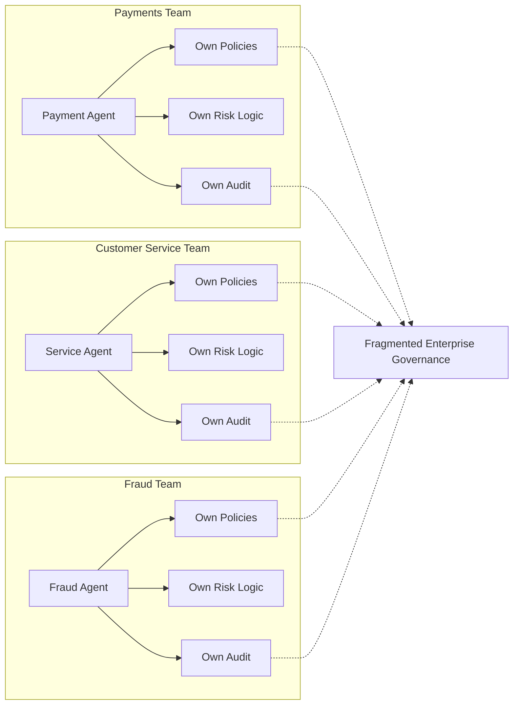
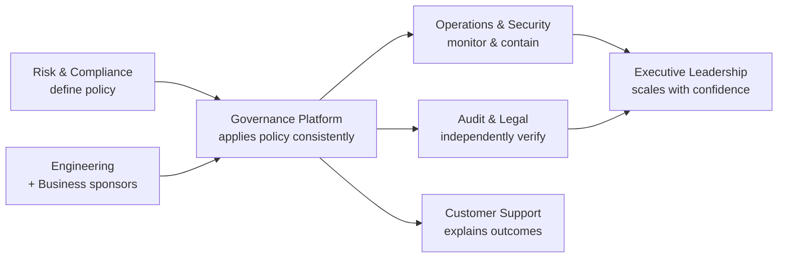
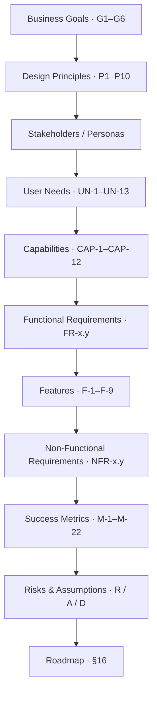

# Product Requirements Document — Governance Layer for Financial Agents

> **Program:** American Express CodeStreet 2026
> **Product (working name):** Enterprise AI Governance Layer — _A Governance Platform for Autonomous Financial Agents_

---

## §0. Document Control

| Field              | Value                                                                                                             |
| ------------------ | ----------------------------------------------------------------------------------------------------------------- |
| Document title     | PRD — Governance Layer for Financial Agents                                                                       |
| Version            | 0.1 (Draft)                                                                                                       |
| Status             | In Review                                                                                                         |
| Document owner     | Product Management                                                                                                |
| Contributing roles | Product, Engineering, Solution Architecture, Risk, Compliance, Security                                           |
| Intended audience  | Product Managers, Engineering Managers, Solution Architects, Risk & Compliance leads, Hackathon Judges            |
| Related documents  | _(to be produced)_ Solution & System Design; Backend & Data Design; AI & Governance Design; Proposal/Presentation |
| Confidentiality    | Internal — Hackathon submission                                                                                   |

### Reviewer sign-off

| Reviewer role          | Name | Decision | Date |
| ---------------------- | ---- | -------- | ---- |
| Product Management     | —    | Pending  | —    |
| Engineering Management | —    | Pending  | —    |
| Solution Architecture  | —    | Pending  | —    |
| Risk / Compliance      | —    | Pending  | —    |
| Security               | —    | Pending  | —    |

### Change log

| Version   | Date       | Author  | Summary                                                                                                                                                                                                      |
| --------- | ---------- | ------- | ------------------------------------------------------------------------------------------------------------------------------------------------------------------------------------------------------------ |
| 0.1       | 2026-07-23 | Product | Initial draft — Document Control and Executive Summary.                                                                                                                                                      |
| 0.1.1     | 2026-07-23 | Product | Renamed product to Enterprise AI Governance Layer; strengthened positioning, value proposition, and business impact; added Current/Future state and positioning refinements.                                 |
| 0.2       | 2026-07-23 | Product | Added §2 Problem Analysis and §2a Regulatory & Compliance Landscape (research-grounded).                                                                                                                     |
| 0.2.1     | 2026-07-23 | Product | §2 executive refinement: fragmentation diagram, executive-questions callout, scale narrative, categorized risks, decision-governance framing, stronger close.                                                |
| 0.3       | 2026-07-23 | Product | Added §3 Product Vision (vision, mission, success signals, organizational transformation, goals, non-goals).                                                                                                 |
| 0.3.1     | 2026-07-23 | Product | §3 executive refinement: Vision at a Glance, Current→Future table, strengthened mission, Vision Principles, goals/non-goals intros, memorable close. Renumbered subsections to 3.1–3.8.                      |
| 0.4       | 2026-07-23 | Product | Added §4 Design Principles (P1–P10), each with statement, rationale, practice, trade-offs, and explicit rejections.                                                                                          |
| 0.5       | 2026-07-23 | Product | Added §5 Scope: scope statement, in/out of scope by domain, responsibility matrix, worked boundary examples, summary — all traced to P1–P10.                                                                 |
| 0.6       | 2026-07-23 | Product | Added §6 Stakeholders: philosophy, ten stakeholder groups, RACI matrix, objectives, collaboration model, summary.                                                                                            |
| 0.7       | 2026-07-24 | Product | Added §7 Personas (five: developer, policy officer, ops engineer, audit analyst, administrator) + persona bridge matrix. Adopted revised structure: new §8 User Needs to follow, renumbering later sections. |
| 0.8       | 2026-07-24 | Product | Added §8 User Needs: thirteen themed needs (UN-1–UN-13) with persona/principle/goal traceability and coverage verification.                                                                                  |
| 0.9       | 2026-07-24 | Product | Added §9 Product Capabilities: twelve capabilities (CAP-1–CAP-12) across ten domains, with UN/persona/principle/goal traceability and coverage validation.                                                   |
| 0.10      | 2026-07-24 | Product | Added §10 Functional Requirements: 34 testable requirements (FR-x.y) organized by capability, each with normative statement, source trace, priority, and acceptance criteria.                                |
| 0.11      | 2026-07-24 | Product | Added §11 Product Features: nine features (F-1–F-9, Core/Enhanced) packaging all 34 FRs, with capability/persona traceability, priority, and FR→feature coverage validation.                                 |
| 0.12      | 2026-07-24 | Product | Added §12 Release Strategy & Prioritization: release philosophy, MVP definition (F-1–F-8), MoSCoW table, deferred scope, and release validation.                                                             |
| 0.13      | 2026-07-24 | Product | Added §13 Non-Functional Requirements: 26 NFRs across 10 quality attributes, technology-agnostic, with principle/goal traceability and coverage validation. Numeric targets marked as proposed defaults.     |
| 0.14      | 2026-07-24 | Product | Added §14 Success Metrics & KPIs: 22 KPIs (M-1–M-22) across five dimensions, with goal/feature coverage validation. Unknown targets marked [TBD].                                                            |
| 0.15      | 2026-07-24 | Product | Added §15 Risks, Assumptions & Dependencies: product & organizational risks (R-1–R-12), assumptions (A-1–A-8), external dependencies (D-1–D-6), mitigation summary, and coverage validation.                 |
| 1.0-draft | 2026-07-24 | Product | Added §16 Product Roadmap & Future Evolution (evolution philosophy, near/medium/long-term, permanent principles, closing statement). First complete PRD draft.                                               |
| 1.0       | 2026-07-24 | Product | Added Appendix A — End-to-End Requirements Traceability Matrix (goal/principle/capability/FR/feature/quality traceability + coverage checklist). No content changes to §§0–16.                               |

### Reading guide

This document is **product-focused**. It defines _why_ the product exists, _who_ uses it, and _what_ it must do. It deliberately excludes technology stack, data models, APIs, and architecture — those are specified in the Solution & System Design and later documents. Where an enforcement or design mechanism is implied, the PRD states the **requirement and outcome**, not the implementation.

By design, this PRD captures **product intent** — the problem, the users, and the required capabilities. Architectural decisions are intentionally deferred: how governance is realized, enforced, and integrated is the responsibility of the **Solution & System Design** document that follows. Keeping these boundaries clear ensures the product requirements remain stable even as implementation approaches evolve.

---

## §1. Executive Summary

### 1.1 Problem overview

**Why now.** Financial institutions are crossing a threshold — from AI that _assists_ human decisions to AI that _executes_ financial actions. The rapid adoption of large language models, the rise of autonomous AI agents, and the maturity of tool-calling have made it practical for software to reason over a request and then _act_ on it: initiate a refund, adjust a limit, move money, or contact a customer, with little or no human in the path. At the same time, regulatory expectations for how automated decisions are controlled, explained, and audited are rising sharply. The industry is moving from **AI-assisted decisions** to **AI-executed actions**, and the governance model has not kept pace.

This shift delivers speed and scale, but it removes the human checkpoint that has historically enforced policy, risk controls, and accountability before a sensitive action occurs.

Today, each agent tends to implement its own guardrails in its own code. The result is **fragmented, inconsistent, and unauditable governance**:

- Controls are duplicated per agent and drift out of sync with policy.
- There is no single place to answer _"was this action allowed, and why?"_
- Risk and Compliance teams gain visibility only **after** an action has already happened.
- There is no consistent way to pause a misbehaving agent, prove control effectiveness to auditors, or explain an automated decision.

As the number of autonomous agents grows, this ungoverned surface area becomes a **material operational, financial, and regulatory risk**.

**Current state vs. future state.** The transformation the platform enables can be read in under thirty seconds:

| Today                                                     | With the Enterprise AI Governance Layer          |
| --------------------------------------------------------- | ------------------------------------------------ |
| Governance implemented independently inside each AI agent | Centralized, enterprise-wide governance          |
| Fragmented, team-specific policies                        | Organization-wide, consistent policies           |
| Divergent audit logs and formats                          | Unified, tamper-evident audit trail              |
| Manual, after-the-fact investigations                     | Explainable governance decisions on every action |
| Compliance evidence assembled by hand                     | Compliance-ready governance by default           |
| Limited, siloed operational visibility                    | Centralized monitoring and oversight             |
| Uniform or ad-hoc controls per agent                      | Governance proportionate to each action's risk   |

### 1.2 Proposed solution

We propose the **Enterprise AI Governance Layer** — a centralized enterprise governance platform that governs autonomous financial agents before they perform sensitive actions. It acts as an organizational trust layer: a single, reusable enterprise capability through which every governed action is evaluated against centralized policy, risk, and authorization controls **appropriate to its risk level**, with every decision recorded in an immutable, explainable audit trail.

The Enterprise AI Governance Layer is an **enterprise platform, not a chatbot**. It does not perform financial work itself; it governs the agents that do. It provides one consistent, centrally managed answer to a single question, for every agent and every action:

> _"Is this agent allowed to take this action, right now, given current policy and risk — and can we prove it later?"_

The platform supports **preventive governance for high-risk actions** (money movement, credit and limit changes, irreversible operations) and **proportionate governance for lower-risk actions** (read-only or reversible operations), so that safety and operational speed are balanced by design.

#### Product Positioning

| Question                        | Answer                                                                                                                                                                                   |
| ------------------------------- | ---------------------------------------------------------------------------------------------------------------------------------------------------------------------------------------- |
| **What is it?**                 | An Enterprise AI Governance Layer for autonomous financial agents.                                                                                                                       |
| **What problem does it solve?** | Centralized governance, policy enforcement, authorization, risk evaluation, auditability, explainability, and operational control for AI agents — as one reusable enterprise capability. |
| **What is it NOT?**             | Not an AI chatbot, not an AI agent framework, not a fraud detection system, and not a core banking platform.                                                                             |
| **Who is it for?**              | Financial institutions deploying autonomous AI agents across multiple business domains.                                                                                                  |
| **Why is it different?**        | Governance is externalized into a single centralized enterprise capability, instead of being embedded and re-implemented independently inside every AI agent.                            |

### 1.3 Key capabilities

Capabilities are presented in the order they engage across the lifecycle of a single agent action — from the policies that govern it, through the decision to allow or escalate it, to the audit and oversight that follow.

| #   | Capability                  | What it provides                                                                                                               |
| --- | --------------------------- | ------------------------------------------------------------------------------------------------------------------------------ |
| 1   | **Policy Management**       | One authoritative place to define, version, and manage what agents may and may not do.                                         |
| 2   | **Authorization**           | Per-agent entitlements enforcing least privilege, so each agent can perform only the actions it is explicitly permitted.       |
| 3   | **Risk Evaluation**         | Contextual assessment of how risky a specific action is at the moment it is requested.                                         |
| 4   | **Human Approval**          | A path for sensitive actions to be reviewed and approved by an accountable person before they proceed.                         |
| 5   | **Execution Governance**    | The decision to allow, block, or escalate an action — preventively for high-risk actions, proportionately for lower-risk ones. |
| 6   | **Audit & Traceability**    | A tamper-evident, immutable record of every governed action and decision, for investigation and audit.                         |
| 7   | **Explainability**          | A clear, human-readable reason for every allow / deny / escalate decision.                                                     |
| 8   | **Monitoring & Visibility** | Dashboards and reporting on agent activity and governance outcomes for Risk, Compliance, Security, and Operations teams.       |
| 9   | **Emergency Controls**      | The ability to pause, throttle, or emergency-stop an individual agent or a class of agents.                                    |

### 1.4 Core value proposition

> **One governed front door for every autonomous financial action.** Rather than each AI agent re-implementing its own policy, risk, and audit logic in isolation, the Enterprise AI Governance Layer consolidates governance into a single reusable enterprise platform that evaluates, authorizes, and records each action _before_ it executes — applying preventive control to high-risk actions and proportionate control to lower-risk ones — turning agent trust from a per-team effort into an organizational capability.

### 1.5 Business impact

| Dimension                     | Impact                                                                                                                                                                                                                                                             |
| ----------------------------- | ------------------------------------------------------------------------------------------------------------------------------------------------------------------------------------------------------------------------------------------------------------------ |
| **Risk reduction**            | Prevents unauthorized, out-of-policy, or high-risk agent actions before they cause financial or customer harm.                                                                                                                                                     |
| **Regulatory readiness**      | Produces the auditability, explainability, and accountability evidence expected for automated decision-making in financial services.                                                                                                                               |
| **Faster, safer AI adoption** | Lets teams deploy new agents on a shared, trusted governance foundation instead of rebuilding controls each time.                                                                                                                                                  |
| **Engineering productivity**  | A reusable governance platform eliminates duplicated per-agent governance logic, accelerates deployment of new AI agents, and reduces operational complexity for platform teams.                                                                                   |
| **Business agility**          | Shared, reusable governance lets teams launch new AI agents faster and onboard them with less effort, so the organization can innovate at speed while every agent inherits consistent governance — reducing organizational friction rather than adding a new gate. |
| **Operational resilience**    | Provides a central "brake" to contain a misbehaving agent without shutting down the wider platform.                                                                                                                                                                |
| **Lower cost of control**     | Replaces duplicated, per-agent guardrail code with one governed, reusable enterprise layer.                                                                                                                                                                        |

### 1.6 Vision statement

> **Empower every financial institution to deploy autonomous AI with confidence** — where each agent action is governed, authorized, and accountable by default, and where trust, oversight, and operational control are built into the organization rather than bolted onto each agent.

---

## §2. Problem Analysis

> **Working definition — Autonomous Financial Agent.** An AI-driven software actor that can independently interpret a goal, decide on a course of action, and execute financial operations — for example, _initiating a payment_, _issuing a refund or credit adjustment_, _changing a credit limit_, _sending a customer financial communication_, or _retrieving customer data_ — by calling enterprise systems, with limited or no human involvement at the moment of action. _(A formal definition appears in the Glossary.)_

Autonomous financial agents are moving from experiment to operation. This section establishes why their arrival creates a genuine, near-term governance problem — one that existing enterprise controls were never designed to solve — and why the answer is a shared governance capability rather than more guardrails inside each agent. A theme runs throughout: what the enterprise ultimately needs to govern is not the _software_ itself, but the **autonomous decisions** that software now makes and executes on its own.

### 2.1 Industry Evolution

Enterprise software has passed through four eras and is entering a fifth. At each step, _software gained more autonomy over consequential decisions_ — and governance had to work harder to keep pace.

| Era                             | What the software does                                 | Who decides the action                                      | Governance mechanism of the era                | Residual gap                                  |
| ------------------------------- | ------------------------------------------------------ | ----------------------------------------------------------- | ---------------------------------------------- | --------------------------------------------- |
| **Traditional software**        | Executes fixed, deterministic logic                    | A human, in advance, via code                               | Code review, change management, access control | Behavior is knowable ahead of time            |
| **Automation (RPA, workflows)** | Repeats predefined steps at scale                      | A human, via a fixed script                                 | Approvals, business rules, audit logs          | Still deterministic; every path is enumerable |
| **AI assistants**               | Recommends; a human acts                               | AI suggests, **human decides**                              | Human judgment remains the control point       | The human is still the safeguard              |
| **Agentic AI**                  | Plans and acts across tools                            | **AI decides and executes**                                 | Ad-hoc, per-agent guardrails in code           | The human checkpoint is removed               |
| **Autonomous financial agents** | Executes sensitive money-movement and customer actions | **AI decides and executes, at scale, in regulated domains** | _Not yet standardized_                         | No consistent, enterprise-wide control        |

**The inflection point.** For the first four eras, the set of actions software could take was **knowable in advance** — enumerable by a developer, reviewable by a risk officer. Agentic AI breaks that assumption. An agent's path is decided _at runtime_, by model inference, in response to context that did not exist when its permissions were granted. Governance can no longer be fully "designed in" beforehand; it must be **evaluated in the moment the action is attempted.**

**So what?** Governance requirements did not grow linearly — they changed _in kind_ at the agentic step. In the first four eras the enterprise governed _software behavior_, which was designed in advance; from the agentic step onward it must govern _autonomous decisions_, which are made in the moment. The controls that served the first four eras assume determinism. The fifth era does not offer it.

### 2.2 Current Enterprise Landscape

Today, governance for AI agents is built **where the agent is built** — by each team, for its own agent, in its own way. There is no shared substrate.

In a typical large institution, several teams are simultaneously shipping agents for payments, servicing, collections, and fraud operations. Each team, acting responsibly, implements its own controls:

| What each team builds independently              | Consequence at enterprise scale                                                  |
| ------------------------------------------------ | -------------------------------------------------------------------------------- |
| Its own policy logic ("what may this agent do?") | Policies diverge and drift; no single source of truth                            |
| Its own permission model                         | Entitlements are inconsistent and hard to certify                                |
| Its own audit logging                            | Logs differ in format, depth, and retention; cross-agent investigation is manual |
| Its own approval workflow                        | "High-risk" means something different for every agent                            |
| Its own risk thresholds                          | No comparability; no portfolio view of agent risk                                |
| Its own kill switch (if any)                     | No reliable, uniform way to stop misbehaving agents                              |

The result is **structural fragmentation**: governance exists, but it is duplicated, uneven, and invisible in aggregate. Each team is, in effect, governing its own agents' decisions in isolation — and no one is governing the institution's autonomous decisions as a whole.

**The real challenge is scale, not any single agent.** Governing one autonomous agent is tractable — a capable team can wrap it in sensible controls. The enterprise problem is different in nature: it is governing **hundreds or thousands of independently developed agents**, spanning payments, servicing, collections, and fraud, each making consequential decisions on its own — while holding them all to **one consistent enterprise governance model**. Fragmentation is manageable at three agents and unmanageable at three hundred. The controls do not fail because any team was careless; they fail because there is no shared standard for the decisions those agents make.

**So what?** This is not a failure of any one team; it is the predictable outcome of solving a shared problem privately. Every new agent multiplies the surface area and the inconsistency. The problem compounds precisely as adoption accelerates — and industry surveys indicate most institutions are still early, running pilots rather than production fleets. **The cheapest time to standardize governance is before the fleet exists, not after.**

#### Today's fragmented enterprise

Each team independently builds the policies, risk logic, and audit around its own agent. Consistent enterprise governance is what falls through the gaps.

#### Questions Every Executive Should Be Able to Answer

A well-governed institution should be able to answer each of the following _at any moment_. Today, in a fragmented model, most cannot be answered without a manual, multi-team investigation:

- **Which autonomous agents can move money today** — and up to what limit?
- **Which agent made a decision that violated policy yesterday**, and what was the action?
- **Which version of which policy approved a specific action** after the fact?
- **Who is ultimately accountable** for a given autonomous decision?
- **Can a single misbehaving agent be stopped immediately** — without disrupting every other agent?
- **Which agents are currently operating outside approved governance** entirely?

Each question is reasonable. The inability to answer it is the problem — and it is a direct consequence of governing decisions agent-by-agent rather than institution-wide.

### 2.3 Why Existing Controls Are No Longer Enough

The enterprise already owns a mature control stack. These controls are not wrong — they are simply built for a world where software behavior is **deterministic and known at design time**. Autonomous agents violate that premise.

| Existing control             | What it was designed to govern                        | Why it strains with autonomous agents                                                                                                                          |
| ---------------------------- | ----------------------------------------------------- | -------------------------------------------------------------------------------------------------------------------------------------------------------------- |
| **IAM / Authentication**     | _Who_ is calling — verifying identity                 | Confirms an agent's identity, but not whether _this action, in this context_ is appropriate. Identity ≠ intent.                                                |
| **RBAC (role-based access)** | Stable, human roles with enumerable permissions       | An agent's needed permissions vary by _task and context_ (retrieving an order vs. issuing a refund). Static roles are either over-privileged or too narrow.    |
| **ABAC / policy engines**    | Attribute-based decisions on known resources          | Closer to what agents need, but typically embedded per-application — not a shared, agent-aware governance service with risk and audit built in.                |
| **API gateways**             | Traffic shaping, rate limits, schema validation       | Sees requests as well-formed or not — it cannot judge whether a _well-formed_ $50,000 refund is _appropriate_ for this agent right now.                        |
| **Traditional audit logs**   | After-the-fact reconstruction of deterministic events | Record _what happened_, not _why the decision was allowed_ or _what the agent intended_ — insufficient to explain an autonomous decision to an auditor.        |
| **Application guardrails**   | Safety rails inside one application                   | Live inside each agent; they cannot be centrally governed, versioned, compared, or proven consistent across the fleet.                                         |
| **Human approval workflows** | Routing a known, bounded set of exceptions            | Effective, but only if _something_ first decides which actions are high-risk enough to route — a judgment agents currently make inconsistently, or not at all. |

**The common thread.** Every one of these controls answers a _design-time_ question: _is this identity known, is this role allowed, is this request well-formed?_ Autonomous agents pose a _runtime_ question: _given who this agent is, what it is trying to do, and how risky that is right now — should this specific action proceed?_ No existing control answers that question as a **shared, consistent, auditable enterprise service.**

**So what?** The gap is not a missing feature in any one tool. It is a missing _layer_ — one that sits between the agent and the action and makes a governed decision every time.

### 2.4 Emerging Risks

When decision-making moves into software that acts on its own, the risks are not merely technical — they are **business risks** that land on the P&L, the regulator's desk, and the customer relationship. They fall into four categories.

**Operational risks** — the institution's ability to run and contain its agents day to day.

| Risk                               | Business impact                                                             | Illustrated by                                                                                      |
| ---------------------------------- | --------------------------------------------------------------------------- | --------------------------------------------------------------------------------------------------- |
| **Over-privileged agents**         | A single compromised or malfunctioning agent can do disproportionate damage | A servicing agent retains standing authority to make large **credit limit changes** it rarely needs |
| **Operational risk / containment** | Inability to contain a misbehaving agent quickly and selectively            | A faulty agent must be stopped without taking down the systems it shares                            |

**Governance risks** — the institution's ability to control and prove what its agents' decisions are permitted to do.

| Risk                       | Business impact                                                                                      | Illustrated by                                                                               |
| -------------------------- | ---------------------------------------------------------------------------------------------------- | -------------------------------------------------------------------------------------------- |
| **Unauthorized actions**   | Financial loss and rework when an agent takes a decision it should never have been permitted to make | An agent initiates a **payment** to a destination outside approved parameters                |
| **Policy drift**           | Controls silently diverge from current policy; the institution cannot prove what was enforced when   | Different agents apply different **refund / credit adjustment** limits after a policy change |
| **Weak action provenance** | No reliable chain of _which agent, on whose behalf, under what authority_ a decision was made        | A disputed **customer financial communication** cannot be traced to an accountable source    |

**Compliance risks** — the institution's ability to satisfy auditors, regulators, and its own accountability standards.

| Risk                             | Business impact                                                                                         | Illustrated by                                                                               |
| -------------------------------- | ------------------------------------------------------------------------------------------------------- | -------------------------------------------------------------------------------------------- |
| **Lack of explainability**       | Decisions cannot be justified to auditors, regulators, or customers; investigations are slow and manual | A **credit limit change** is challenged and no clear reason for the decision can be produced |
| **Regulatory exposure**          | Findings, remediation cost, and reputational damage from ungoverned automated decisions                 | Automated decisions lack the auditability and accountability supervisors now expect          |
| **Diffuse human accountability** | When "the AI decided," no person is clearly answerable — unacceptable in regulated finance              | No named owner can be identified for an autonomous decision after the fact                   |

**Customer & business risks** — the institution's franchise, trust, and long-term relationship with customers.

| Risk                          | Business impact                                                                     | Illustrated by                                                                                         |
| ----------------------------- | ----------------------------------------------------------------------------------- | ------------------------------------------------------------------------------------------------------ |
| **Erosion of customer trust** | Customer harm from wrong or inappropriate automated decisions damages the franchise | A customer receives an incorrect **financial communication** or has **data retrieved** inappropriately |

**So what?** Each risk is individually familiar to a risk officer. What is new is that they now arise _from software making decisions on its own, continuously, at scale_ — and no current mechanism addresses them consistently across every agent's decisions at once.

### 2.5 Opportunity

The instinct is to respond with _better guardrails_ — stronger rules inside each agent. That instinct is understandable and insufficient. Better per-agent guardrails still leave the institution with the same structural problem: **N agents, N implementations, N interpretations of policy, N audit formats, and no aggregate control.** Improving each silo does not remove the silos.

The opportunity is to treat governance the way the industry once learned to treat identity, payments, and observability: **as a shared enterprise capability, not a per-team responsibility.**

- Just as no team builds its own authentication system, no team should build its own agent governance.
- A single, reusable capability can enforce **one set of policies**, apply **consistent, risk-proportionate control**, produce **one audit standard**, and offer **one place to see and stop** every agent.
- This turns agent trust from a variable — dependent on which team built which agent — into a **property of the platform** every agent inherits by default.

The prize is not incremental safety. It is the ability to **adopt autonomous financial AI at scale with confidence** — deploying new agents quickly _because_ the governance of their decisions is already handled, consistently, centrally, and provably.

**The conclusion.** The transition to autonomous financial agents is already underway, and with it the shift from governing software to **governing the decisions that software now makes on its own**. The question is therefore no longer _whether_ autonomous financial agents require governance — that debate is settled. The real question is one of **architecture of responsibility**: should the governance of autonomous decisions remain fragmented inside every agent, re-invented team by team, or become a single reusable enterprise capability that every agent inherits by default? This document argues for the latter — and the next section defines the vision for what that capability must be.

---

## §2a. Regulatory & Compliance Landscape

This section frames the **expectations** that autonomous financial agents must meet. It is intentionally not a legal catalog. Supervisory detail varies by jurisdiction and evolves quickly; what remains stable is a set of **business expectations** that any institution deploying autonomous agents will be held to — by regulators, auditors, boards, and customers alike.

### 2a.1 The expectation categories

| Expectation                        | What it requires in practice                                                                                   | Why autonomous agents raise the bar                                                         |
| ---------------------------------- | -------------------------------------------------------------------------------------------------------------- | ------------------------------------------------------------------------------------------- |
| **Auditability**                   | Every consequential action can be reconstructed: what happened, under what authority, and why it was permitted | Agent decisions are made at runtime; without deliberate capture, the "why" is lost          |
| **Explainability**                 | Automated decisions can be explained in human terms, proportional to their risk                                | A denied or approved **credit limit change** must have a stated, defensible reason          |
| **Accountability**                 | A specific, named owner is answerable for each automated decision                                              | "The model decided" is not an acceptable answer in regulated finance                        |
| **Operational resilience**         | The institution can detect, contain, and recover from a malfunctioning automated system                        | A misbehaving agent must be stoppable quickly and selectively                               |
| **Model risk management**          | AI systems that make decisions are governed, monitored, and validated over their lifecycle                     | Legacy model governance assumed _static, bounded_ models; agents are dynamic and autonomous |
| **Consumer protection & fairness** | Customers are treated fairly and consistently by automated processes                                           | Inconsistent agent behavior across a customer base is both a conduct and a fairness concern |

### 2a.2 Anchoring references

Two widely recognized, non-jurisdiction-specific references establish that these expectations are mainstream, not aspirational:

- **NIST AI Risk Management Framework (AI RMF).** Organizes AI governance around _Govern, Map, Measure, Manage_, and explicitly emphasizes **accountability, transparency, and explainability proportional to risk** — the same risk-proportionate stance this product adopts.
- **ISO/IEC 42001:2023 (AI Management System).** The first management-system standard for AI, establishing that AI governance should be **structured, auditable, and continuously managed** as an organizational discipline — not improvised per project.

Established **model risk management** practice reinforces the point: its traditional assumptions — that a model is a _relatively static, bounded, reconstructable_ representation — strain when applied to systems that decide and act autonomously. That strain is precisely the space a dedicated governance layer is meant to fill.

### 2a.3 The implication for this product

These expectations are **cross-cutting** — they apply to every agent and every sensitive action, regardless of which team built the agent. Meeting them consistently is exactly what a fragmented, per-agent approach cannot guarantee, and exactly what a shared governance capability is positioned to deliver: **auditability, explainability, accountability, and control as defaults of the platform, not features each team must re-earn.**

---

## §3. Product Vision

§2 ended on a question: should the governance of autonomous decisions stay fragmented inside every agent, or become one reusable enterprise capability? This section does not re-argue that question — it describes the **future that answering it correctly creates**, and commits to the goals and boundaries that define it.

### 3.1 Vision statement

> **A future where autonomous finance is trusted by default** — where any team can deploy an agent that decides and acts on the institution's behalf, and every one of those decisions is already governed, explainable, and accountable, without a single team having to build governance itself.

In that future, **governed autonomy is the default state of the enterprise, not a privilege earned agent by agent.** Trust stops being a question asked repeatedly — _can we trust this new agent?_ — and becomes a property the institution simply has, because every autonomous decision passes through the same governed path before it takes effect. Governance becomes infrastructure the organization can rely on the way it relies on identity or settlement: present everywhere, assumed, and invisible until it is needed.

#### Vision at a Glance

|             |                                                                                               |
| ----------- | --------------------------------------------------------------------------------------------- |
| **Vision**  | Autonomous finance, trusted by default.                                                       |
| **Mission** | One place to govern every autonomous decision — making safe AI adoption possible, not slower. |
| **Pillars** | **1 · Govern Every Decision** — **2 · Scale AI with Confidence** — **3 · Trust by Default**   |

### 3.2 Mission

> **Give financial institutions one place to govern every autonomous decision — protecting the institution and its customers while accelerating AI adoption, not restraining it.**

The Governance Layer exists to make _safe_ autonomous finance possible. It is not a brake on AI adoption; it is what allows the institution to say _yes_ to it. Institutions scale AI without scaling risk — and move faster precisely because every decision is already governed.

### 3.3 Current → future: the transformation at a glance

The vision translates into a concrete change in how the institution operates. The shift is summarized here, then explored in the sections that follow.

| Dimension            | Today                                       | Tomorrow                                                    |
| -------------------- | ------------------------------------------- | ----------------------------------------------------------- |
| **Governance model** | Built per agent, per team                   | Inherited from the enterprise platform                      |
| **Engineering**      | Rebuilds controls for every new agent       | Builds agent capability; governance comes with the platform |
| **Risk**             | Assesses each agent one at a time           | Sets enterprise policy once, applied everywhere             |
| **Compliance**       | Assembles evidence after the fact           | Evidence produced by default, continuously                  |
| **Operations**       | Fragmented, per-team visibility and control | One place to observe and contain the whole fleet            |
| **Leadership**       | Weighs whether to risk saying "yes" to AI   | Says "yes" by default, because AI is already governed       |
| **AI adoption**      | Gated by bespoke, case-by-case review       | Accelerated by inherited governance                         |

### 3.4 What success looks like

If this product exists and succeeds, the change is observable — not in slideware, but in how the institution actually operates:

| In the successful future…                                        | Observable signal                                                                                           |
| ---------------------------------------------------------------- | ----------------------------------------------------------------------------------------------------------- |
| Deploying an agent is an engineering act, not a governance event | A new agent reaches production in days, inheriting policy, risk, audit, and control on day one              |
| Every sensitive autonomous decision is accounted for             | Leadership can name, at any moment, every agent that can move money and the authority under which it does   |
| Oversight is proactive, not forensic                             | Risk and Compliance watch decisions as they are governed, rather than reconstructing them after an incident |
| Containment is instant and surgical                              | A single misbehaving agent can be stopped in seconds without disrupting the rest of the fleet               |
| Explaining a decision takes minutes, not weeks                   | Any governed decision can be reproduced with its reason, policy version, and accountable owner attached     |
| Governance scales sub-linearly with agents                       | The hundredth agent costs no more to govern than the tenth                                                  |

Success is not that the institution has _more controls_. It is that governance has become **effortless, consistent, and provable** across every agent at once.

### 3.5 The organizational transformation this enables

The at-a-glance shifts in §3.3 become real through people. Beyond _what_ changes, the deeper transformation is _how each function relates_ to autonomous AI — as governance moves from a **gate** that slows adoption to a **foundation** that accelerates it.

| Function                  | How its role changes                                                                                             |
| ------------------------- | ---------------------------------------------------------------------------------------------------------------- |
| **Engineering teams**     | Stop reinventing governance; spend their effort on agent capability, trusting the platform for control           |
| **Risk & Compliance**     | Move from case-by-case review of each new agent to setting enterprise policy once and overseeing it continuously |
| **Security & Operations** | Gain one console to see, contain, and audit the entire agent fleet, rather than a patchwork per team             |
| **Business & Leadership** | Can say _yes_ to autonomous AI faster, because the answer to "is it governed?" is already "yes, by default"      |

This is the transformation the vision is really about: **turning governance from the thing that holds autonomous AI back into the thing that lets the institution embrace it with confidence.**

### 3.6 Vision principles

These are not design principles — those follow in §4. They are the **enduring beliefs about the future** the product is built to create. They should hold true regardless of how the product is implemented, and every later decision should remain consistent with them.

1. **Trust should be inherited, not rebuilt.** Every agent should receive governance from the platform; none should have to re-implement it.
2. **Governance should enable innovation, not gate it.** Done right, control accelerates adoption rather than restraining it.
3. **Every autonomous decision should remain accountable.** No decision should ever be beyond explanation or ownership.
4. **Safety should scale with autonomy.** As agents gain reach, governance should grow with them automatically, not lag behind.
5. **Enterprise consistency should outweigh local optimization.** One coherent standard serves the institution better than many individually optimal ones.

### 3.7 Goals

Goals describe **outcomes, not features**. They are intentionally technology-agnostic: the specific capabilities that achieve them may change over time, but the goals themselves should remain stable for the life of the product. A proposed feature that moves none of these goals is worth questioning.

The product commits to a small set of outcome goals. Each is a destination, not a feature.

| #      | Goal                                | What "achieved" means                                                                                                             |
| ------ | ----------------------------------- | --------------------------------------------------------------------------------------------------------------------------------- |
| **G1** | **Universal coverage**              | Every sensitive autonomous decision, across every governed agent, passes through the same governance path before it takes effect. |
| **G2** | **Risk-proportionate control**      | High-risk decisions receive preventive control; lower-risk decisions receive proportionate, low-friction governance.              |
| **G3** | **Provable accountability**         | Every governed decision can be explained and attributed to a policy, an agent, and an accountable owner.                          |
| **G4** | **Fleet-scale operational control** | The institution can observe, pause, throttle, or stop any agent — individually or by class — without collateral disruption.       |
| **G5** | **Governance as an accelerator**    | New agents onboard quickly because governance is inherited from the platform, not rebuilt per team.                               |
| **G6** | **One enterprise standard**         | A single, consistent model for policy, authorization, risk, and audit replaces divergent per-team implementations.                |

### 3.8 Non-Goals

Great enterprise products succeed by solving one problem completely, not many partially. Explicit non-goals are a strategic discipline: they protect focus, preserve the product's role as a trusted and neutral control point, and make clear where the platform _integrates with_ other systems rather than absorbing them. Here, boundaries are not limitations — they are what make the vision achievable.

Defining what the product is _not_ is therefore as important as defining what it is. The following are explicit non-goals for the initial product. _(These are stated as assumptions pending confirmation; each has a noted rationale and, where relevant, a future path.)_

| Non-goal                                               | Why it is out of scope                                                                                                                                                           | Future path                       |
| ------------------------------------------------------ | -------------------------------------------------------------------------------------------------------------------------------------------------------------------------------- | --------------------------------- |
| **Building or running the agents themselves**          | The product governs autonomous decisions; it is not an agent framework, runtime, or orchestration engine. Conflating the two would compromise its neutrality as a control point. | Remains out of scope by design    |
| **Executing financial transactions**                   | It decides whether an action _may_ proceed; it does not move money or post entries. It governs the decision, not the settlement.                                                 | Remains out of scope by design    |
| **Making the business decision for the agent**         | It does not decide _what_ the refund amount should be or _whether_ a customer qualifies; it governs whether the agent's decision may proceed.                                    | Remains out of scope by design    |
| **Fraud detection / transaction scoring**              | Distinct discipline with its own systems; the platform may _consume_ such signals as risk inputs but does not replace them.                                                      | Integrate as a risk input         |
| **Third-party / partner agents**                       | The initial product targets first-party agents to keep the trust boundary clean; external agents require additional isolation and identity design.                               | Planned extension after v1        |
| **Replacing existing enterprise controls (IAM, etc.)** | The platform complements identity, access, and network controls; it governs the decision layer they were never designed for.                                                     | Integrates with, does not replace |

**The destination.** The future this vision describes is not one where every AI agent is painstakingly made trustworthy — an endless, per-agent effort that never quite finishes. It is one where the enterprise **no longer has to ask whether an agent is trustworthy at all**, because every autonomous decision already passes through a trusted governance capability before it can take effect. Trust becomes a property of the institution, not a verdict rendered agent by agent. What must stay constant as the product evolves — the beliefs, priorities, and constraints that keep it faithful to this future — is the work of the design principles that follow.

---

## §4. Design Principles

These principles are the product's **laws**. Every later requirement, feature, workflow, and architectural choice must obey them. The test for any future proposal is a single question: _does it violate one of these principles?_ If it does, the proposal is wrong — or the product is quietly becoming something other than a governance layer.

Each principle is stated with what it **deliberately rejects**, because a principle that rejects nothing constrains nothing. Principles are referenced elsewhere in this document by their IDs (P1–P10).

| ID      | Principle                                        | In one line                                                             |
| ------- | ------------------------------------------------ | ----------------------------------------------------------------------- |
| **P1**  | Governance Remains External to the Agent         | The agent is governed _by_ the platform, never by itself                |
| **P2**  | Govern the Decision, Not the Agent               | Trust is judged per action, not granted to an agent wholesale           |
| **P3**  | Authority Is Evaluated at the Moment of Decision | Permission is decided when the action is attempted, not only in advance |
| **P4**  | Governance Is Proportional to Risk               | Rigor and friction scale with the stakes of the decision                |
| **P5**  | Every Decision Is Reproducible                   | Any governed decision can be reconstructed exactly, later               |
| **P6**  | Every Decision Is Explainable                    | Every outcome carries a human-understandable reason                     |
| **P7**  | Every Decision Has an Accountable Human Owner    | No autonomous decision is ownerless                                     |
| **P8**  | Under Uncertainty, Default to the Safe Outcome   | When governance cannot decide confidently, safety wins                  |
| **P9**  | The Institution Can Always Override the Agent    | Containment never depends on the agent's cooperation                    |
| **P10** | The Platform Governs _Whether_, Not _What_       | It permits or denies actions; it never makes the business decision      |

---

### P1 — Governance Remains External to the Agent

**Statement.** Governance is enforced _outside_ the agent, by the platform — never implemented inside the agent it governs.

**Why it exists.** If every agent carries its own governance, the enterprise recreates the fragmentation the product exists to remove, and trust can no longer be _inherited_ — it must be rebuilt per agent. External governance is what makes "governed by default" possible.

**In practice.** An agent cannot self-certify that it followed the rules; the governing decision is made by a component the agent does not control. An agent that bypasses the layer is, by definition, ungoverned — and must not be able to act as though it were.

**Trade-offs.** Introduces a dependency between the agent and an external authority, and integration work to route decisions through it. The agent gives up the ability to act unilaterally on governed paths.

**Rejects.** Embedding policy, risk, or audit logic inside each agent; trusting an agent's own assertion that it complied.

---

### P2 — Govern the Decision, Not the Agent

**Statement.** The unit of governance is the individual action a decision produces, evaluated in its own context — not the agent's overall identity or reputation.

**Why it exists.** Agents are non-deterministic: a well-behaved, trusted agent can still attempt a wrong or out-of-policy action. Governing the agent wholesale ("this agent is approved") cannot catch the specific bad action; only governing the decision can.

**In practice.** The same agent may be allowed one action and denied the next moments later. Approving an agent is never the same as approving its actions. Every sensitive action stands or falls on its own merits.

**Trade-offs.** More evaluations than a one-time agent approval; the institution cannot "bless" an agent and stop checking its actions.

**Rejects.** Blanket trust in an agent; governing by agent identity alone; the assumption "this agent is approved, therefore its actions are approved."

---

### P3 — Authority Is Evaluated at the Moment of Decision

**Statement.** Whether an action is permitted is determined _when the action is attempted_ — against current policy, risk, and context — not solely by permissions granted in advance.

**Why it exists.** The set of actions an agent may attempt is not fully knowable when its permissions are first assigned. Authorization decided only at design time cannot account for the context that exists only at runtime.

**In practice.** Standing entitlements are necessary but not sufficient: an action permitted in principle can still be denied by current risk or context. A policy change takes effect on the _next_ decision, not on the next redeployment of the agent.

**Trade-offs.** Runtime evaluation adds cost on the decision path and depends on more live inputs than a static check.

**Rejects.** Treating pre-granted, static permissions as sufficient basis to act; authorization performed only at design time.

---

### P4 — Governance Is Proportional to Risk

**Statement.** The rigor and friction of governance scale with the risk of the decision — preventive control for high-risk actions, light-touch governance for low-risk ones.

**Why it exists.** Uniform governance fails in both directions: gate everything and the platform throttles the business; gate nothing and the dangerous few slip through. Proportionality is what lets governance be safe _and_ fast.

**In practice.** A routine customer-data read and a large payment are not governed identically. High-risk decisions may require human approval; low-risk decisions may be allowed and recorded. This presumes an explicit notion of risk tiers.

**Trade-offs.** Requires a means to classify a decision's risk — a judgment that can be wrong in either direction — and is more complex than a blanket "allow all" or "block all."

**Rejects.** One-size-fits-all governance; treating every action as equally dangerous; imposing high-risk friction on low-risk actions until they become unusable.

---

### P5 — Every Decision Is Reproducible

**Statement.** Any governed decision can be reconstructed after the fact — its inputs, the exact policy version applied, and its outcome — and would yield the same result.

**Why it exists.** Accountability and auditability are impossible without reconstruction: you cannot explain, investigate, or defend a decision whose basis has been lost. Reproducibility is the foundation the other accountability principles stand on.

**In practice.** The inputs and policy version are captured at the moment of decision; policy is versioned; no part of a decision's basis is ephemeral. An investigator can replay a decision months later and understand exactly why it went the way it did.

**Trade-offs.** Imposes capture and retention overhead and requires disciplined policy versioning.

**Rejects.** Decisions whose basis is lost after execution; ephemeral or best-effort logging; unversioned policy that cannot be pinned to a past decision.

---

### P6 — Every Decision Is Explainable

**Statement.** Every allow / deny / escalate outcome carries a reason a human can understand, proportional to the decision's risk.

**Why it exists.** A decision no one can explain cannot be defended to a regulator, an auditor, or a customer. Explainability is distinct from reproducibility: reproducing a decision shows _that_ it followed the rules; explaining it says _why_, in human terms.

**In practice.** An outcome is expressed as, in effect, "denied because policy X and risk factor Y," not merely as a code. Explanations are written for people, and higher-risk decisions warrant richer ones.

**Trade-offs.** The governing logic must be expressible in human terms, which constrains reliance on wholly opaque mechanisms as the _sole_ basis for a consequential decision.

**Rejects.** Opaque, unexplained allow/deny outcomes; "the system decided" with no stated reason; black-box governance verdicts on consequential actions.

---

### P7 — Every Decision Has an Accountable Human Owner

**Statement.** For every autonomous decision there is a specific, identifiable person or role who is ultimately accountable for it.

**Why it exists.** In regulated finance, "the AI decided" is not an acceptable answer. Accountability cannot be diffuse; someone must always be answerable for what an agent does.

**In practice.** Agents act under a named owner or sponsor; that accountability is recorded alongside the decision. There are no orphan decisions and no agents operating without a human owner.

**Trade-offs.** Ownership must be assigned before an agent can act, which adds an onboarding obligation and a standing responsibility.

**Rejects.** Diffuse or absent accountability; decisions attributable only to "the model"; agents that operate without an assigned human owner.

---

### P8 — Under Uncertainty, Default to the Safe Outcome

**Statement.** When governance cannot reach a confident decision, it resolves toward the outcome that best protects the institution and the customer — not toward letting the action proceed.

**Why it exists.** For consequential actions, the cost of wrongly allowing far exceeds the cost of a delay or an escalation. Governance that fails open on high-risk actions is not governance.

**In practice.** An unavailable risk signal, an ambiguous policy, or low confidence resolves a high-risk decision to _deny_ or _escalate_. Safety wins ties on consequential actions. (For genuinely low-risk actions, proportionality — P4 — still applies, and the safe outcome may be to allow and flag.)

**Trade-offs.** Some legitimate actions will be delayed or escalated unnecessarily (false positives), and friction rises when signals degrade.

**Rejects.** Allowing high-risk actions to proceed by default when governance is uncertain or unavailable; failing open on consequential decisions.

---

### P9 — The Institution Can Always Override the Agent

**Statement.** The institution retains the ability to pause, throttle, or stop any agent — independently of that agent's cooperation.

**Why it exists.** Containment cannot depend on the very thing that is misbehaving. If the only way to stop an agent runs through the agent, the institution has no real control.

**In practice.** The stop control lives outside the agent and works even when the agent is malfunctioning. It can be scoped to a single agent or a class of agents without taking down the systems they share.

**Trade-offs.** Requires a control surface independent of the agents, and it makes the platform a critical operational point that must itself be highly available.

**Rejects.** Relying on an agent to stop itself; containment logic that lives inside the agent; all-or-nothing shutdowns that cannot isolate one misbehaving agent.

---

### P10 — The Platform Governs _Whether_, Not _What_

**Statement.** The platform decides _whether_ an action may proceed; it never decides _what_ the business action should be.

**Why it exists.** The platform's authority as a neutral control point depends on it not doing the agent's job. The moment it computes refund amounts or sets credit lines, it becomes an agent itself — and needs a governance layer of its own.

**In practice.** It does not calculate the refund or set the limit; it evaluates the agent's _proposed_ action and permits, denies, or escalates it. Business logic stays in the agent; governance stays in the platform.

**Trade-offs.** The platform depends on the agent to propose the action, and it cannot "correct" a poor-but-permitted decision — only allow, deny, or escalate it.

**Rejects.** The governance layer making or overriding business decisions; blurring the boundary between governing an action and performing it.

---

**Using these principles.** Later sections are accountable to P1–P10. When §9 defines a functional requirement or §11 packages a feature, the implicit check is whether it upholds these principles — and where a genuine tension between principles arises (for example, P4's low-friction intent against P8's fail-safe bias), that tension is resolved explicitly, in favor of safety on consequential actions. §5 now draws the product's scope boundary within these constraints.

---

## §5. Scope

§3 said _what future we are creating_; §4 set the _laws_ that future must obey. This section answers a narrower, sharper question: **what problems does this product own, and what problems does it deliberately leave to other systems?** It defines responsibility boundaries, not features. Every boundary here is drawn to satisfy the design principles, and is annotated with the principle it follows.

### 5.1 Scope statement

The product owns **the governance of autonomous decisions made by first-party financial agents.** For every sensitive action an agent proposes, it owns the responsibility to evaluate that action against current policy, authorization, and risk; to decide whether the action may proceed, be denied, or be escalated to a human; and to produce an explainable, reproducible, accountable record of that decision. It owns the controls to observe agent decisions across the fleet and to stop any agent independently.

It does **not** own performing the action, deciding the business outcome, running the agent, or verifying identity. Its responsibility begins when an agent proposes a sensitive action and ends when it has rendered and recorded a governed decision (**P10** — _governs whether, not what_; **P1** — _external to the agent_).

### 5.2 In scope

The product owns the following responsibilities, grouped by governance domain. These are _responsibilities_, not features — the specific capabilities that fulfill them are defined in §9 and §11.

| Domain                       | Responsibility the product owns                                                                                                                    | Principle basis |
| ---------------------------- | -------------------------------------------------------------------------------------------------------------------------------------------------- | --------------- |
| **Policy governance**        | Owning the authoritative definition, versioning, and consistent enforcement of what agents may and may not do, as one enterprise standard          | P3, P5          |
| **Authorization governance** | Determining whether _this_ agent is permitted to take _this_ action at the moment it is attempted                                                  | P2, P3          |
| **Decision governance**      | Rendering the allow / deny / escalate outcome for every sensitive proposed action                                                                  | P2, P8          |
| **Risk governance**          | Evaluating the risk of a proposed action and applying treatment proportional to it (consuming external risk signals as inputs, not producing them) | P4              |
| **Human oversight**          | Routing decisions that warrant human judgment to an accountable person and capturing that approval                                                 | P4, P7          |
| **Audit governance**         | Producing and preserving an immutable, reproducible record of every governed decision and its basis                                                | P5, P7          |
| **Explainability**           | Producing a human-understandable reason for every decision outcome                                                                                 | P6              |
| **Operational governance**   | Providing the controls to pause, throttle, or stop any agent — independently of the agent                                                          | P9              |
| **Visibility**               | Providing fleet-wide monitoring and reporting of agent decisions and governance outcomes                                                           | P4, P9          |

### 5.3 Out of scope

The following are owned by other systems. Each exclusion is deliberate and follows directly from the principles — most often from the rule that the platform governs _whether_ an action may proceed, never _what_ the action should be (**P10**), and that it remains external to the agent (**P1**).

| Excluded responsibility                         | Why it is out of scope                                                                                                                                                  | Principle basis |
| ----------------------------------------------- | ----------------------------------------------------------------------------------------------------------------------------------------------------------------------- | --------------- |
| **Business logic / the business decision**      | Deciding the refund amount, the new credit limit, or whether a customer qualifies is the agent's job; the product only governs whether the resulting action may proceed | P10             |
| **AI models (training & serving)**              | The models an agent uses to reason are part of the agent, not the governance layer; governing them from inside would violate externality                                | P1, P10         |
| **Agent runtime & orchestration**               | Hosting and running the agent belongs to the agent platform; the product governs the agent's decisions, it does not execute the agent                                   | P1              |
| **Fraud detection / transaction scoring**       | A distinct discipline with its own systems; the product _consumes_ fraud signals as risk inputs but does not compute them                                               | P4              |
| **Core banking, settlement & execution**        | Moving money and posting ledger entries is execution, which happens only after a governed decision permits it                                                           | P10             |
| **Identity provider (IAM)**                     | Issuing and authenticating agent and human identities belongs to IAM; the product consumes a verified identity, it does not mint one                                    | P1              |
| **Systems of record / customer data ownership** | The product references data to evaluate a decision; it is not the authoritative store for customer or account data                                                      | P1              |
| **Infrastructure (compute, network, hosting)**  | Underlying platform concerns are owned by infrastructure and are addressed later in the design documents, not as a product responsibility                               | —               |

### 5.4 Responsibility matrix

This matrix is the single clearest statement of the boundary. For each responsibility, exactly one owner is authoritative.

| Responsibility                                                 | Governance Layer | Other system (owner) | Basis  |
| -------------------------------------------------------------- | :--------------: | -------------------- | :----: |
| The business decision (e.g., refund amount, credit-line value) |        —         | **Agent**            |  P10   |
| Policy definition, versioning & enforcement                    |        ✓         | —                    | P3, P5 |
| Authorization of an action at the moment of decision           |        ✓         | —                    | P2, P3 |
| Risk evaluation & tiering of a proposed action                 |        ✓         | —                    |   P4   |
| Fraud score / transaction scoring                              |        —         | **Fraud system**     |   P4   |
| Human approval routing & capture                               |        ✓         | —                    | P4, P7 |
| Decision audit & reproducibility                               |        ✓         | —                    |   P5   |
| Explanation of a governance outcome                            |        ✓         | —                    |   P6   |
| Accountable-owner assignment for an agent                      |        ✓         | —                    |   P7   |
| Emergency stop / containment control                           |        ✓         | —                    |   P9   |
| Agent identity issuance & authentication                       |        —         | **IAM**              |   P1   |
| Agent runtime, orchestration & hosting                         |        —         | **Agent platform**   |   P1   |
| Model training & serving                                       |        —         | **AI platform**      |   P1   |
| Settlement / money movement / ledger posting                   |        —         | **Core banking**     |  P10   |
| Customer / account system of record                            |        —         | **Source systems**   |   P1   |

### 5.5 Scope boundaries — worked examples

Applying the boundary to concrete cases, drawn from the five canonical use cases. The recurring pattern is P10: the product owns _whether_, the agent owns _what_.

| Example                                                                | Owned here? | One-line reason                                                                                       |
| ---------------------------------------------------------------------- | :---------: | ----------------------------------------------------------------------------------------------------- |
| **Refund approval** (may this refund proceed?)                         |   **Yes**   | Governing whether the agent's proposed refund is permitted is decision governance (P2, P3).           |
| **Refund amount** (how much to refund)                                 |   **No**    | The amount is the agent's business decision (P10).                                                    |
| **Credit-limit calculation** (the new limit value)                     |   **No**    | Computing the value is business logic owned by the agent (P10).                                       |
| **Credit-limit change approval** (may this change proceed?)            |   **Yes**   | Governing the proposed change is risk-proportionate decision governance (P4).                         |
| **Policy evaluation**                                                  |   **Yes**   | Deciding an action against current policy is the product's core responsibility (P3).                  |
| **Payment execution** (moving the money)                               |   **No**    | Execution and settlement belong to core banking (P10).                                                |
| **Payment-initiation authorization** (may the agent initiate?)         |   **Yes**   | Governing whether initiation is permitted — fail-safe if uncertain — is decision governance (P2, P8). |
| **Agent registration** (owner, entitlements, onboarding to governance) |   **Yes**   | Establishing accountability and authorization is a governance responsibility (P7).                    |
| **Human approval** (routing and capturing a sensitive decision)        |   **Yes**   | Escalating high-risk decisions to an accountable person is human oversight (P4, P7).                  |
| **Fraud score** (computing a risk/fraud signal)                        |   **No**    | Produced by the fraud system; the product consumes it as a risk input (P4).                           |
| **Sending a customer financial communication**                         |   **No**    | Dispatching the message is execution performed by the agent/comms system (P10).                       |
| **Authorizing that communication** (may it be sent?)                   |   **Yes**   | Governing whether the communication is permitted is decision governance (P2).                         |

### 5.6 Scope summary

The product governs **the decision to allow, deny, or escalate every sensitive autonomous action taken by first-party financial agents — and everything required to make that decision trustworthy**: policy, authorization, risk, human oversight, audit, explainability, containment, and visibility. It owns nothing beyond that boundary. It does not decide the business outcome, execute the action, run the agent, serve the model, or issue identity — those belong to the agent, core banking, the agent platform, the AI platform, and IAM respectively.

Put most simply: **the product's responsibility starts when an agent proposes a sensitive action and ends the moment a governed, recorded decision is rendered.** What happens before that proposal, and what executes after that decision, belongs to others. This is the boundary every later section must respect.

---

## §6. Stakeholders

§5 fixed _what the product is responsible for_. This section maps _who in the organization has a stake in it_ — who owns policy, who is accountable for an agent, who monitors, who integrates, who consumes evidence, and who sponsors adoption. It is an **enterprise stakeholder map, not a persona list** (personas — the subset who directly use the product — follow in §7). Nothing here describes screens, features, or workflows.

### 6.1 Stakeholder philosophy

An enterprise governance product does not succeed because one department adopts it. It succeeds only when several business functions cooperate around a shared standard: risk defines what is acceptable, engineering builds agents within it, operations watches it hold, and audit confirms it held. **Governance is organizational, not departmental** — no single team can make autonomous decisions trustworthy on its own, which is precisely why the product externalizes governance into one capability all of them share (P1). The stakeholder map below reflects that distribution of interest.

### 6.2 Stakeholder groups

| Group                              | Purpose                                               | Interest in the product                                          | Primary responsibility                                                   |
| ---------------------------------- | ----------------------------------------------------- | ---------------------------------------------------------------- | ------------------------------------------------------------------------ |
| **Executive Leadership**           | Sets AI ambition and risk appetite                    | Confident, defensible scaling of autonomous AI                   | Owning the enterprise's stance on autonomous-AI risk                     |
| **Business & Product Teams**       | Sponsor agents to achieve business outcomes           | Their agents go live quickly and stay within policy              | Owning each agent and being the accountable party for its decisions (P7) |
| **Risk & Compliance**              | Define acceptable behavior and prove it to regulators | Consistent, enforceable policy and audit-ready evidence          | Owning the enterprise governance policy and its adequacy                 |
| **Security**                       | Protect the institution from misuse and compromise    | Agents cannot exceed authority; the control point is trustworthy | Securing the governance capability and agent authorization posture       |
| **Engineering (Agent Developers)** | Build and integrate the agents                        | Governance is easy to adopt and does not slow delivery           | Building agents that route sensitive actions through governance          |
| **Governance Platform Team**       | Build and operate the product itself                  | The platform is reliable, consistent, and adopted                | Owning, running, and evolving the governance capability                  |
| **Operations**                     | Keep the fleet healthy and contained                  | Fast, selective containment of misbehaving agents                | Monitoring governed activity and executing containment (P9)              |
| **Internal Audit**                 | Independently verify controls work                    | Evidence is complete, reproducible, and available on demand      | Attesting to control effectiveness from the governance record (P5)       |
| **Legal**                          | Manage legal and regulatory exposure                  | Automated decisions are accountable and explainable              | Advising on obligations that shape policy and accountability             |
| **Customer Support**               | Serve customers affected by agent actions             | Any decision touching a customer can be explained                | Consuming explanations to resolve customer questions (P6)                |

### 6.3 Stakeholder responsibility matrix (RACI)

Read per stakeholder: what each is **R**esponsible for (does the work), **A**ccountable for (answerable; one owner per outcome), **C**onsulted on (input sought), and **I**nformed of (kept aware). Accountability is deliberately concentrated, not spread.

| Stakeholder                        | Responsible                                   | Accountable                                       | Consulted                               | Informed                                 |
| ---------------------------------- | --------------------------------------------- | ------------------------------------------------- | --------------------------------------- | ---------------------------------------- |
| **Executive Leadership**           | Setting AI risk appetite                      | The enterprise's autonomous-AI risk posture       | Major policy thresholds                 | Fleet risk and adoption posture          |
| **Business & Product Teams**       | Sponsoring agents; assigning owners           | Their agent's decisions and outcomes (P7)         | Policy affecting their domain           | Governance outcomes for their agents     |
| **Risk & Compliance**              | Authoring and maintaining policy              | The governance policy and its adequacy            | Risk-tiering and escalation thresholds  | Policy violations and trends             |
| **Security**                       | Hardening authorization and the control point | Security of the governance capability             | Authorization and entitlement design    | Anomalous agent behavior                 |
| **Engineering (Agent Developers)** | Integrating agents with governance            | Their agents routing actions through the platform | Feasibility of policy and controls      | Decision outcomes affecting their agents |
| **Governance Platform Team**       | Operating and evolving the platform           | The platform's reliability and consistency        | Policy and risk model needs             | Adoption and operational health          |
| **Operations**                     | Monitoring and containment                    | Timely, selective incident containment (P9)       | Containment thresholds                  | Live governance and agent health         |
| **Internal Audit**                 | Reviewing the governance record               | The independent control-effectiveness opinion     | Evidence and retention standards        | Governance activity                      |
| **Legal**                          | Advising on legal obligations                 | Legal defensibility of the accountability model   | Policy with legal implications          | Regulatory-relevant decisions            |
| **Customer Support**               | Explaining decisions to customers             | —                                                 | Clarity of customer-facing explanations | Decisions affecting their customers      |

### 6.4 Stakeholder objectives — what success looks like

| Stakeholder                  | Success means…                                                                              |
| ---------------------------- | ------------------------------------------------------------------------------------------- |
| **Executive Leadership**     | The institution adopts autonomous AI faster than peers _and_ can defend how it is governed. |
| **Business & Product Teams** | Their agents reach production quickly and rarely get blocked for the wrong reasons.         |
| **Risk & Compliance**        | One consistent policy is enforced everywhere, and evidence is always audit-ready.           |
| **Security**                 | No agent can act beyond its authority, and the control point itself is trustworthy.         |
| **Engineering**              | Governance is a low-friction dependency, not a bespoke rebuild for every agent (G5).        |
| **Governance Platform Team** | The platform is reliable, widely adopted, and scales sub-linearly with agents.              |
| **Operations**               | A misbehaving agent is contained in seconds, without collateral disruption.                 |
| **Internal Audit**           | Any decision can be reconstructed and explained on demand, with no gaps.                    |
| **Legal**                    | Every automated decision has a defensible, accountable, explainable basis.                  |
| **Customer Support**         | Any customer-affecting decision can be explained clearly and quickly.                       |

### 6.5 Stakeholder relationships

These groups form a **collaboration model**, not a workflow. Conceptually, responsibility flows around a shared capability:

- **Risk & Compliance** define what is acceptable →
- **Engineering**, sponsored by **Business & Product Teams**, build agents within those bounds →
- the **Governance Platform Team**'s capability applies the policy consistently to every decision →
- **Operations** and **Security** watch it hold and contain what doesn't →
- **Internal Audit** and **Legal** confirm, independently, that it held →
- **Executive Leadership** relies on that assurance to keep scaling, and **Customer Support** draws on it to explain outcomes to customers.

The important property: **no group governs alone, and no group is bypassed.** Each contributes one part of trust; the platform is where their contributions converge.

### 6.6 Stakeholder summary

Trust in autonomous finance is not owned by any one department. Risk cannot enforce policy it cannot reach; engineering cannot certify its own agents (P1); audit cannot attest to evidence that was never captured (P5); leadership cannot scale what it cannot see. The product's value is that it gives all of these functions **one shared capability to converge on** — each keeping its own accountability, none duplicating the others' work. Governance, in this model, is a shared organizational capability, and the stakeholder map is the proof that it must be.

---

## §7. Personas

§6 mapped everyone with a _stake_ in the product. This section narrows to the people who _actually interact with it_. Each persona represents a **distinct interaction model** — a different way of using the product — not a job title or department. Two people who use the product the same way are one persona. There are exactly five: one who **builds**, one who **authors**, one who **operates**, one who **audits**, and one who **administers**. Nothing below describes screens, workflows, or APIs — only user intent.

---

### 7.1 Agent Developer

#### Persona summary

- **Role.** Engineer who builds and integrates first-party financial agents.
- **Primary goal.** Ship capable agents to production quickly, without building governance themselves.
- **Success definition.** Agents go live fast and stay within policy by construction, not by bespoke effort.
- **Primary interaction.** Connects agents to the governance capability, submits proposed sensitive actions for a decision, and reads decision outcomes to understand and fix agent behavior.

#### Responsibilities

- Route every sensitive action an agent attempts through governance (P1).
- Declare the set of actions the agent may propose.
- Handle allow / deny / escalate outcomes correctly in the agent.
- Keep the agent operating within its granted authority.

#### Pain points today

- Must hand-build policy, risk, audit, and guardrail logic inside each agent — reinventing controls every time (§2.2).
- No confidence the agent is actually compliant; "compliant" means something different per team.
- Governance work competes with product work and slows delivery.

#### Future experience

- Governance is inherited from the platform, not rebuilt; the developer spends effort on agent capability, not controls (§3.5).
- A new agent reaches production in days because governance already exists (§3.4).

#### Product needs

- _"I need to integrate governance without rebuilding it for every agent."_
- _"I need to understand why an action was denied, so I can correct my agent."_
- _"I need confidence my agent is compliant by construction, not by review."_
- _"I need governance not to become my delivery bottleneck."_

#### Success metrics (qualitative)

- Onboarding an agent to governance feels trivial, not like a project.
- Denials are understandable and actionable.
- The agent is rarely blocked for the wrong reasons.
- No bespoke governance code lives in the agent.

#### Related principles

- **P1 (external governance)** matters most — it is _why_ the developer doesn't have to build governance at all.
- **P6 (explainable)** turns a denial into something they can act on rather than a dead end.
- **P10 (whether, not what)** keeps their business logic theirs; the platform never takes it over.

---

### 7.2 Risk / Policy Officer

#### Persona summary

- **Role.** Defines acceptable agent behavior and encodes it as enterprise governance policy.
- **Primary goal.** Ensure every agent decision stays within acceptable risk — consistently, everywhere.
- **Success definition.** One policy, authored once, is provably enforced across the whole fleet.
- **Primary interaction.** Authors, versions, and maintains governance policy and risk tiers; reviews violations and trends.

#### Responsibilities

- Define what agents may and may not do, and under what conditions.
- Set risk tiers and escalation thresholds (P4).
- Keep policy current as the business and regulations evolve.
- Review governance outcomes to confirm policy is working.

#### Pain points today

- Policy is embedded in each agent's code and interpreted differently team to team (§2.2).
- A policy change does not reliably propagate; controls silently drift from intent (§2.4 policy drift).
- No portfolio view of how agents are actually behaving against policy.

#### Future experience

- Policy is set once and applied to every decision; oversight becomes proactive rather than forensic (§3.4).
- Confidence that the _current_ policy governs the _next_ decision, not a stale copy.

#### Product needs

- _"I need to define policy once and know it applies everywhere."_
- _"I need confidence that the current policy governs the very next decision."_
- _"I need to see where and how policy is being violated."_
- _"I need to treat a large payment differently from a routine data read."_

#### Success metrics (qualitative)

- Policy is demonstrably consistent across every agent.
- A policy change takes effect predictably and provably.
- There is no silent drift between written policy and enforced policy.
- The officer can articulate the institution's policy posture at any time.

#### Related principles

- **P3 (authority at the moment of decision)** is why a policy change reaches the next decision, not the next redeploy.
- **P4 (proportional to risk)** is the officer's core lever — tiering rigor to stakes.
- **P5 (reproducible / versioned policy)** lets them prove which policy governed which decision.
- **P8 (fail-safe)** encodes their instinct that uncertainty on high-risk actions must resolve safely.

---

### 7.3 Governance Operations Engineer

#### Persona summary

- **Role.** Monitors governed activity across the agent fleet and contains incidents.
- **Primary goal.** Keep the fleet healthy and stop misbehavior fast — and selectively.
- **Success definition.** Any misbehaving agent is contained in seconds, without collateral disruption.
- **Primary interaction.** Observes governance outcomes and agent activity in aggregate; pauses, throttles, or stops agents when needed.

#### Responsibilities

- Monitor decisions and detect anomalous agent behavior.
- Execute containment — on one agent or a class — when something goes wrong (P9).
- Maintain the operational health of the governed fleet.

#### Pain points today

- No unified view of what agents are doing; visibility is fragmented per team (§2.2).
- No reliable way to stop a single agent — and stopping it may mean taking down shared systems (§2.4 operational risk).

#### Future experience

- One place to see the whole fleet, and instant, surgical containment (§3.4).
- Confidence that the stop works even when the agent itself is malfunctioning.

#### Product needs

- _"I need to see what every agent is deciding, right now."_
- _"I need to stop one agent instantly, without affecting the others."_
- _"I need to detect a misbehaving agent early, before harm compounds."_
- _"I need confidence that containment works even if the agent is broken."_

#### Success metrics (qualitative)

- Containment is both fast and precise.
- Misbehavior is caught early, not after damage.
- Stopping one agent never disrupts the rest of the fleet.

#### Related principles

- **P9 (always override the agent)** is this persona's foundation — containment independent of the agent.
- **P2 (govern the decision)** gives them per-decision visibility, not just per-agent status.
- **P8 (fail-safe)** means the system is already erring toward safety while they respond.

---

### 7.4 Compliance / Audit Analyst

#### Persona summary

- **Role.** Proves the controls work — producing evidence for internal audit and regulators.
- **Primary goal.** Reconstruct and explain any governed decision, on demand.
- **Success definition.** Evidence is complete, reproducible, and immediately available — no manual hunt.
- **Primary interaction.** Queries the governance record to reconstruct decisions and extract explanations and evidence.

#### Responsibilities

- Review the governance record for control effectiveness.
- Reconstruct specific decisions when challenged or sampled.
- Produce audit-ready evidence and explanations.

#### Pain points today

- Audit logs differ in format and depth per agent; investigations are manual and slow (§2.2, §2.4).
- The _reason_ a decision was made is often unrecoverable after the fact (§2a auditability, §2.4 explainability).

#### Future experience

- A unified, reproducible record; any decision carries its reason, policy version, and accountable owner (§3.4).
- Explaining a decision takes minutes, not weeks.

#### Product needs

- _"I need to reconstruct any decision exactly as it was made."_
- _"I need the human-understandable reason a decision was reached."_
- _"I need to know who was accountable for it."_
- _"I need evidence to be available without a manual investigation."_

#### Success metrics (qualitative)

- Any decision can be reconstructed with no gaps.
- Explanations are clear enough to satisfy an auditor or regulator.
- Audits move faster and rely on the record, not on tribal knowledge.

#### Related principles

- **P5 (reproducible)** is the bedrock — there is no evidence without reconstruction.
- **P6 (explainable)** provides the _why_ the analyst must present.
- **P7 (accountable owner)** answers the auditor's inevitable "who is responsible?"

---

### 7.5 Governance Platform Administrator

#### Persona summary

- **Role.** Onboards agents to governance and manages their owners, entitlements, and configuration.
- **Primary goal.** Ensure every governed agent is correctly registered, owned, and scoped to least privilege.
- **Success definition.** No agent acts without an accountable owner and correctly bounded authority.
- **Primary interaction.** Registers agents, assigns accountable owners, manages authorization scope, and maintains governance configuration.

#### Responsibilities

- Onboard agents into governance and maintain the agent registry.
- Assign an accountable owner to every agent before it can act (P7).
- Grant and maintain least-privilege authorization per agent (P2, P3).
- Keep governance configuration accurate as the fleet changes.

#### Pain points today

- No central registry of agents; the institution cannot even list what exists (§2.2).
- Agents accumulate standing privilege they rarely need (§2.4 over-privileged agents).
- Ownership is unclear, so accountability is diffuse (§2.4).

#### Future experience

- Central, consistent onboarding; every agent has an owner and a bounded scope from day one (§3).
- The institution can answer "which agents exist and what can they do?" instantly (§3.4).

#### Product needs

- _"I need every agent to have an accountable owner before it can act."_
- _"I need to grant each agent only the authority it actually needs."_
- _"I need to know which agents exist and exactly what each can do."_
- _"I need onboarding to be consistent, not improvised per team."_

#### Success metrics (qualitative)

- No ownerless or over-privileged agents exist.
- The agent registry is complete and trustworthy.
- Onboarding is uniform across every team.

#### Related principles

- **P7 (accountable owner)** is enforced at exactly this persona's step — no owner, no action.
- **P2 / P3 (authorization)** are the levers they use to scope authority to least privilege, evaluated at decision time.
- **P1 (external control point)** is what makes a central registry and consistent onboarding possible at all.

---

### 7.6 Persona bridge matrix

This matrix condenses the five personas into the dimensions that feed the rest of the document. It is the bridge from _who uses the product_ to _what the product must do_: the final column previews the needs that §8 will synthesize and §9 will formalize as requirements.

| Persona                               | Core responsibility                    | Primary goal                                 | Primary principles | Primary future needs                                   |
| ------------------------------------- | -------------------------------------- | -------------------------------------------- | ------------------ | ------------------------------------------------------ |
| **Agent Developer**                   | Route agent actions through governance | Ship agents fast without building governance | P1, P6, P10        | Low-friction integration; understandable decisions     |
| **Risk / Policy Officer**             | Author and maintain policy             | One consistent policy, enforced everywhere   | P3, P4, P5, P8     | Author-once policy; risk tiering; visible violations   |
| **Governance Operations Engineer**    | Monitor and contain the fleet          | Stop misbehavior fast and selectively        | P2, P8, P9         | Fleet visibility; instant, surgical containment        |
| **Compliance / Audit Analyst**        | Prove controls work                    | Reconstruct and explain any decision         | P5, P6, P7         | Reproducible record; explanations; accountable owner   |
| **Governance Platform Administrator** | Onboard, own, and scope agents         | Every agent owned and least-privileged       | P1, P2, P3, P7     | Central onboarding; ownership; least-privilege scoping |

**So what?** Five personas, five distinct interaction models, one shared capability. Their needs overlap in revealing ways — the developer's _"why was this denied?"_ and the analyst's _"reconstruct this decision"_ both trace to the same reproducibility and explainability principles. §8 synthesizes these persona-level needs into themed **user needs**, deliberately organized by theme rather than by person, so that shared needs are stated once — and become the direct input to product capabilities and requirements.

---

## §8. User Needs

§7 described the personas one at a time. This section **synthesizes** their needs — stated once, organized by theme rather than by person, so a need shared by several personas is not repeated five times. These are **enduring needs, not features**: they say what users must be able to rely on, never how. They are the direct input to Product Capabilities (§9), which become Functional Requirements.

Each need is written from the user's perspective and traced to the personas it serves, the design principles it embodies, and the product goals it advances — the internal traceability chain **Goal → Principle → Persona → Need** made explicit. Needs are identified as **UN-n** for reference downstream.

---

### Theme 1 — Governance Confidence

**UN-1 · Every sensitive action is governed by default.**

- **Need.** _"I need confidence that every sensitive action an agent takes is governed before it happens — never left to each agent to enforce on its own."_
- **Why it matters.** Consistent, universal coverage is the foundation of trust; a single ungoverned path is an invisible gap that undermines the whole model.
- **Personas served.** Agent Developer, Risk / Policy Officer, Platform Administrator.
- **Design principles.** P1, P2, P3.
- **Product goals.** G1.

---

### Theme 2 — Policy Management

**UN-2 · Author policy once; enforce it everywhere; keep it current.**

- **Need.** _"I need to define governance policy once and trust it is enforced consistently across every agent, with a change effective on the very next decision."_
- **Why it matters.** Eliminates drift between written and enforced policy and gives the institution a single source of truth.
- **Personas served.** Risk / Policy Officer.
- **Design principles.** P3, P5.
- **Product goals.** G6, G1.

**UN-3 · Govern in proportion to risk.**

- **Need.** _"I need to govern a high-risk action more strictly than a routine one, so control matches the stakes."_
- **Why it matters.** Uniform governance either throttles the business or under-protects the dangerous few; proportionality is what makes governance both safe and fast.
- **Personas served.** Risk / Policy Officer (Agent Developer benefits from lower friction on low-risk actions).
- **Design principles.** P4.
- **Product goals.** G2.

---

### Theme 3 — Operational Control

**UN-4 · Contain any agent instantly and selectively.**

- **Need.** _"I need to stop or throttle a single misbehaving agent in seconds — independently of that agent — without disrupting the rest of the fleet."_
- **Why it matters.** Containment cannot depend on the very thing that is malfunctioning; blunt, all-or-nothing shutdowns are not real control.
- **Personas served.** Governance Operations Engineer.
- **Design principles.** P9, P8.
- **Product goals.** G4.

---

### Theme 4 — Explainability

**UN-5 · Understand why any decision was made.**

- **Need.** _"I need every allow / deny / escalate outcome to carry a reason I can understand in human terms."_
- **Why it matters.** A developer cannot fix what they cannot understand, and an analyst cannot defend to a regulator or customer what no one can explain.
- **Personas served.** Agent Developer, Compliance / Audit Analyst.
- **Design principles.** P6.
- **Product goals.** G3.

---

### Theme 5 — Auditability

**UN-6 · Reconstruct any decision exactly, after the fact.**

- **Need.** _"I need to reconstruct any past decision — its inputs and the exact policy version applied — to prove how it was governed."_
- **Why it matters.** There is no audit evidence without faithful reconstruction; explanation and investigation both depend on it.
- **Personas served.** Compliance / Audit Analyst, Risk / Policy Officer.
- **Design principles.** P5.
- **Product goals.** G3.

---

### Theme 6 — Accountability

**UN-7 · Every decision has an accountable owner; no agent acts ownerless.**

- **Need.** _"I need every agent to have an accountable human owner before it can act, recorded alongside its decisions."_
- **Why it matters.** In regulated finance, "the AI decided" is not an answer; accountability must be specific and never diffuse.
- **Personas served.** Platform Administrator, Compliance / Audit Analyst.
- **Design principles.** P7.
- **Product goals.** G3.

---

### Theme 7 — Enterprise Visibility

**UN-8 · See the whole fleet's decisions and governance posture in one place.**

- **Need.** _"I need one view of what every agent is deciding and where the institution stands on governance — not a patchwork per team."_
- **Why it matters.** The institution cannot manage, scale, or defend what it cannot see in aggregate.
- **Personas served.** Governance Operations Engineer, Risk / Policy Officer.
- **Design principles.** P2, P9.
- **Product goals.** G4, G1.

---

### Theme 8 — Low-Friction Integration

**UN-9 · Adopt governance without rebuilding it.**

- **Need.** _"I need to connect an agent to governance without building policy, risk, or audit logic myself."_
- **Why it matters.** Reuse is what turns governance from a per-team tax into an inherited platform property, and what keeps it off the critical path of delivery.
- **Personas served.** Agent Developer, Platform Administrator.
- **Design principles.** P1.
- **Product goals.** G5.

**UN-10 · Be judged on the action without surrendering the business decision.**

- **Need.** _"I need governance to permit or deny my proposed action without deciding what that action should be."_
- **Why it matters.** Developers must keep ownership of business logic; a platform that made those decisions would stop being a neutral control point.
- **Personas served.** Agent Developer.
- **Design principles.** P10.
- **Product goals.** G5.

**UN-11 · Onboard every agent consistently, with least privilege.**

- **Need.** _"I need to onboard every agent the same way — with an accountable owner and only the authority it actually needs."_
- **Why it matters.** Consistent onboarding prevents over-privileged, ownerless agents and makes the fleet knowable and certifiable.
- **Personas served.** Platform Administrator.
- **Design principles.** P2, P3, P7.
- **Product goals.** G5, G6.

---

### Theme 9 — Safe AI Adoption

**UN-12 · Bring new agents to production quickly and defensibly.**

- **Need.** _"I need to deploy new agents fast, confident they are governed from day one and that the adoption is defensible."_
- **Why it matters.** The product's business value is that governance _accelerates_ adoption rather than gating it — speed and safety together.
- **Personas served.** Agent Developer, Platform Administrator (directly enables the Business & Leadership stakeholders' confidence).
- **Design principles.** P1, P4.
- **Product goals.** G5, G2.

**UN-13 · Trust that uncertainty resolves safely.**

- **Need.** _"I need confidence that when governance is uncertain about a high-risk action, it errs toward safety rather than letting the action through."_
- **Why it matters.** A defensible adoption story depends on knowing the system fails safe on consequential actions; this is what lets risk owners sign off.
- **Personas served.** Risk / Policy Officer, Governance Operations Engineer.
- **Design principles.** P8.
- **Product goals.** G2.

---

### 8.1 Coverage verification

Confirming the internal traceability model holds before these needs feed §9 (the full traceability matrix is deferred, per plan):

- **Every persona contributes ≥ 1 need.** Developer → UN-1, 5, 9, 10, 12; Risk/Policy Officer → UN-2, 3, 6, 8, 13; Operations Engineer → UN-4, 8, 13; Audit Analyst → UN-5, 6, 7; Platform Administrator → UN-1, 7, 9, 11, 12. ✓
- **Every product goal (G1–G6) is supported.** G1 → UN-1, 2, 8; G2 → UN-3, 12, 13; G3 → UN-5, 6, 7; G4 → UN-4, 8; G5 → UN-9, 10, 11, 12; G6 → UN-2, 11. ✓
- **Every design principle (P1–P10) is reflected.** P1 → UN-1, 9, 12; P2 → UN-1, 8, 11; P3 → UN-1, 2, 11; P4 → UN-3, 12; P5 → UN-2, 6; P6 → UN-5; P7 → UN-7, 11; P8 → UN-4, 13; P9 → UN-4, 8; P10 → UN-10. ✓

Nothing is orphaned and nothing important is missing. **So what?** These thirteen needs are the complete, deduplicated demand the product must satisfy. §9 turns each into one or more **product capabilities** — still implementation-agnostic — which §10 then formalizes as testable functional requirements.

---

## §9. Product Capabilities

§8 defined _what users must be able to rely on_. This section defines the **capabilities** — the enduring business abilities the product must possess — that satisfy those needs. A capability is not a feature and not a requirement: it answers _"what enduring ability does the product provide?"_ (e.g., _Operational Containment_), never _"what specific thing exists?"_ (e.g., _a stop button_). Capabilities are stable; the features and requirements that realize them (§10 onward) may change.

Capabilities are identified as **CAP-n** and grouped by governance domain. Each traces up to the needs, personas, principles, and goals it serves. Everything here remains implementation-agnostic — no screens, APIs, workflows, or architecture.

_(Field format per capability: **Purpose** · **User Needs** · **Personas** · **Design Principles** · **Product Goals** · **Success Definition**.)_

---

### Domain A — Decision Governance

#### CAP-1 · Action Decisioning

- **Purpose.** Render a governed outcome — allow, deny, or escalate — for every sensitive action an agent proposes, before it can take effect.
- **User Needs.** UN-1, UN-10.
- **Personas.** Agent Developer (and, indirectly, every persona that relies on decisions being governed).
- **Design Principles.** P1, P2, P3, P8, P10.
- **Product Goals.** G1, G2.
- **Success Definition.** No sensitive action reaches execution without a governed decision; the decision reflects current policy and risk, judges the action without making the business choice, and resolves safely when uncertain.

---

### Domain B — Policy Management

#### CAP-2 · Enterprise Policy Management

- **Purpose.** Provide one authoritative place to define, version, and manage the policy that governs agent actions, applied consistently across the fleet.
- **User Needs.** UN-2.
- **Personas.** Risk / Policy Officer.
- **Design Principles.** P3, P5.
- **Product Goals.** G6, G1.
- **Success Definition.** Policy is authored once and enforced everywhere; a change takes effect on the next decision; any past decision can be tied to the exact policy version that governed it.

---

### Domain C — Risk Governance

#### CAP-3 · Contextual Risk Evaluation

- **Purpose.** Assess how risky a specific proposed action is in its moment and context, assign it a risk tier, and incorporate external risk signals as inputs.
- **User Needs.** UN-3, UN-13.
- **Personas.** Risk / Policy Officer, Governance Operations Engineer.
- **Design Principles.** P4, P8.
- **Product Goals.** G2.
- **Success Definition.** Each action carries a defensible risk assessment that drives proportionate treatment; when signals are missing or ambiguous, high-risk actions are treated as high-risk, not waved through.

---

### Domain D — Human Oversight

#### CAP-4 · Human Oversight & Approval

- **Purpose.** Route decisions that warrant human judgment to an accountable person and capture that approval as part of the decision.
- **User Needs.** UN-3, UN-13.
- **Personas.** Risk / Policy Officer, Business approver, Governance Operations Engineer.
- **Design Principles.** P4, P7, P8.
- **Product Goals.** G2, G3.
- **Success Definition.** High-risk and uncertain decisions can be escalated to and resolved by an accountable human, and that human judgment is recorded as an integral part of the decision.

---

### Domain E — Explainability

#### CAP-5 · Decision Explainability

- **Purpose.** Attach a human-understandable reason to every allow / deny / escalate outcome, proportional to the decision's risk.
- **User Needs.** UN-5.
- **Personas.** Agent Developer, Compliance / Audit Analyst.
- **Design Principles.** P6.
- **Product Goals.** G3.
- **Success Definition.** Any decision can be understood in plain terms by the person who needs it — a developer debugging an agent or an analyst answering a regulator — without reverse-engineering the system.

---

### Domain F — Audit & Evidence

#### CAP-6 · Immutable Audit & Decision Reproducibility

- **Purpose.** Produce and preserve a tamper-evident record of every governed decision, sufficient to reconstruct it exactly and attribute it to its accountable owner.
- **User Needs.** UN-6, UN-7.
- **Personas.** Compliance / Audit Analyst, Risk / Policy Officer.
- **Design Principles.** P5, P7.
- **Product Goals.** G3.
- **Success Definition.** Any past decision can be reconstructed with its inputs, policy version, outcome, and owner intact; the record is trustworthy enough to stand as audit evidence with no gaps.

---

### Domain G — Agent Lifecycle Governance

#### CAP-7 · Accountable Ownership

- **Purpose.** Ensure every agent has a specific, identifiable accountable owner before it can act, and that ownership is bound to its decisions.
- **User Needs.** UN-7.
- **Personas.** Platform Administrator, Business & Product Teams, Compliance / Audit Analyst.
- **Design Principles.** P7.
- **Product Goals.** G3.
- **Success Definition.** No agent operates without an accountable owner; for any decision, the responsible party can be named.

#### CAP-8 · Agent Onboarding & Registry

- **Purpose.** Register agents into governance through one consistent onboarding path and maintain an authoritative inventory of governed agents.
- **User Needs.** UN-1, UN-11.
- **Personas.** Platform Administrator.
- **Design Principles.** P1, P7.
- **Product Goals.** G5, G6.
- **Success Definition.** Every agent is onboarded the same way; the institution can always answer "which agents exist?"; an un-onboarded agent cannot pose as governed.

#### CAP-9 · Authorization & Entitlement Management

- **Purpose.** Define and maintain what each agent is permitted to do, scoped to least privilege and evaluated at the moment of decision.
- **User Needs.** UN-11.
- **Personas.** Platform Administrator, Security.
- **Design Principles.** P2, P3.
- **Product Goals.** G5, G6.
- **Success Definition.** Each agent holds only the authority it needs; entitlements are consistent and certifiable; permission is confirmed when an action is attempted, not assumed from a past grant.

---

### Domain H — Operational Control

#### CAP-10 · Operational Containment

- **Purpose.** Provide the ability to pause, throttle, or stop any agent — or class of agents — independently of the agent's cooperation and without collateral disruption.
- **User Needs.** UN-4.
- **Personas.** Governance Operations Engineer.
- **Design Principles.** P9, P8.
- **Product Goals.** G4.
- **Success Definition.** A single misbehaving agent can be contained in seconds even if it is malfunctioning, while the rest of the fleet continues unaffected.

---

### Domain I — Enterprise Visibility

#### CAP-11 · Fleet Visibility & Monitoring

- **Purpose.** Provide a single, aggregate view of what agents are deciding and where the institution stands on governance.
- **User Needs.** UN-8.
- **Personas.** Governance Operations Engineer, Risk / Policy Officer.
- **Design Principles.** P2, P9.
- **Product Goals.** G4, G1.
- **Success Definition.** Operations and risk can see governance activity and posture across the whole fleet in one place, and detect anomalies early — no per-team patchwork.

---

### Domain J — Integration & Adoption

#### CAP-12 · Governance Integration

- **Purpose.** Provide a single, reusable means for an agent to be governed — the "front door" — so teams adopt governance without rebuilding it, and business logic stays in the agent.
- **User Needs.** UN-9, UN-10, UN-12.
- **Personas.** Agent Developer, Platform Administrator.
- **Design Principles.** P1, P10.
- **Product Goals.** G5.
- **Success Definition.** A new agent can be brought under governance quickly and consistently, inheriting policy, risk, and audit without team-specific rework, while retaining ownership of its own decisions.

---

### 9.1 Coverage validation

Verifying the traceability chain holds before capabilities feed §10 Functional Requirements:

- **Every user need (UN-1–UN-13) maps to ≥ 1 capability.** UN-1 → CAP-1, CAP-8; UN-2 → CAP-2; UN-3 → CAP-3, CAP-4; UN-4 → CAP-10; UN-5 → CAP-5; UN-6 → CAP-6; UN-7 → CAP-6, CAP-7; UN-8 → CAP-11; UN-9 → CAP-12; UN-10 → CAP-1, CAP-12; UN-11 → CAP-8, CAP-9; UN-12 → CAP-12; UN-13 → CAP-3, CAP-4. ✓
- **Every capability supports ≥ 1 product goal.** CAP-1 → G1,G2; CAP-2 → G6,G1; CAP-3 → G2; CAP-4 → G2,G3; CAP-5 → G3; CAP-6 → G3; CAP-7 → G3; CAP-8 → G5,G6; CAP-9 → G5,G6; CAP-10 → G4; CAP-11 → G4,G1; CAP-12 → G5. ✓
- **No capability exists without a supporting user need.** All twelve cite at least one UN. ✓ (And every goal G1–G6 and principle P1–P10 is carried by ≥ 1 capability.)

**So what?** These twelve capabilities are the complete, stable set of business abilities the product must possess. §10 decomposes each into testable **functional requirements (FR-n)**, carrying the CAP → FR trace so every requirement remains anchored to a need, a persona, a principle, and a goal.

---

## §10. Functional Requirements

This is the first section written to be **testable**. Each requirement is stated in normative language ("_The product shall…_") so that an independent reviewer could determine, from the acceptance criteria alone, whether it is satisfied. Requirements are organized **by capability**, identified as **FR-x.y** (where _x_ is the capability's domain index and _y_ the requirement), and each traces to exactly one **primary capability**. Acceptance criteria are observable and implementation-agnostic — no UI, APIs, data model, or architecture.

_Per requirement: **Statement** · **Purpose** · **Source** (CAP · UN · P · G) · **Priority** · **Acceptance**._

---

### 10.1 Decision Governance Requirements (CAP-1)

**FR-1.1 — The product shall render exactly one decision outcome — allow, deny, or escalate — for every sensitive action an agent proposes.**

- _Purpose._ Guarantee no sensitive action is ungoverned.
- _Source._ CAP-1 · UN-1 · P1, P2 · G1
- _Priority._ Must Have
- _Acceptance._ For any submitted sensitive action, one of {allow, deny, escalate} is returned; no sensitive action can proceed without an outcome.

**FR-1.2 — The product shall render each decision using the policy and risk assessment in effect at the moment the action is attempted.**

- _Purpose._ Ensure decisions reflect current, not stale, governance (P3).
- _Source._ CAP-1 · UN-1 · P3 · G1
- _Priority._ Must Have
- _Acceptance._ An action submitted after a policy or risk change is decided against the version in effect at submission time, without agent redeployment.

**FR-1.3 — The product shall decide only whether a proposed action may proceed and shall not modify or determine the business content of that action.**

- _Purpose._ Preserve neutrality as a control point (P10).
- _Source._ CAP-1 · UN-10 · P10 · G5
- _Priority._ Must Have
- _Acceptance._ The outcome permits, denies, or escalates the action exactly as proposed; it never substitutes altered action parameters.

**FR-1.4 — The product shall resolve a high-risk decision to deny or escalate when it cannot determine a confident outcome.**

- _Purpose._ Fail safe on consequential actions (P8).
- _Source._ CAP-1 · UN-13 · P8 · G2
- _Priority._ Must Have
- _Acceptance._ When a required input is unavailable or ambiguous for a high-risk action, the outcome is deny or escalate — never allow.

---

### 10.2 Policy Management Requirements (CAP-2)

**FR-2.1 — The product shall maintain a single authoritative definition of governance policy that applies to all governed agents.**

- _Purpose._ One source of truth; eliminate per-agent divergence.
- _Source._ CAP-2 · UN-2 · P3 · G6, G1
- _Priority._ Must Have
- _Acceptance._ A policy defined once is enforced for every governed agent with no per-agent re-definition.

**FR-2.2 — The product shall assign a distinct version identifier to every policy change and retain all prior versions.**

- _Purpose._ Enable reproducibility and audit (P5).
- _Source._ CAP-2 · UN-2 · P5 · G3
- _Priority._ Must Have
- _Acceptance._ Each change yields a new retained version identifier; any prior version remains retrievable.

**FR-2.3 — The product shall apply a policy change to the next decision made after the change becomes effective.**

- _Purpose._ Guarantee timely propagation without redeploying agents (P3).
- _Source._ CAP-2 · UN-2 · P3 · G1
- _Priority._ Must Have
- _Acceptance._ A decision made after a change's effective time reflects the new policy; no agent redeployment is required.

**FR-2.4 — The product shall associate every decision with the identifier of the policy version applied to it.**

- _Purpose._ Bind each decision to its governing policy for later proof.
- _Source._ CAP-2 · UN-6 · P5 · G3
- _Priority._ Must Have
- _Acceptance._ For any decision, the exact policy version that governed it can be retrieved.

---

### 10.3 Risk Governance Requirements (CAP-3)

**FR-3.1 — The product shall assign a risk classification to every sensitive proposed action.**

- _Purpose._ Provide the basis for proportionate control (P4).
- _Source._ CAP-3 · UN-3 · P4 · G2
- _Priority._ Must Have
- _Acceptance._ Every governed action carries a risk classification at decision time.

**FR-3.2 — The product shall apply governance treatment proportional to an action's assigned risk classification.**

- _Purpose._ Match rigor to stakes; avoid uniform gating.
- _Source._ CAP-3 · UN-3 · P4 · G2
- _Priority._ Must Have
- _Acceptance._ Under the same policy, a higher-risk action receives stricter treatment (e.g., escalation) than a lower-risk one.

**FR-3.3 — The product shall incorporate external risk signals as inputs to its risk classification without depending on producing those signals itself.**

- _Purpose._ Consume fraud/other signals while staying in scope (§5, P4).
- _Source._ CAP-3 · UN-3 · P4 · G2
- _Priority._ Should Have
- _Acceptance._ When an external signal is supplied it influences classification; when absent, classification still completes and FR-1.4 governs uncertainty.

---

### 10.4 Human Oversight Requirements (CAP-4)

**FR-4.1 — The product shall route a decision to a designated human approver when policy or risk classification requires human judgment.**

- _Purpose._ Enable human-in-the-loop for high-risk actions (P4).
- _Source._ CAP-4 · UN-3 · P4 · G2
- _Priority._ Must Have
- _Acceptance._ An action meeting escalation criteria enters a pending-approval state awaiting a human decision.

**FR-4.2 — The product shall prevent an escalated action from proceeding until an accountable human approver has resolved it.**

- _Purpose._ Ensure escalation is a real gate, not advisory (P8).
- _Source._ CAP-4 · UN-13 · P8, P7 · G2, G3
- _Priority._ Must Have
- _Acceptance._ An escalated action remains non-executable until an approval outcome is recorded.

**FR-4.3 — The product shall record the identity of the human approver and their decision within the governed decision record.**

- _Purpose._ Preserve accountability for escalated decisions (P7).
- _Source._ CAP-4 · UN-7 · P7 · G3
- _Priority._ Must Have
- _Acceptance._ For any escalated decision, the approver's identity and outcome are retrievable from the record.

---

### 10.5 Explainability Requirements (CAP-5)

**FR-5.1 — The product shall attach a human-understandable reason to every decision outcome.**

- _Purpose._ Make every outcome defensible and actionable (P6).
- _Source._ CAP-5 · UN-5 · P6 · G3
- _Priority._ Must Have
- _Acceptance._ Every allow / deny / escalate outcome includes a stated reason intelligible without knowledge of system internals.

**FR-5.2 — The product shall provide explanation detail proportional to the decision's risk classification.**

- _Purpose._ Richer justification where stakes are higher (P6, P4).
- _Source._ CAP-5 · UN-5 · P6, P4 · G3
- _Priority._ Should Have
- _Acceptance._ A higher-risk decision carries a more detailed explanation than a lower-risk one.

---

### 10.6 Audit & Evidence Requirements (CAP-6)

**FR-6.1 — The product shall record every governed decision in a tamper-evident manner.**

- _Purpose._ Make the record trustworthy as evidence (P5).
- _Source._ CAP-6 · UN-6 · P5 · G3
- _Priority._ Must Have
- _Acceptance._ Any alteration of a decision record is detectable.

**FR-6.2 — The product shall capture, at decision time, sufficient information to reconstruct each decision — including its inputs, policy version, risk classification, outcome, and accountable owner.**

- _Purpose._ Guarantee reproducibility (P5, P7).
- _Source._ CAP-6 · UN-6, UN-7 · P5, P7 · G3
- _Priority._ Must Have
- _Acceptance._ Any decision can be reconstructed from its record to yield the same outcome and the basis for it.

**FR-6.3 — The product shall retain decision records for a defined retention period during which they remain retrievable.**

- _Purpose._ Ensure evidence survives long enough to be audited.
- _Source._ CAP-6 · UN-6 · P5 · G3
- _Priority._ Must Have
- _Acceptance._ Records remain retrievable throughout the configured retention period.

---

### 10.7 Accountable Ownership Requirements (CAP-7)

**FR-7.1 — The product shall require an assigned accountable owner for an agent before that agent can receive an allow outcome for any action.**

- _Purpose._ No ownerless action (P7).
- _Source._ CAP-7 · UN-7 · P7 · G3
- _Priority._ Must Have
- _Acceptance._ An agent with no assigned owner cannot obtain an allow outcome; its sensitive actions are denied or blocked.

**FR-7.2 — The product shall bind the accountable owner in effect at decision time to every decision made for that agent.**

- _Purpose._ Make responsibility attributable per decision.
- _Source._ CAP-7 · UN-7 · P7 · G3
- _Priority._ Must Have
- _Acceptance._ Every decision record identifies the accountable owner in effect when it was made.

---

### 10.8 Agent Onboarding & Registry Requirements (CAP-8)

**FR-8.1 — The product shall require every agent to be registered before it can be governed.**

- _Purpose._ Prevent unregistered agents acting as if governed (P1).
- _Source._ CAP-8 · UN-1, UN-11 · P1 · G6
- _Priority._ Must Have
- _Acceptance._ An unregistered agent cannot obtain a governed decision.

**FR-8.2 — The product shall maintain an authoritative inventory of all governed agents.**

- _Purpose._ Make the fleet knowable ("which agents exist?").
- _Source._ CAP-8 · UN-11 · P1 · G6
- _Priority._ Must Have
- _Acceptance._ The complete set of governed agents can be enumerated at any time.

**FR-8.3 — The product shall apply a consistent onboarding process to all agents regardless of the team that owns them.**

- _Purpose._ Uniformity; no per-team improvisation (G5, G6).
- _Source._ CAP-8 · UN-11 · P1 · G5, G6
- _Priority._ Should Have
- _Acceptance._ The required onboarding steps and attributes are identical across agents and teams.

---

### 10.9 Authorization & Entitlement Requirements (CAP-9)

**FR-9.1 — The product shall maintain, for each agent, the set of actions that agent is permitted to attempt.**

- _Purpose._ Establish least-privilege authority per agent (P2).
- _Source._ CAP-9 · UN-11 · P2 · G6
- _Priority._ Must Have
- _Acceptance._ Each agent has a defined entitlement set.

**FR-9.2 — The product shall deny any action that falls outside the acting agent's entitlements.**

- _Purpose._ Enforce authorization at decision time (P2, P3).
- _Source._ CAP-9 · UN-11 · P2, P3 · G1
- _Priority._ Must Have
- _Acceptance._ An action not within an agent's entitlements receives a deny outcome.

**FR-9.3 — The product shall confirm an agent's entitlement at the moment an action is attempted rather than relying solely on entitlement granted in advance.**

- _Purpose._ Runtime authority evaluation (P3).
- _Source._ CAP-9 · UN-11 · P3 · G1
- _Priority._ Must Have
- _Acceptance._ Entitlement is evaluated per action; a revoked entitlement takes effect on the agent's next action.

---

### 10.10 Operational Containment Requirements (CAP-10)

**FR-10.1 — The product shall provide the ability to pause, throttle, or stop an individual agent.**

- _Purpose._ Enable containment (P9).
- _Source._ CAP-10 · UN-4 · P9 · G4
- _Priority._ Must Have
- _Acceptance._ An operator can place a single agent into a paused, throttled, or stopped state.

**FR-10.2 — The product shall enforce containment independently of the affected agent's cooperation.**

- _Purpose._ Containment must not depend on the misbehaving agent (P9).
- _Source._ CAP-10 · UN-4 · P9 · G4
- _Priority._ Must Have
- _Acceptance._ A stopped agent cannot obtain allow outcomes even if it continues submitting actions.

**FR-10.3 — The product shall allow containment of a single agent or class of agents without affecting other agents.**

- _Purpose._ Selective, non-collateral containment (P9).
- _Source._ CAP-10 · UN-4 · P9 · G4
- _Priority._ Must Have
- _Acceptance._ Containing one agent or class leaves all other agents operating normally.

---

### 10.11 Fleet Visibility & Monitoring Requirements (CAP-11)

**FR-11.1 — The product shall provide an aggregate view of governed decisions across all agents.**

- _Purpose._ One place to see fleet activity (P2).
- _Source._ CAP-11 · UN-8 · P2 · G4, G1
- _Priority._ Must Have
- _Acceptance._ Decisions across the entire governed fleet can be viewed together.

**FR-11.2 — The product shall surface aggregate governance-posture indicators across the fleet.**

- _Purpose._ Show posture (denials, escalations, out-of-policy activity).
- _Source._ CAP-11 · UN-8 · P2, P9 · G4
- _Priority._ Should Have
- _Acceptance._ Aggregate indicators of governance activity and anomalies are available.

**FR-11.3 — The product shall enable detection of anomalous agent behavior from monitored activity.**

- _Purpose._ Catch misbehavior early (P9).
- _Source._ CAP-11 · UN-8 · P9 · G4
- _Priority._ Should Have
- _Acceptance._ Anomalous patterns can be identified from monitoring outputs.

---

### 10.12 Governance Integration Requirements (CAP-12)

**FR-12.1 — The product shall provide a single, uniform means by which any agent submits actions for governance.**

- _Purpose._ One "front door"; no per-team governance path (P1).
- _Source._ CAP-12 · UN-9 · P1 · G5
- _Priority._ Must Have
- _Acceptance._ All agents integrate through the same governance entry path; no per-team governance implementation is required.

**FR-12.2 — The product shall allow an agent to be brought under governance without embedding policy, risk, or audit logic within the agent.**

- _Purpose._ Governance inherited, not rebuilt (P1).
- _Source._ CAP-12 · UN-9 · P1 · G5
- _Priority._ Must Have
- _Acceptance._ A governed agent contains no governance logic of its own and relies on the product for it.

---

### 10.13 Coverage validation

Verifying the requirement layer before it feeds §11 (Feature List):

- **Every capability has ≥ 1 functional requirement.** CAP-1 → FR-1.1–1.4; CAP-2 → FR-2.1–2.4; CAP-3 → FR-3.1–3.3; CAP-4 → FR-4.1–4.3; CAP-5 → FR-5.1–5.2; CAP-6 → FR-6.1–6.3; CAP-7 → FR-7.1–7.2; CAP-8 → FR-8.1–8.3; CAP-9 → FR-9.1–9.3; CAP-10 → FR-10.1–10.3; CAP-11 → FR-11.1–11.3; CAP-12 → FR-12.1–12.2. ✓
- **Every requirement traces to exactly one primary capability.** Each FR-x.y is filed under a single capability. ✓
- **No requirement exists without a supporting user need.** Every FR cites at least one UN. ✓

**Count:** 34 functional requirements across 12 capabilities. **So what?** Each is testable, singular, and anchored end-to-end to a need, principle, and goal. §11 groups these requirements into user-facing **features**, and §12 prioritizes them with MoSCoW.

---

## §11. Product Features

Features **package** related functional requirements into coherent, user-visible product functionality. A feature is not a restatement of a requirement: one feature normally satisfies several FRs. This layer is meant to _simplify_ the document — to describe the product as a person would experience it — while remaining anchored, by FR ID, to everything already established. Features are identified as **F-n**. Everything here is implementation-agnostic — no APIs, services, data stores, or UI layouts.

The product comprises **nine features**, grouped as **Core** (the governance guarantee itself) and **Enhanced** (breadth on top of the guarantee).

| ID      | Feature                      | Group    | Priority    | Primary personas                                      |
| ------- | ---------------------------- | -------- | ----------- | ----------------------------------------------------- |
| **F-1** | Governance Integration Layer | Core     | Must Have   | Agent Developer, Platform Administrator               |
| **F-2** | Decision Governance Engine   | Core     | Must Have   | Agent Developer (outcomes: all)                       |
| **F-3** | Enterprise Policy Service    | Core     | Must Have   | Risk / Policy Officer                                 |
| **F-4** | Risk Evaluation Service      | Core     | Must Have   | Risk / Policy Officer, Operations Engineer            |
| **F-5** | Human Approval Center        | Core     | Must Have   | Risk / Policy Officer, Operations Engineer            |
| **F-6** | Decision Evidence Repository | Core     | Must Have   | Compliance / Audit Analyst, Risk / Policy Officer     |
| **F-7** | Agent Registry & Onboarding  | Core     | Must Have   | Platform Administrator, Security                      |
| **F-8** | Operational Control Center   | Core     | Must Have   | Governance Operations Engineer                        |
| **F-9** | Fleet Governance Dashboard   | Enhanced | Should Have | Governance Operations Engineer, Risk / Policy Officer |

_Per feature: **Purpose** · **Functional Requirements Implemented** · **Capabilities Supported** · **Primary Personas** · **Priority** · **Success Definition**._

---

### F-1 · Governance Integration Layer

- **Purpose.** The single entry point through which any agent submits a proposed action and receives a governed outcome — letting teams adopt governance without building it, and keeping business logic in the agent.
- **Functional Requirements.** FR-12.1, FR-12.2.
- **Capabilities.** CAP-12.
- **Primary Personas.** Agent Developer, Platform Administrator.
- **Priority.** Must Have.
- **Success Definition.** Any agent is brought under governance through one uniform path, with no per-team governance code and no surrender of business logic.

---

### F-2 · Decision Governance Engine

- **Purpose.** The product's core: for every proposed action it renders allow / deny / escalate — applying current policy, the agent's entitlements, and the action's risk, with a stated reason — and fails safe when uncertain.
- **Functional Requirements.** FR-1.1, FR-1.2, FR-1.3, FR-1.4, FR-3.2, FR-5.1, FR-5.2, FR-9.2, FR-9.3.
- **Capabilities.** CAP-1, CAP-3 (proportionate treatment), CAP-5 (reasoned outcome), CAP-9 (entitlement enforcement).
- **Primary Personas.** Agent Developer (whose actions are decided); outcomes matter to every persona.
- **Priority.** Must Have.
- **Success Definition.** No sensitive action proceeds without a current, entitlement-checked, risk-proportionate decision that carries a human-understandable reason and errs safe on uncertainty.

---

### F-3 · Enterprise Policy Service

- **Purpose.** Where governance policy is authored once, versioned, and made effective across the whole fleet — the single source of truth the engine enforces.
- **Functional Requirements.** FR-2.1, FR-2.2, FR-2.3, FR-2.4.
- **Capabilities.** CAP-2.
- **Primary Personas.** Risk / Policy Officer.
- **Priority.** Must Have.
- **Success Definition.** One policy governs every agent; changes take effect on the next decision; any past decision can be tied to the exact policy version that governed it.

---

### F-4 · Risk Evaluation Service

- **Purpose.** Assigns a risk classification to each proposed action and incorporates external risk signals, giving the engine the basis for proportionate treatment.
- **Functional Requirements.** FR-3.1, FR-3.3.
- **Capabilities.** CAP-3.
- **Primary Personas.** Risk / Policy Officer, Governance Operations Engineer.
- **Priority.** Must Have.
- **Success Definition.** Every action carries a defensible risk tier; external signals sharpen it when present; its absence never blocks a decision (uncertainty is handled by the engine's fail-safe rule).

---

### F-5 · Human Approval Center

- **Purpose.** Where decisions that warrant human judgment are routed, held, and resolved by an accountable approver — the human-in-the-loop for high-risk and uncertain actions.
- **Functional Requirements.** FR-4.1, FR-4.2, FR-4.3.
- **Capabilities.** CAP-4.
- **Primary Personas.** Risk / Policy Officer (and business approvers), Governance Operations Engineer.
- **Priority.** Must Have.
- **Success Definition.** Escalated actions cannot proceed until an accountable human resolves them, and that human judgment is recorded as part of the decision.

---

### F-6 · Decision Evidence Repository

- **Purpose.** The immutable, reproducible record of every governed decision — with its inputs, policy version, risk tier, reason, outcome, and accountable owner — queryable as audit evidence.
- **Functional Requirements.** FR-6.1, FR-6.2, FR-6.3, FR-7.2.
- **Capabilities.** CAP-6, CAP-7 (ownership recorded with the decision).
- **Primary Personas.** Compliance / Audit Analyst, Risk / Policy Officer.
- **Priority.** Must Have.
- **Success Definition.** Any past decision can be reconstructed and attributed with no gaps, and the record is trustworthy enough to stand as evidence to an auditor or regulator.

---

### F-7 · Agent Registry & Onboarding

- **Purpose.** Where agents are registered, assigned an accountable owner, and scoped to least-privilege entitlements before they can be governed — and the authoritative inventory of the fleet.
- **Functional Requirements.** FR-7.1, FR-8.1, FR-8.2, FR-8.3, FR-9.1.
- **Capabilities.** CAP-7, CAP-8, CAP-9 (entitlement definition).
- **Primary Personas.** Platform Administrator, Security.
- **Priority.** Must Have.
- **Success Definition.** No agent is governed without registration, an owner, and a bounded entitlement set; the institution can enumerate every governed agent and what it may do.

---

### F-8 · Operational Control Center

- **Purpose.** Where operators pause, throttle, or stop agents — independently of the agent and selectively — to contain misbehavior without collateral disruption.
- **Functional Requirements.** FR-10.1, FR-10.2, FR-10.3.
- **Capabilities.** CAP-10.
- **Primary Personas.** Governance Operations Engineer.
- **Priority.** Must Have.
- **Success Definition.** A single misbehaving agent can be contained in seconds even while malfunctioning, leaving the rest of the fleet unaffected.

---

### F-9 · Fleet Governance Dashboard

- **Purpose.** The aggregate view of what agents are deciding and where the institution stands on governance — surfacing posture indicators and anomalous behavior across the fleet.
- **Functional Requirements.** FR-11.1, FR-11.2, FR-11.3.
- **Capabilities.** CAP-11.
- **Primary Personas.** Governance Operations Engineer, Risk / Policy Officer.
- **Priority.** Should Have. _(The core governance guarantee — decide, gate, record, contain — holds without rich dashboards; enterprise-wide visibility is strongly desired but not required for any single decision to be trustworthy. The basic aggregate view (FR-11.1) is the strongest candidate to promote to Must in §12.)_
- **Success Definition.** Operations and Risk see fleet-wide governance activity and posture in one place and detect anomalies early — replacing per-team patchwork.

---

### 11.1 Coverage validation

Verifying the feature layer before it feeds §12 (Prioritization):

- **Every functional requirement belongs to ≥ 1 feature.**

| Feature | Functional requirements                                                |
| ------- | ---------------------------------------------------------------------- |
| F-1     | FR-12.1, FR-12.2                                                       |
| F-2     | FR-1.1, FR-1.2, FR-1.3, FR-1.4, FR-3.2, FR-5.1, FR-5.2, FR-9.2, FR-9.3 |
| F-3     | FR-2.1, FR-2.2, FR-2.3, FR-2.4                                         |
| F-4     | FR-3.1, FR-3.3                                                         |
| F-5     | FR-4.1, FR-4.2, FR-4.3                                                 |
| F-6     | FR-6.1, FR-6.2, FR-6.3, FR-7.2                                         |
| F-7     | FR-7.1, FR-8.1, FR-8.2, FR-8.3, FR-9.1                                 |
| F-8     | FR-10.1, FR-10.2, FR-10.3                                              |
| F-9     | FR-11.1, FR-11.2, FR-11.3                                              |

All 34 requirements (FR-1.1 through FR-12.2) appear. ✓

- **Every feature implements ≥ 1 functional requirement.** All nine features list FRs. ✓
- **No feature exists without supporting functional requirements.** None. ✓

**So what?** Nine features — eight forming the non-negotiable governance guarantee, one adding enterprise-wide visibility — package 34 requirements into functionality a stakeholder can reason about. §12 applies MoSCoW across these features (and the finer-grained Should-Have FRs within them) to define what the first release must deliver.

---

## §12. Release Strategy & Prioritization

This section defines **what ships first, what is deferred, and why.** MoSCoW prioritization is one component of it — the decision is framed by a release philosophy, an explicit MVP definition, and a validation that the cut is coherent. Everything remains at the product level: no schedules, no engineering sequencing, no architecture.

### 12.1 Release philosophy

The first release optimizes for **a complete and defensible governance capability, not the maximum number of features.** Three commitments follow from that:

- **Correctness over breadth.** It is better to govern the in-scope sensitive actions _completely_ than to govern many things _partially_. A governance layer with gaps is not trustworthy, and untrustworthy governance is worse than none — it creates false confidence.
- **Enterprise trust before optimization.** The first release earns trust — every decision governed, accountable, explainable, reversible via containment — before it pursues efficiency, analytics, or convenience.
- **A complete governance path before operational enhancements.** The end-to-end path from _an agent proposes an action_ to _a recorded, governed outcome_ must exist in full before features that make that path nicer to operate are added.

In short: the first release is deliberately **narrow and complete**, not broad and partial.

### 12.2 MVP definition

The guiding question is not "how many features can we ship?" but **"when can an enterprise begin governing autonomous financial agents?"**

An enterprise can begin the moment **every sensitive action an agent proposes is subject to the full governance path**:

1. It is submitted through one uniform governance entry point (**F-1**).
2. It is decided — allow / deny / escalate — against current policy, the agent's entitlements, and the action's risk, with a stated reason, failing safe when uncertain (**F-2**, drawing on **F-3** policy and **F-4** risk).
3. It is escalated to an accountable human when policy or risk requires judgment, and cannot proceed until resolved (**F-5**).
4. It is recorded immutably and reproducibly, attributed to an accountable owner (**F-6**), for an agent that was registered, owned, and scoped before it could act (**F-7**).
5. It can be contained — the agent paused or stopped, independently and selectively — if it misbehaves (**F-8**).

When these eight features exist, the **governance guarantee** holds: _no sensitive action proceeds ungoverned, every decision is accountable and explainable, and any agent can be stopped._ That is the minimum viable governance capability — **F-1 through F-8**. It is viable not because it is small, but because it is _complete along the one dimension that matters_: the path a decision travels.

### 12.3 MoSCoW prioritization

| Feature                              | Priority   | Reason                                                                                                                                                                                                                                                                                              |
| ------------------------------------ | ---------- | --------------------------------------------------------------------------------------------------------------------------------------------------------------------------------------------------------------------------------------------------------------------------------------------------- |
| **F-1** Governance Integration Layer | **Must**   | Without one entry point, governance is not inherited and fragmentation returns (P1). No integration, no governed decisions.                                                                                                                                                                         |
| **F-2** Decision Governance Engine   | **Must**   | The core. Without it there is no allow/deny/escalate — the product does not exist.                                                                                                                                                                                                                  |
| **F-3** Enterprise Policy Service    | **Must**   | A decision needs a basis. Without authoritative, versioned policy there is nothing to enforce and no consistency (P3, P5).                                                                                                                                                                          |
| **F-4** Risk Evaluation Service      | **Must**   | Without risk classification, governance cannot be proportionate (P4) and cannot fail safe intelligently on high-risk actions (P8).                                                                                                                                                                  |
| **F-5** Human Approval Center        | **Must**   | Preventive governance of high-risk actions requires a real escalation gate; without it the product must either block everything or allow unsafe actions (P4, P8).                                                                                                                                   |
| **F-6** Decision Evidence Repository | **Must**   | Without a reproducible, immutable record the capability is not defensible to an auditor or regulator (P5, P7) — failing the core regulatory expectation.                                                                                                                                            |
| **F-7** Agent Registry & Onboarding  | **Must**   | Without registration, ownership, and entitlements, agents are ownerless and over-privileged (P7, P2); the fleet is unknowable.                                                                                                                                                                      |
| **F-8** Operational Control Center   | **Must**   | Without independent, selective containment the institution cannot stop a misbehaving agent (P9) — an unacceptable operational risk.                                                                                                                                                                 |
| **F-9** Fleet Governance Dashboard   | **Should** | Enterprise-wide visibility greatly improves operations and oversight, but a single decision is fully governed, recorded, and containable without it. Its **basic aggregate view (FR-11.1)** is the strongest candidate to pull forward; its **anomaly detection (FR-11.3)** is the most deferrable. |

**Finer-grained Should items inside Must features.** A few requirements within otherwise-Must features are themselves Should — valuable, but not required for a single decision to be trustworthy:

| Requirement                                                  | Within | Priority       | Reason                                                                                                                                        |
| ------------------------------------------------------------ | ------ | -------------- | --------------------------------------------------------------------------------------------------------------------------------------------- |
| **FR-3.3** Incorporate external risk signals                 | F-4    | Should         | Sharpens risk classification, but the tier is still assigned and uncertainty still fails safe without it.                                     |
| **FR-5.2** Explanation detail proportional to risk           | F-2    | Should         | Every decision is already explained (FR-5.1); graduated depth is an enhancement.                                                              |
| **FR-8.3** Uniform onboarding across teams                   | F-7    | Should         | Registration, ownership, and scoping are Must; enforced _uniformity_ strengthens G5/G6 but is not required for a single agent to be governed. |
| **FR-11.2 / FR-11.3** Posture indicators & anomaly detection | F-9    | Should / Could | Aggregate posture is valuable oversight; proactive anomaly detection is a genuine future enhancement (see §12.4).                             |

No feature is classified **Could**; the one genuine Could-level item is anomaly detection (FR-11.3), noted above and expanded in Deferred Scope. **Won't** is intentionally omitted — Scope (§5) already defines exclusions.

### 12.4 Deferred scope

The following are deliberately **not** in Release 1. Each is a real future capability, not a gap — deferred because the governance guarantee does not depend on it.

| Deferred capability                                  | Why it waits                                                                                                                                                                            |
| ---------------------------------------------------- | --------------------------------------------------------------------------------------------------------------------------------------------------------------------------------------- |
| **Advanced analytics & predictive governance**       | Anticipating risky behavior before it occurs is valuable, but the first release must first govern reliably in the present.                                                              |
| **AI-assisted policy authoring**                     | Helping officers write policy faster is an efficiency gain; authoritative, versioned policy authored directly is the requirement for Release 1 (and would itself need governing — P10). |
| **Governance optimization / tuning recommendations** | Suggesting policy or threshold improvements presumes a body of governed history that only exists after the product is in use.                                                           |
| **Cross-enterprise benchmarking**                    | Comparing governance posture across institutions is a maturity feature; it adds nothing to governing one institution's agents correctly.                                                |
| **Third-party / partner agent governance**           | Carried from §3.8 as a post-v1 extension; external agents require additional isolation and identity design beyond the first-party scope.                                                |

### 12.5 Release validation

Confirming the cut is coherent — that Must is truly minimal and Should is truly additive.

**Every Must feature is required for the governance guarantee — removing any one breaks the product:**

| Remove… | …and the product breaks because                                                                    |
| ------- | -------------------------------------------------------------------------------------------------- |
| F-1     | Agents cannot be governed uniformly; governance is no longer inherited (fragmentation returns).    |
| F-2     | There are no decisions at all.                                                                     |
| F-3     | Decisions have no authoritative basis and cannot be consistent.                                    |
| F-4     | Governance cannot be risk-proportionate or intelligently fail-safe.                                |
| F-5     | High-risk and uncertain actions cannot be escalated — governance is either all-blocking or unsafe. |
| F-6     | Decisions cannot be reconstructed or proven — the capability is indefensible.                      |
| F-7     | Agents act ownerless and over-privileged; the fleet is unknowable.                                 |
| F-8     | A misbehaving agent cannot be stopped.                                                             |

Each removal violates at least one design principle and defeats at least one product goal — confirming the Must set is **minimal** (nothing removable) and **sufficient** (together they deliver the guarantee).

**Every Should item improves value without breaking the guarantee.** F-9 and the finer-grained Shoulds (FR-3.3, FR-5.2, FR-8.3, FR-11.2/11.3) each add oversight, precision, or consistency; removing any of them leaves every individual decision still governed, explained, recorded, and containable. This is the test of a correct Should: **its absence is felt in efficiency and breadth, never in trust.**

**So what?** Release 1 is a narrow, complete, defensible governance capability — the eight-feature path a decision travels — with enterprise visibility and refinements layered on as Should. §13 now shows how that capability behaves as a flow, from the business perspective.

---

## §13. Non-Functional Requirements

Functional Requirements (§10) define _what_ the product does. **Non-Functional Requirements define how well it must do it** — the qualities that make the product enterprise-ready. They do not restate behavior; they constrain its quality. Each is written to remain valid regardless of technology stack or implementation.

NFRs are identified as **NFR-x.y**, organized by quality attribute. Where an acceptance criterion carries a numeric target, that target is a **proposed default shown in [brackets]** — a starting point to be ratified (see §Assumptions / §Open Questions), not an invented requirement. Nothing here names a vendor, infrastructure, data store, or API.

_Per NFR: **Statement** · **Purpose** · **Principles** · **Goals** · **Priority** · **Acceptance**._

---

### 13.1 Availability & Reliability

**NFR-1.1 — The product shall keep the decision path continuously available.**

- _Purpose._ Governance sits on the critical path of autonomous actions; if it is unavailable, the business either stalls or bypasses control.
- _Principles._ P1, P8 · _Goals._ G1 · _Priority._ Must Have
- _Acceptance._ Decision-path availability ≥ [99.95%] monthly; planned maintenance introduces no decision-path downtime.

**NFR-1.2 — The product shall not silently lose any governed decision.**

- _Purpose._ A lost decision is an unaccountable action — the opposite of the product's purpose.
- _Principles._ P5, P8 · _Goals._ G1, G3 · _Priority._ Must Have
- _Acceptance._ Recorded decisions reconcile 1:1 with rendered decisions (zero gaps); if a decision cannot be durably recorded, its outcome is not _allow_.

**NFR-1.3 — The product shall prevent a sensitive action from taking effect without a decision, even under partial degradation.**

- _Purpose._ Reliability of enforcement must not depend on every component being healthy.
- _Principles._ P1, P8 · _Goals._ G1 · _Priority._ Must Have
- _Acceptance._ Under induced component degradation, sensitive actions are denied or escalated — never silently allowed.

---

### 13.2 Performance & Scalability

**NFR-2.1 — The product shall add minimal latency to a governed action.**

- _Purpose._ Governance must be fast enough that it does not throttle the business, or teams will route around it.
- _Principles._ P4 · _Goals._ G2, G5 · _Priority._ Must Have
- _Acceptance._ Added decision latency ≤ [50 ms] at P95 and ≤ [150 ms] at P99 for automated (non-escalated) decisions, excluding time spent awaiting external signals or human approval.

**NFR-2.2 — The product shall scale from dozens to thousands of agents without changing the governance model.**

- _Purpose._ The value proposition is fleet-scale governance; the model must not need rework as the fleet grows.
- _Principles._ — · _Goals._ G1, G5 · _Priority._ Must Have
- _Acceptance._ Peak decision volume is sustained at target latency across a [10×] growth in agent count with no change to the governance model.

**NFR-2.3 — The product shall hold its availability and latency targets as the governed fleet grows.**

- _Purpose._ Governance cost must scale sub-linearly per agent (the "hundredth agent costs no more than the tenth").
- _Principles._ — · _Goals._ G5 · _Priority._ Should Have
- _Acceptance._ NFR-1.1 and NFR-2.1 targets continue to hold at the largest supported fleet size.

---

### 13.3 Security

**NFR-3.1 — The product shall permit only authenticated, authorized identities — agent or human — to interact with governance capabilities.**

- _Purpose._ An unauthenticated actor interacting with governance would undermine every guarantee.
- _Principles._ P2, P3, P7 · _Goals._ G1 · _Priority._ Must Have
- _Acceptance._ Unauthenticated or unauthorized interactions are rejected; every interaction is bound to a verified identity.

**NFR-3.2 — The product shall permit only authorized roles to alter policy, entitlements, or configuration, and shall make every such change attributable.**

- _Purpose._ The controls that govern agents must themselves be governed.
- _Principles._ P7 · _Goals._ G3, G6 · _Priority._ Must Have
- _Acceptance._ Policy/entitlement/configuration changes require authorization and are each attributable to an identity.

**NFR-3.3 — The product shall enforce least privilege and separation of duties across its own administrative functions.**

- _Purpose._ No single actor should both author policy and approve the actions it governs.
- _Principles._ P2, P7 · _Goals._ G3 · _Priority._ Should Have
- _Acceptance._ Policy authoring, human approval, and administration can be held by separate roles, and that separation is enforceable.

---

### 13.4 Privacy & Data Protection

**NFR-4.1 — The product shall capture only the information necessary to govern, explain, and reconstruct a decision.**

- _Purpose._ Data minimization limits privacy exposure and retention risk.
- _Principles._ P5, P6 · _Goals._ G3 · _Priority._ Must Have
- _Acceptance._ Captured data is limited to what a decision's governance, explanation, and reconstruction require; no extraneous sensitive data is retained.

**NFR-4.2 — The product shall protect sensitive financial and customer information throughout the governance lifecycle.**

- _Purpose._ Governance handles sensitive data; a breach here is a breach of the institution's most trusted control.
- _Principles._ P5 · _Goals._ G3 · _Priority._ Must Have
- _Acceptance._ Sensitive data is protected in transit and at rest and access-restricted at every stage from submission to retention.

**NFR-4.3 — The product shall restrict access to decision records and evidence to authorized roles, and log that access.**

- _Purpose._ Evidence must be confidential and its access itself accountable.
- _Principles._ P7 · _Goals._ G3 · _Priority._ Should Have
- _Acceptance._ Evidence access is role-restricted; each access is recorded.

---

### 13.5 Auditability & Compliance

**NFR-5.1 — The product shall keep every governed decision reconstructable for its full retention period.**

- _Purpose._ Evidence is worthless if it decays before it is needed.
- _Principles._ P5, P7 · _Goals._ G3 · _Priority._ Must Have
- _Acceptance._ Any decision sampled at any point within the retention period is fully reconstructable; retention is ≥ [7 years] or the configured obligation, whichever is greater.

**NFR-5.2 — The product shall record 100% of governed decisions, without sampling.**

- _Purpose._ Partial audit coverage cannot support accountability.
- _Principles._ P5 · _Goals._ G1, G3 · _Priority._ Must Have
- _Acceptance._ Recorded decisions equal rendered decisions; reconciliation shows zero omissions.

**NFR-5.3 — The product shall make the evidence for any decision retrievable within a defined time.**

- _Purpose._ "Minutes, not weeks" is the promised shift; evidence must be timely, not merely present.
- _Principles._ P5, P6 · _Goals._ G3 · _Priority._ Should Have
- _Acceptance._ Evidence for a specified decision is retrievable within [minutes].

---

### 13.6 Explainability

**NFR-6.1 — The product shall render every governance outcome understandable by its intended audience without system-internal knowledge.**

- _Purpose._ An explanation only counts if the person who needs it can understand it.
- _Principles._ P6 · _Goals._ G3 · _Priority._ Must Have
- _Acceptance._ Explanations are intelligible to their target persona (developer, analyst, approver) without reference to internal codes or system internals.

**NFR-6.2 — The product shall persist each decision's explanation for the decision's full retention period.**

- _Purpose._ A decision challenged years later must still be explainable, not just reconstructable.
- _Principles._ P6, P5 · _Goals._ G3 · _Priority._ Should Have
- _Acceptance._ An explanation is retrievable whenever its decision is, throughout retention.

---

### 13.7 Resilience & Fault Tolerance

**NFR-7.1 — The product shall fail safe: upon internal failure or dependency unavailability, high-risk decisions resolve to deny or escalate, never to allow.**

- _Purpose._ The direct expression of P8 as a system quality.
- _Principles._ P8 · _Goals._ G1, G2 · _Priority._ Must Have
- _Acceptance._ Induced failure of an internal component or external dependency causes high-risk actions to be denied or escalated; no _allow_ is produced by default.

**NFR-7.2 — The product shall recover from failure within defined objectives without losing any recorded decision.**

- _Purpose._ Recovery must not come at the cost of accountability.
- _Principles._ P8, P5 · _Goals._ G1, G3 · _Priority._ Must Have
- _Acceptance._ Recovery-time objective ≤ [target]; recovery-point objective = 0 for committed decision records (no committed decision is lost).

**NFR-7.3 — The product shall allow non-critical functions to degrade without impairing the decision path or containment.**

- _Purpose._ Dashboards or analytics failing must never take governance or the "stop" with them.
- _Principles._ P8, P9 · _Goals._ G4 · _Priority._ Should Have
- _Acceptance._ An outage of visibility/analytics functions leaves decisioning and containment fully operational.

---

### 13.8 Usability & Operability

**NFR-8.1 — The product shall enable an operator to contain an agent within a defined time of deciding to.**

- _Purpose._ Containment that is slow is not real control.
- _Principles._ P9 · _Goals._ G4 · _Priority._ Must Have
- _Acceptance._ From operator action, containment takes effect within [seconds] and is confirmable.

**NFR-8.2 — The product shall enable operators to diagnose why a decision or agent behaved as it did without engineering escalation.**

- _Purpose._ Operability under pressure depends on self-service diagnosis.
- _Principles._ P6, P9 · _Goals._ G4 · _Priority._ Should Have
- _Acceptance._ An operator can trace an outcome to its cause using the product's own outputs alone.

**NFR-8.3 — The product shall enable a qualified user to onboard a new agent within a defined effort.**

- _Purpose._ Low-friction adoption is the product's growth mechanism (G5).
- _Principles._ P1 · _Goals._ G5 · _Priority._ Should Have
- _Acceptance._ Onboarding a new agent completes within [target time] using standard steps, with no bespoke governance work.

---

### 13.9 Maintainability & Extensibility

**NFR-9.1 — The product shall allow policy and risk criteria to evolve without redesigning the product or redeploying agents.**

- _Purpose._ Governance must keep pace with the business without re-engineering.
- _Principles._ P3, P5 · _Goals._ G6 · _Priority._ Must Have
- _Acceptance._ Policy and risk-criteria changes are made through configuration, require no product redesign, and require no agent redeployment.

**NFR-9.2 — The product shall allow new action types and agent types to be governed without changing the governance model.**

- _Purpose._ Extensibility: the model must generalize as new use cases arrive.
- _Principles._ — · _Goals._ G1, G5 · _Priority._ Should Have
- _Acceptance._ A new action or agent type becomes governable through policy/configuration alone.

**NFR-9.3 — The product shall allow new external risk signals to be added as inputs without redesign.**

- _Purpose._ Risk inputs will grow; the product must absorb them (consistent with §5, it consumes but does not own them).
- _Principles._ P4 · _Goals._ G2 · _Priority._ Should Have
- _Acceptance._ A new risk signal can be incorporated as an input without altering the decision model.

---

### 13.10 Interoperability & Integration

**NFR-10.1 — The product shall integrate diverse first-party agents through one consistent governance contract regardless of their internal technology.**

- _Purpose._ Consistent integration is what makes governance reusable rather than bespoke.
- _Principles._ P1, P10 · _Goals._ G5 · _Priority._ Must Have
- _Acceptance._ Heterogeneous agents integrate via the same governance contract, with no per-agent governance redesign.

**NFR-10.2 — The product shall interoperate with enterprise identity and risk-signal sources without owning them, and remain functional when an optional source is absent.**

- _Purpose._ The product consumes enterprise services (per §5) and must degrade safely if one is unavailable.
- _Principles._ P1, P8 · _Goals._ G1 · _Priority._ Should Have
- _Acceptance._ External identity and risk sources are consumed through defined integration points; absence of an optional source triggers fail-safe handling rather than failure.

---

### 13.11 Coverage validation

Verifying the quality layer before it feeds later sections:

- **Every product goal (G1–G6) is supported by ≥ 1 NFR.** G1 → NFR-1.1, 1.2, 1.3, 2.2, 5.2, 7.1, 7.2, 9.2, 10.2; G2 → NFR-2.1, 7.1, 9.3; G3 → NFR-1.2, 3.2, 4.1, 4.2, 4.3, 5.1, 5.2, 5.3, 6.1, 6.2, 7.2; G4 → NFR-7.3, 8.1, 8.2; G5 → NFR-2.1, 2.3, 8.3, 9.2, 10.1; G6 → NFR-3.2, 9.1. ✓
- **Every design principle (P1–P10) is reinforced by ≥ 1 NFR.** P1 → NFR-1.1, 1.3, 3.1, 8.3, 10.1, 10.2; P2 → NFR-3.1, 3.3; P3 → NFR-3.1, 9.1; P4 → NFR-2.1, 9.3; P5 → NFR-1.2, 4.1, 4.2, 5.1, 5.2, 6.2, 7.2, 9.1; P6 → NFR-4.1, 6.1, 6.2, 8.2; P7 → NFR-3.1, 3.2, 3.3, 4.3, 5.1; P8 → NFR-1.1, 1.2, 1.3, 7.1, 7.2, 7.3, 10.2; P9 → NFR-7.3, 8.1, 8.2; P10 → NFR-10.1. ✓
- **No NFR duplicates a functional requirement.** Each states a quality (how well) and, where adjacent to an FR, references rather than repeats it (e.g., NFR-9.1 references FR-2.3's propagation behavior without restating it). ✓

**Count:** 26 non-functional requirements across 10 quality attributes. **So what?** These are the qualities that make the governance capability _enterprise-ready_ — available on the critical path, fast enough not to throttle, fail-safe under stress, provably auditable, and consistently integrable — independent of any technology choice. §14 now depicts the product as business-level workflows.

---

## §14. Success Metrics & KPIs

This section answers one question: **how will we know this product is successful?** It is a product-management view, not telemetry — every metric here is understandable by product, engineering, risk, and executive leadership without reading an implementation document. It deliberately excludes infrastructure and system-health signals (CPU, memory, storage, cloud utilization); those belong to operations, not to the definition of product success.

A governance platform succeeds only if it is, along five dimensions: **adopted**, **trusted**, **effective**, **operationally manageable**, and an **accelerator of AI adoption**. The five metric categories map to those dimensions.

Metrics are identified as **M-n**. Targets are expressed as **Current State → Release 1 Target → Long-term Vision**; unknown values are shown as `[TBD]` rather than invented. Operational metrics (14.3) _track against_ the NFR targets in §13 rather than restating them — the NFR is the requirement, the KPI is the ongoing measure.

_Per metric: **Purpose** · **Calculation** · **Targets** · **Why it matters** · **Goals**._

---

### 14.1 Adoption Metrics — _is it adopted?_

**M-1 · Governed Agents**

- _Purpose._ Count of first-party agents live under governance — the base of everything.
- _Calculation._ Number of registered agents that have rendered at least one governed decision.
- _Targets._ Current: 0 → R1: `[first cohort — TBD]` → Long-term: every agent taking sensitive actions.
- _Why it matters._ Nothing else can be true if agents are not governed.
- _Goals._ G1, G5.

**M-2 · Enterprise Agent Coverage**

- _Purpose._ Share of the enterprise's autonomous financial agents under governance.
- _Calculation._ Governed agents ÷ total agents that take sensitive financial actions.
- _Targets._ Current: `[baseline TBD]` → R1: `[target %]` → Long-term: ~100% of in-scope agents.
- _Why it matters._ Coverage gaps are exactly the ungoverned surface area the product exists to remove.
- _Goals._ G1, G5.

**M-3 · Time to Onboard a New Agent**

- _Purpose._ How quickly a team can bring an agent under governance.
- _Calculation._ Median elapsed time from onboarding start to the agent's first governed decision.
- _Targets._ Current: N/A (bespoke, weeks) → R1: `[days — TBD]` → Long-term: `[hours]`.
- _Why it matters._ Low onboarding friction is the growth engine (governance as accelerator).
- _Goals._ G5.

**M-4 · Governed Decisions per Day**

- _Purpose._ Scale of governed activity.
- _Calculation._ Count of decisions rendered per day across the fleet.
- _Targets._ Current: 0 → R1: `[TBD]` → Long-term: scales with fleet, no ceiling imposed by the model.
- _Why it matters._ Demonstrates the product is on the real critical path, not a pilot curiosity.
- _Goals._ G1.

---

### 14.2 Governance Effectiveness Metrics — _is it trusted and working?_

**M-5 · Sensitive-Action Governance Coverage**

- _Purpose._ Whether _every_ sensitive action of a governed agent is actually governed.
- _Calculation._ Governed sensitive actions ÷ total sensitive actions attempted by governed agents.
- _Targets._ Current: N/A → R1: 100% for governed agents → Long-term: 100%, sustained.
- _Why it matters._ The core promise — no ungoverned sensitive action — is either 100% or it is broken.
- _Goals._ G1.

**M-6 · Policy Compliance Rate**

- _Purpose._ Whether executed actions actually conform to policy.
- _Calculation._ 1 − (out-of-policy actions that took effect ÷ actions that took effect).
- _Targets._ Current: `[TBD]` → R1: `[target, → 100%]` → Long-term: ~100% (no out-of-policy action executes).
- _Why it matters._ Governance that lets out-of-policy actions through is not governance.
- _Goals._ G1, G6.

**M-7 · Unauthorized-Action Prevention Rate**

- _Purpose._ Whether attempts outside an agent's authority are stopped.
- _Calculation._ Unauthorized attempts denied ÷ unauthorized attempts detected.
- _Targets._ Current: `[TBD]` → R1: 100% → Long-term: 100%.
- _Why it matters._ Direct evidence of preventive control working (P2, P3).
- _Goals._ G1.

**M-8 · Human Escalation Rate**

- _Purpose._ Share of decisions routed to a human — a health signal for proportionate governance.
- _Calculation._ Escalated decisions ÷ total decisions.
- _Targets._ Current: N/A → R1: `[calibrated band — TBD]` → Long-term: stable within band.
- _Why it matters._ Too high burdens humans; too low may signal under-escalation of risk. The _band_ is the signal.
- _Goals._ G2.

**M-9 · False-Escalation Rate (Escalation Precision)** _(guardrail metric)_

- _Purpose._ How often escalations were unnecessary — a friction / counter-metric.
- _Calculation._ Escalations approved without modification ÷ total escalations.
- _Targets._ Current: N/A → R1: `[establish baseline]` → Long-term: minimized without lowering safety.
- _Why it matters._ Guards against governance that "cries wolf" and trains humans to rubber-stamp.
- _Goals._ G2, G5.

---

### 14.3 Operational Metrics — _is it operationally manageable?_

_(These track the ongoing reality against the §13 NFR targets; the NFR defines the bar, the KPI reports adherence.)_

**M-10 · Decision Latency Added**

- _Purpose._ The friction governance imposes on the business.
- _Calculation._ Added decision latency at P95 / P99 (per NFR-2.1).
- _Targets._ Current: N/A → R1: within NFR-2.1 targets → Long-term: within targets at full scale.
- _Why it matters._ If governance is slow, teams route around it — coverage collapses.
- _Goals._ G2.

**M-11 · Governance Availability**

- _Purpose._ Whether the decision path is there when agents need it.
- _Calculation._ Decision-path uptime % (per NFR-1.1).
- _Targets._ Current: N/A → R1: meet NFR-1.1 → Long-term: meet or exceed.
- _Why it matters._ On the critical path, downtime stalls the business or invites bypass.
- _Goals._ G1.

**M-12 · Containment Response Time**

- _Purpose._ How fast a misbehaving agent can actually be stopped.
- _Calculation._ Time from operator containment action to containment effective (per NFR-8.1).
- _Targets._ Current: N/A → R1: within NFR-8.1 → Long-term: within target at scale.
- _Why it matters._ Operational trust rests on fast, selective containment.
- _Goals._ G4.

**M-13 · Mean Time to Restore Governance (MTTR)**

- _Purpose._ How quickly the governance capability recovers from disruption.
- _Calculation._ Mean time from governance-incident start to service restored.
- _Targets._ Current: N/A → R1: `[target — TBD]` → Long-term: reduced.
- _Why it matters._ Resilience of the control plane itself is an operational-trust signal.
- _Goals._ G4, G1.

---

### 14.4 Audit & Compliance Metrics — _is it defensible?_

**M-14 · Decision Reconstruction Success Rate**

- _Purpose._ Whether any decision can actually be reconstructed on demand.
- _Calculation._ Sampled decisions successfully reconstructed ÷ sampled decisions.
- _Targets._ Current: N/A → R1: 100% → Long-term: 100%, sustained.
- _Why it matters._ Reproducibility is the bedrock of audit evidence (P5).
- _Goals._ G3.

**M-15 · Audit Completeness**

- _Purpose._ Whether every governed decision is recorded.
- _Calculation._ Recorded decisions ÷ rendered decisions.
- _Targets._ Current: N/A → R1: 100% → Long-term: 100%.
- _Why it matters._ A single gap undermines the whole evidentiary record.
- _Goals._ G3.

**M-16 · Explanation Availability**

- _Purpose._ Whether every outcome carries a retrievable, human-understandable reason.
- _Calculation._ Decisions with a retrievable explanation ÷ total decisions.
- _Targets._ Current: N/A → R1: 100% → Long-term: 100%.
- _Why it matters._ Explainability that is sometimes missing is not explainability (P6).
- _Goals._ G3.

**M-17 · Policy Traceability**

- _Purpose._ Whether each decision can be tied to the exact policy that governed it.
- _Calculation._ Decisions with a resolvable policy version ÷ total decisions.
- _Targets._ Current: N/A → R1: 100% → Long-term: 100%.
- _Why it matters._ Proving _which_ policy applied is central to defensibility and change control.
- _Goals._ G3, G6.

**M-18 · Evidence Retrieval Time**

- _Purpose._ How fast evidence for a decision can be produced.
- _Calculation._ Median time to retrieve the full evidence for a specified decision.
- _Targets._ Current: weeks (manual) → R1: `[minutes — TBD]` → Long-term: near-immediate.
- _Why it matters._ The promised shift is "minutes, not weeks" — timeliness is the value.
- _Goals._ G3.

---

### 14.5 Business Impact Metrics — _does it accelerate the enterprise?_

**M-19 · Duplicate Governance Effort Eliminated**

- _Purpose._ The reuse dividend — governance built once instead of per team.
- _Calculation._ Estimated per-agent governance build effort avoided × governed agents.
- _Targets._ Current: 0 → R1: `[TBD]` → Long-term: the enterprise builds governance once.
- _Why it matters._ Quantifies the engineering-productivity case for the platform (G5).
- _Goals._ G5.

**M-20 · Time-to-Production for New Agents**

- _Purpose._ Whether governance speeds up (not slows) agent delivery.
- _Calculation._ Median time from "agent ready" to production, compared before vs. after adoption.
- _Targets._ Current: `[baseline TBD]` → R1: measurable reduction → Long-term: governance is not on the critical path of delivery.
- _Why it matters._ Proves governance is an accelerator, the central business claim.
- _Goals._ G5.

**M-21 · Risk Incidents Prevented**

- _Purpose._ Harmful actions stopped before they occurred.
- _Calculation._ Count of high-risk actions denied or escalated that would otherwise have caused loss or harm (assessed).
- _Targets._ Current: N/A → R1: `[establish baseline]` → Long-term: sustained prevention with trend visibility.
- _Why it matters._ The clearest evidence of value to risk leadership and executives.
- _Goals._ G1, G2.

**M-22 · Enterprise AI Adoption Acceleration**

- _Purpose._ Whether the fleet grows faster because governance is in place.
- _Calculation._ Rate of new governed-agent deployment (agents per quarter), compared before vs. after.
- _Targets._ Current: `[baseline TBD]` → R1: `[target increase]` → Long-term: adoption limited by ambition, not by governance.
- _Why it matters._ The ultimate outcome — "say yes to AI faster because it is governed."
- _Goals._ G5.

---

### 14.6 Coverage validation

Verifying that success is measurable and complete:

- **Every product goal (G1–G6) is measured by ≥ 1 KPI.** G1 → M-1, 4, 5, 6, 7, 11, 15, 21; G2 → M-8, 9, 10, 21; G3 → M-14, 15, 16, 17, 18; G4 → M-12, 13; G5 → M-1, 2, 3, 19, 20, 22; G6 → M-6, 17. ✓
- **Every core feature (F-1–F-8) contributes to ≥ 1 KPI.** F-1 → M-1, 3, 19, 20; F-2 → M-4, 5, 10; F-3 → M-6, 17; F-4 → M-8, 9; F-5 → M-8, 9; F-6 → M-14, 15, 16, 18; F-7 → M-2, 3, 7; F-8 → M-12, 13. ✓
- **Success is evaluable without any implementation document.** Every metric is a product/business outcome, not a system-health signal. ✓

**Count:** 22 KPIs across five dimensions. **So what?** Success is now defined the way leadership will judge it — adoption, effectiveness, operability, defensibility, and business acceleration — each tied to a goal and a core feature, each expressed as a target trajectory rather than an invented number. The `[TBD]` targets are consolidated as open items in §Assumptions / §Open Questions.

---

## §15. Risks, Assumptions & Dependencies

This is a **product** risk assessment — what could prevent the product from succeeding as a product, not how it might fail in build. It documents the risks to adoption and trust, the assumptions the product rests on, and the external systems it depends on. Nothing here concerns engineering, scheduling, or architecture.

Risks are **R-n**, assumptions **A-n**, dependencies **D-n**. Each item ties back to concepts already established earlier in this document.

### 15.1 Product risks

| ID      | Risk                                                                                                 | Impact if realized                                                                           | Relates to          |
| ------- | ---------------------------------------------------------------------------------------------------- | -------------------------------------------------------------------------------------------- | ------------------- |
| **R-1** | **Low adoption** — teams do not onboard their agents                                                 | Ungoverned surface area persists; the central promise (universal coverage) is unmet          | G1, G5 · M-1, M-2   |
| **R-2** | **Over-governance** — too much friction or too many false escalations                                | Teams resent or route around governance; adoption stalls and the accelerator becomes a brake | G2, G5 · P4 · M-9   |
| **R-3** | **Under-governance** — risk is mis-tiered too low, or policy is too permissive                       | Harmful actions are allowed; the product creates confidence without delivering safety        | G1, G2 · P4, P8     |
| **R-4** | **False trust** — stakeholders assume "everything is governed" when coverage or policy is incomplete | The most dangerous failure: unearned confidence leads to reduced human vigilance             | G1, G4              |
| **R-5** | **Policy complexity** — policy becomes too intricate to author or maintain correctly                 | Errors and drift creep into the one source of truth; governance quality silently degrades    | G6 · F-3            |
| **R-6** | **Poor explainability** — explanations are technically present but not actually understandable       | Audits stall, developers cannot debug, and the defensibility claim fails in practice         | G3 · P6             |
| **R-7** | **Human approval bottleneck** — escalation volume exceeds human capacity                             | Delays pile up, or approvers rubber-stamp — turning oversight into theatre                   | G2 · F-5 · M-8, M-9 |

### 15.2 Organizational risks

| ID       | Risk                                                                             | Impact if realized                                                                                                     | Relates to    |
| -------- | -------------------------------------------------------------------------------- | ---------------------------------------------------------------------------------------------------------------------- | ------------- |
| **R-8**  | **Inconsistent ownership** — agents lack a clear accountable owner               | Accountability becomes diffuse; the "no ownerless decision" guarantee erodes                                           | G3 · P7 · F-7 |
| **R-9**  | **Governance bypass** — agents act outside the layer                             | Externalized governance only works if every agent routes through it; bypass reopens fragmentation and blinds oversight | G1, G4 · P1   |
| **R-10** | **Poor policy quality** — authored policy is weak or misaligned with intent      | Governance is only ever as good as its policy; the engine faithfully enforces bad rules                                | G6            |
| **R-11** | **Lack of executive sponsorship** — no mandate for centralized governance        | Teams default to their own controls; adoption never reaches critical mass                                              | G5            |
| **R-12** | **Resistance to centralized governance** — cultural preference for local control | Slow or partial adoption; the enterprise standard fragments in practice                                                | G5, G6        |

### 15.3 Assumptions

Each assumption is drawn from an argument made earlier in the PRD; if it fails, the referenced part of the product thesis weakens.

| ID      | Assumption                                                                               | Why it matters                                                           | Impact if false                                                                                       | Established in        |
| ------- | ---------------------------------------------------------------------------------------- | ------------------------------------------------------------------------ | ----------------------------------------------------------------------------------------------------- | --------------------- |
| **A-1** | Financial institutions continue adopting autonomous financial agents                     | The product's entire premise is a growing population of agents to govern | Demand shrinks; the problem is smaller than framed                                                    | §2.1                  |
| **A-2** | Governance, auditability, and accountability remain expectations for automated decisions | Drives urgency and the defensibility value                               | Weaker external pressure, though the operational risk remains                                         | §2a                   |
| **A-3** | The enterprise operates an identity capability that can authenticate agents and humans   | The product consumes verified identity; it does not mint it              | The product would have to absorb identity — outside scope; onboarding and authorization blocked       | §5, NFR-3.1, NFR-10.2 |
| **A-4** | External risk signals exist and can be consumed                                          | Sharpens risk classification and proportionate control                   | Risk tiering relies on internal criteria only; proportionality is coarser (but fail-safe still holds) | §5, CAP-3, FR-3.3     |
| **A-5** | Organizations are willing to route agents' sensitive actions through governance          | Externalized governance (P1) only works with cooperation or mandate      | Bypass risk (R-9) dominates; coverage cannot be guaranteed                                            | §7, §12               |
| **A-6** | A business owner can be assigned as accountable for each agent                           | The accountability guarantee (P7) depends on it                          | "No ownerless decision" cannot hold; agents cannot be fully governed                                  | §6, CAP-7, P7         |
| **A-7** | First-party agents can be integrated to submit their proposed actions for a decision     | Without a proposed action there is nothing to govern                     | The product has no decisions to render                                                                | §5, CAP-12            |
| **A-8** | Sensitive actions can be identified and classified by risk                               | Determines what must be governed and how strictly                        | Scope of governance becomes ambiguous; proportionality is undermined                                  | §10 (FR-3.1)          |

### 15.4 External dependencies

These are systems the product **depends on but does not own** — consistent with the responsibility boundary in §5. They are integration relationships, not transfers of responsibility.

| ID      | Dependency                                       | What the product relies on it for                                            | Established in |
| ------- | ------------------------------------------------ | ---------------------------------------------------------------------------- | -------------- |
| **D-1** | **Enterprise IAM / identity provider**           | Verified identity for agents and humans (the product consumes, never issues) | §5, §6         |
| **D-2** | **Fraud / risk-signal systems**                  | External risk signals as inputs to classification                            | §5, §9 (CAP-3) |
| **D-3** | **Core banking / execution systems**             | Executing the action _after_ a governed decision permits it                  | §5             |
| **D-4** | **Agent platform / runtime**                     | Hosting and running the agents whose decisions are governed                  | §5             |
| **D-5** | **AI platform (models)**                         | The models agents use to reason (part of the agent, not the layer)           | §5             |
| **D-6** | **Enterprise policy owners (Risk & Compliance)** | Authoring the policy the product enforces                                    | §6             |

### 15.5 Mitigation summary

Product-level mitigations for the most material risks. Owners are the accountable stakeholder groups from §6; residual risk is what remains after mitigation.

| Major risk                        | Mitigation strategy (product-level)                                                                   | Residual risk                                   | Owner                                          |
| --------------------------------- | ----------------------------------------------------------------------------------------------------- | ----------------------------------------------- | ---------------------------------------------- |
| **R-1 Low adoption**              | Low-friction integration (F-1) and governance-as-accelerator positioning; pair with executive mandate | Some teams remain slow to onboard               | Governance Platform Team; Executive Leadership |
| **R-2 Over-governance**           | Risk-proportionate design (P4); track and tune escalation with the guardrail metric (M-9)             | Occasional unnecessary friction                 | Risk & Compliance                              |
| **R-3 Under-governance**          | Fail-safe defaults (P8); conservative default risk tiers; human oversight on high-risk (F-5)          | Residual mis-tiering until policy matures       | Risk & Compliance                              |
| **R-4 False trust**               | Explicit coverage reporting (M-5) and fleet visibility (F-9); communicate coverage honestly           | Perception outrunning reality during rollout    | Risk & Compliance; Executive Leadership        |
| **R-7 Approval bottleneck**       | Proportionate escalation (P4) so only genuinely high-risk actions reach humans; monitor M-8/M-9       | Capacity strain during demand spikes            | Operations; Risk & Compliance                  |
| **R-9 Governance bypass**         | Enforce externality — an unregistered agent cannot act as governed (FR-8.1); reinforce with mandate   | Determined bypass outside the product's control | Governance Platform Team; Executive Leadership |
| **R-10 Poor policy quality**      | Policy versioning and review; separation of duties (NFR-3.3)                                          | Policy remains a human-judgment dependency      | Risk & Compliance                              |
| **R-11 No executive sponsorship** | Frame governance as the enabler of AI adoption, tied to business impact metrics (M-19–M-22)           | Sponsorship may lag adoption ambition           | Executive Leadership                           |

### 15.6 Coverage validation

- **Every product goal (G1–G6) has ≥ 1 identified risk.** G1 → R-3, R-4, R-9; G2 → R-2, R-3, R-7; G3 → R-6, R-8; G4 → R-4, R-9; G5 → R-1, R-2, R-11, R-12; G6 → R-5, R-10, R-12. ✓
- **Every assumption is referenced earlier in the PRD.** A-1 §2.1; A-2 §2a; A-3 §5/NFR-3.1; A-4 §5/CAP-3; A-5 §7/§12; A-6 §6/P7; A-7 §5/CAP-12; A-8 §10. ✓
- **Every dependency already exists in prior sections.** All of D-1–D-6 appear in the §5 responsibility matrix and/or §6. ✓ No new concepts introduced.

**So what?** The product's success rests on adoption and trust more than on any single feature — and the largest risks (false trust, bypass, over/under-governance) are governance risks, not build risks. The mitigations are product decisions already embedded in earlier sections (P4, P8, F-1, F-5, F-8, M-5, M-9), which is why they are credible rather than aspirational.

---

## §16. Product Roadmap & Future Evolution

Release 1 establishes the **governance foundation**: the complete path every sensitive autonomous decision travels, from proposal to a recorded, governed outcome. This closing section answers one question — _where does the product evolve after that foundation exists?_ — and it answers it as strategy, not implementation. The through-line is simple: **capabilities expand; principles do not.**

### 16.1 Product evolution philosophy

The product grows the way durable infrastructure grows — by broadening what it can govern, never by changing what governance means.

- **The design principles (P1–P10) remain stable.** They are the product's identity; a future capability that requires bending one of them is not evolution, it is a different product.
- **Capabilities evolve; the governance model stays consistent.** New action types, domains, and analytics attach to the same model of _decide, gate, record, contain_ — they do not fork it.
- **Growth should not require redesigning the product.** This is a design commitment already encoded in the non-functional requirements (extensibility, NFR-9.x): new coverage should arrive through policy and configuration, not through re-architecture.

In short, the roadmap adds **reach and richness**, not new foundations.

### 16.2 Near-term evolution

Natural maturation of Release 1 — deepening what already exists.

| Direction                           | What it adds                                                             | Extends                            |
| ----------------------------------- | ------------------------------------------------------------------------ | ---------------------------------- |
| **Expanded action coverage**        | Governing a broader set of sensitive action types beyond the initial set | CAP-1, policy model                |
| **Additional financial domains**    | Applying the same governance to more lines of business                   | Scope breadth (within first-party) |
| **Richer policy authoring**         | More expressive, easier-to-maintain policy for officers                  | F-3                                |
| **Improved explainability**         | Deeper, more tailored explanations per audience                          | F-2 / F-6, NFR-6.x                 |
| **Expanded dashboards & reporting** | Broader fleet visibility and governance reporting                        | F-9 (promotes its Should items)    |

### 16.3 Medium-term evolution

Capabilities that build on a body of governed history and mature policy.

| Direction                                   | What it adds                                                                           | Note                                                                           |
| ------------------------------------------- | -------------------------------------------------------------------------------------- | ------------------------------------------------------------------------------ |
| **Predictive governance**                   | Anticipating risky agent behavior before it occurs, to pre-empt rather than only react | Deferred in §12.4; requires governed history                                   |
| **AI-assisted policy authoring**            | Helping officers draft and refine policy faster                                        | Itself a governed capability — it advises, humans decide (consistent with P10) |
| **Governance optimization recommendations** | Suggesting policy or threshold refinements from observed outcomes                      | Advisory only; officers remain accountable (P7)                                |
| **Cross-domain governance**                 | Consistent governance spanning multiple business domains under one model               | Same model, wider reach                                                        |
| **Advanced governance analytics**           | Trends, patterns, and posture intelligence across the fleet                            | Extends F-9                                                                    |

### 16.4 Long-term vision

Visionary but grounded in the same identity — governance as shared enterprise infrastructure.

| Direction                                           | What it becomes                                                                                                                                |
| --------------------------------------------------- | ---------------------------------------------------------------------------------------------------------------------------------------------- |
| **Governance for all enterprise AI**                | The same trusted layer governing autonomous decisions beyond financial agents — a deliberate, future expansion of scope, not a change of model |
| **Cross-enterprise & partner-ecosystem governance** | Extending governance to third-party and partner agents (the §3.8 future path), with the additional trust boundaries that requires              |
| **Contribution to industry governance standards**   | The institution's governance model informing shared standards for autonomous financial AI                                                      |
| **Governance as shared enterprise infrastructure**  | Governance assumed and relied upon the way identity or settlement is — present everywhere, invisible until needed                              |

Each of these expands _reach_; none of them changes the answer to "what does it mean to govern a decision?"

### 16.5 Product principles that must never change

However far the product evolves, these characteristics are permanent. They are the difference between the product growing and the product becoming something else.

| Permanent characteristic                              | Anchored in |
| ----------------------------------------------------- | ----------- |
| **Governance remains external to the agent**          | P1          |
| **Governance is decision-centric, not agent-centric** | P2, P3      |
| **Control is proportional to risk**                   | P4          |
| **Every decision is reproducible and accountable**    | P5, P7      |
| **Every decision is explainable**                     | P6          |
| **Operation is fail-safe under uncertainty**          | P8          |
| **The institution can always override the agent**     | P9          |
| **The platform governs _whether_, never _what_**      | P10         |

Any future capability is measured against this list first. If it cannot be added without violating one of these, it does not belong in this product.

### 16.6 Closing statement

The Enterprise AI Governance Layer is not intended to become another AI platform. It is intended to become the **trusted governance foundation** that lets every future autonomous financial agent operate safely, consistently, and accountably across the enterprise. Release 1 delivers that foundation completely; everything after it adds reach and richness on top of an identity that does not move.

The deeper point is the one this document has returned to throughout. **This product is not about governing AI. It is about governing autonomous financial decisions** — the moments when software, acting on the institution's behalf, moves money, changes a customer's standing, or speaks in the institution's name. As those moments multiply, the enterprise's task is not to make each agent individually trustworthy, one at a time, forever. It is to ensure that **every autonomous decision — no matter which agent makes it, no matter what it is — passes through a single trusted place before it can take effect.** That place is the product. That is the whole idea, and it is the idea that must remain true no matter how far the product grows.

### 16.7 Roadmap validation

- **Every future direction aligns with the design principles.** None requires weakening P1–P10; advisory capabilities (AI-assisted authoring, optimization) explicitly preserve human accountability (P7) and the _whether-not-what_ boundary (P10).
- **No near/medium-term direction violates Scope (§5).** Near- and medium-term items stay within first-party governance of autonomous decisions. Long-term expansions (all enterprise AI, third-party/partner agents) are flagged as _deliberate future scope extensions_, consistent with the §3.8 non-goals' stated future paths — not contradictions of Release 1 scope.
- **The roadmap naturally extends Release 1.** Each item deepens or widens an existing capability (CAP/F reference given), rather than introducing a new foundation. ✓

---

## Appendix A — End-to-End Requirements Traceability Matrix

Enterprise products require complete traceability so a reviewer can verify that **every requirement ultimately supports a business objective** — and that no artifact exists without a reason. This appendix creates no new relationships and introduces no new content; it consolidates, using IDs only, the links already stated throughout §§3–15 so they can be audited in a few minutes.

**Traceability chain (high-level).**

### A.1 Goal traceability

| Goal                                   | Principles     | User Needs                | Capabilities               | Functional Reqs                                | Features           | KPIs                                      |
| -------------------------------------- | -------------- | ------------------------- | -------------------------- | ---------------------------------------------- | ------------------ | ----------------------------------------- |
| **G1** Universal coverage              | P1, P2, P3, P8 | UN-1, UN-2, UN-8          | CAP-1, CAP-2, CAP-11       | FR-1.1, FR-1.2, FR-2.1, FR-8.1, FR-9.2         | F-1, F-2, F-3, F-7 | M-1, M-4, M-5, M-6, M-7, M-11, M-15, M-21 |
| **G2** Risk-proportionate control      | P4, P8         | UN-3, UN-12, UN-13        | CAP-3, CAP-4               | FR-1.4, FR-3.1, FR-3.2, FR-4.1, FR-4.2         | F-2, F-4, F-5      | M-8, M-9, M-10, M-21                      |
| **G3** Provable accountability         | P5, P6, P7     | UN-5, UN-6, UN-7          | CAP-4, CAP-5, CAP-6, CAP-7 | FR-4.3, FR-5.1, FR-6.1, FR-6.2, FR-7.1, FR-7.2 | F-5, F-6, F-7      | M-14, M-15, M-16, M-17, M-18              |
| **G4** Fleet-scale operational control | P8, P9         | UN-4, UN-8                | CAP-10, CAP-11             | FR-10.1, FR-10.2, FR-10.3, FR-11.1             | F-8, F-9           | M-12, M-13                                |
| **G5** Governance as accelerator       | P1, P10        | UN-9, UN-10, UN-11, UN-12 | CAP-8, CAP-9, CAP-12       | FR-1.3, FR-8.3, FR-9.1, FR-12.1, FR-12.2       | F-1, F-7           | M-1, M-2, M-3, M-19, M-20, M-22           |
| **G6** One enterprise standard         | P2, P3, P5     | UN-2, UN-11               | CAP-2, CAP-8, CAP-9        | FR-2.1, FR-2.2, FR-8.3, FR-9.1                 | F-3, F-7           | M-6, M-17                                 |

### A.2 Principle traceability

| Principle                      | User Needs        | Capabilities                | Functional Reqs                        | Features      | NFRs                                                           |
| ------------------------------ | ----------------- | --------------------------- | -------------------------------------- | ------------- | -------------------------------------------------------------- |
| **P1** External governance     | UN-1, UN-9, UN-12 | CAP-1, CAP-8, CAP-12        | FR-1.1, FR-8.1, FR-12.1, FR-12.2       | F-1, F-2, F-7 | NFR-1.1, NFR-1.3, NFR-3.1, NFR-8.3, NFR-10.1, NFR-10.2         |
| **P2** Govern the decision     | UN-1, UN-8, UN-11 | CAP-1, CAP-9, CAP-11        | FR-1.1, FR-9.1, FR-9.2, FR-11.1        | F-2, F-7, F-9 | NFR-3.1, NFR-3.3                                               |
| **P3** Authority at the moment | UN-1, UN-2, UN-11 | CAP-1, CAP-2, CAP-9         | FR-1.2, FR-2.3, FR-9.3                 | F-2, F-3, F-7 | NFR-3.1, NFR-9.1                                               |
| **P4** Proportional to risk    | UN-3, UN-12       | CAP-3, CAP-4                | FR-3.1, FR-3.2, FR-4.1, FR-5.2         | F-2, F-4, F-5 | NFR-2.1, NFR-9.3                                               |
| **P5** Reproducible            | UN-2, UN-6        | CAP-2, CAP-6                | FR-2.2, FR-2.4, FR-6.1, FR-6.2, FR-6.3 | F-3, F-6      | NFR-1.2, NFR-4.1, NFR-5.1, NFR-5.2, NFR-7.2, NFR-9.1           |
| **P6** Explainable             | UN-5              | CAP-5                       | FR-5.1, FR-5.2                         | F-2, F-6      | NFR-4.1, NFR-6.1, NFR-6.2, NFR-8.2                             |
| **P7** Accountable owner       | UN-7, UN-11       | CAP-6, CAP-7                | FR-4.3, FR-6.2, FR-7.1, FR-7.2         | F-6, F-7      | NFR-3.2, NFR-3.3, NFR-4.3, NFR-5.1                             |
| **P8** Fail-safe               | UN-4, UN-13       | CAP-1, CAP-3, CAP-4, CAP-10 | FR-1.4, FR-4.2, FR-10.2                | F-2, F-5, F-8 | NFR-1.1, NFR-1.2, NFR-1.3, NFR-7.1, NFR-7.2, NFR-7.3, NFR-10.2 |
| **P9** Always override         | UN-4, UN-8        | CAP-10, CAP-11              | FR-10.1, FR-10.2, FR-10.3, FR-11.2     | F-8, F-9      | NFR-7.3, NFR-8.1, NFR-8.2                                      |
| **P10** Whether, not what      | UN-10             | CAP-1, CAP-12               | FR-1.3, FR-12.2                        | F-1, F-2      | NFR-10.1                                                       |

### A.3 Capability traceability

| Capability                                  | Functional Reqs                | Features | Primary Personas                                |
| ------------------------------------------- | ------------------------------ | -------- | ----------------------------------------------- |
| **CAP-1** Action Decisioning                | FR-1.1, FR-1.2, FR-1.3, FR-1.4 | F-2      | Agent Developer                                 |
| **CAP-2** Enterprise Policy Management      | FR-2.1, FR-2.2, FR-2.3, FR-2.4 | F-3      | Risk / Policy Officer                           |
| **CAP-3** Contextual Risk Evaluation        | FR-3.1, FR-3.2, FR-3.3         | F-4, F-2 | Risk / Policy Officer, Ops Engineer             |
| **CAP-4** Human Oversight & Approval        | FR-4.1, FR-4.2, FR-4.3         | F-5      | Risk / Policy Officer, Ops Engineer             |
| **CAP-5** Decision Explainability           | FR-5.1, FR-5.2                 | F-2, F-6 | Agent Developer, Audit Analyst                  |
| **CAP-6** Immutable Audit & Reproducibility | FR-6.1, FR-6.2, FR-6.3, FR-7.2 | F-6      | Audit Analyst, Risk / Policy Officer            |
| **CAP-7** Accountable Ownership             | FR-7.1, FR-7.2                 | F-7, F-6 | Platform Administrator, Business, Audit Analyst |
| **CAP-8** Agent Onboarding & Registry       | FR-8.1, FR-8.2, FR-8.3         | F-7      | Platform Administrator                          |
| **CAP-9** Authorization & Entitlement       | FR-9.1, FR-9.2, FR-9.3         | F-7, F-2 | Platform Administrator, Security                |
| **CAP-10** Operational Containment          | FR-10.1, FR-10.2, FR-10.3      | F-8      | Ops Engineer                                    |
| **CAP-11** Fleet Visibility & Monitoring    | FR-11.1, FR-11.2, FR-11.3      | F-9      | Ops Engineer, Risk / Policy Officer             |
| **CAP-12** Governance Integration           | FR-12.1, FR-12.2               | F-1      | Agent Developer, Platform Administrator         |

### A.4 Functional requirement coverage

| FR      | Capability | Feature | Acceptance ref |
| ------- | ---------- | ------- | -------------- |
| FR-1.1  | CAP-1      | F-2     | §10.1          |
| FR-1.2  | CAP-1      | F-2     | §10.1          |
| FR-1.3  | CAP-1      | F-2     | §10.1          |
| FR-1.4  | CAP-1      | F-2     | §10.1          |
| FR-2.1  | CAP-2      | F-3     | §10.2          |
| FR-2.2  | CAP-2      | F-3     | §10.2          |
| FR-2.3  | CAP-2      | F-3     | §10.2          |
| FR-2.4  | CAP-2      | F-3     | §10.2          |
| FR-3.1  | CAP-3      | F-4     | §10.3          |
| FR-3.2  | CAP-3      | F-2     | §10.3          |
| FR-3.3  | CAP-3      | F-4     | §10.3          |
| FR-4.1  | CAP-4      | F-5     | §10.4          |
| FR-4.2  | CAP-4      | F-5     | §10.4          |
| FR-4.3  | CAP-4      | F-5     | §10.4          |
| FR-5.1  | CAP-5      | F-2     | §10.5          |
| FR-5.2  | CAP-5      | F-2     | §10.5          |
| FR-6.1  | CAP-6      | F-6     | §10.6          |
| FR-6.2  | CAP-6      | F-6     | §10.6          |
| FR-6.3  | CAP-6      | F-6     | §10.6          |
| FR-7.1  | CAP-7      | F-7     | §10.7          |
| FR-7.2  | CAP-7      | F-6     | §10.7          |
| FR-8.1  | CAP-8      | F-7     | §10.8          |
| FR-8.2  | CAP-8      | F-7     | §10.8          |
| FR-8.3  | CAP-8      | F-7     | §10.8          |
| FR-9.1  | CAP-9      | F-7     | §10.9          |
| FR-9.2  | CAP-9      | F-2     | §10.9          |
| FR-9.3  | CAP-9      | F-2     | §10.9          |
| FR-10.1 | CAP-10     | F-8     | §10.10         |
| FR-10.2 | CAP-10     | F-8     | §10.10         |
| FR-10.3 | CAP-10     | F-8     | §10.10         |
| FR-11.1 | CAP-11     | F-9     | §10.11         |
| FR-11.2 | CAP-11     | F-9     | §10.11         |
| FR-11.3 | CAP-11     | F-9     | §10.11         |
| FR-12.1 | CAP-12     | F-1     | §10.12         |
| FR-12.2 | CAP-12     | F-1     | §10.12         |

_All 34 FRs belong to exactly one primary capability and one feature. No orphan FRs._

### A.5 Feature coverage

| Feature                              | Functional Reqs                                    | KPIs                   | Release     |
| ------------------------------------ | -------------------------------------------------- | ---------------------- | ----------- |
| **F-1** Governance Integration Layer | FR-12.1, FR-12.2                                   | M-1, M-3, M-19, M-20   | R1 · Must   |
| **F-2** Decision Governance Engine   | FR-1.1–1.4, FR-3.2, FR-5.1, FR-5.2, FR-9.2, FR-9.3 | M-4, M-5, M-10         | R1 · Must   |
| **F-3** Enterprise Policy Service    | FR-2.1–2.4                                         | M-6, M-17              | R1 · Must   |
| **F-4** Risk Evaluation Service      | FR-3.1, FR-3.3                                     | M-8, M-9               | R1 · Must   |
| **F-5** Human Approval Center        | FR-4.1–4.3                                         | M-8, M-9               | R1 · Must   |
| **F-6** Decision Evidence Repository | FR-6.1–6.3, FR-7.2                                 | M-14, M-15, M-16, M-18 | R1 · Must   |
| **F-7** Agent Registry & Onboarding  | FR-7.1, FR-8.1–8.3, FR-9.1                         | M-2, M-3, M-7          | R1 · Must   |
| **F-8** Operational Control Center   | FR-10.1–10.3                                       | M-12, M-13             | R1 · Must   |
| **F-9** Fleet Governance Dashboard   | FR-11.1–11.3                                       | M-4, M-8, M-11         | R1 · Should |

_Every feature has ≥ 1 KPI — the product is measurable end to end._

### A.6 Quality attribute traceability

| Quality attribute               | NFRs                      | KPIs                               |
| ------------------------------- | ------------------------- | ---------------------------------- |
| Availability & Reliability      | NFR-1.1, NFR-1.2, NFR-1.3 | M-11, M-15                         |
| Performance & Scalability       | NFR-2.1, NFR-2.2, NFR-2.3 | M-10, M-4                          |
| Security                        | NFR-3.1, NFR-3.2, NFR-3.3 | M-7                                |
| Privacy & Data Protection       | NFR-4.1, NFR-4.2, NFR-4.3 | — (assured via NFR; access logged) |
| Auditability & Compliance       | NFR-5.1, NFR-5.2, NFR-5.3 | M-14, M-15, M-17, M-18             |
| Explainability                  | NFR-6.1, NFR-6.2          | M-16                               |
| Resilience & Fault Tolerance    | NFR-7.1, NFR-7.2, NFR-7.3 | M-11, M-13                         |
| Usability & Operability         | NFR-8.1, NFR-8.2, NFR-8.3 | M-12, M-3                          |
| Maintainability & Extensibility | NFR-9.1, NFR-9.2, NFR-9.3 | M-3, M-20                          |
| Interoperability & Integration  | NFR-10.1, NFR-10.2        | M-1, M-2                           |

### A.7 Coverage validation checklist

Automated-style verification against the matrices above:

- ✓ **Every Goal maps to ≥ 1 Principle** — G1–G6 each list principles (A.1).
- ✓ **Every Principle maps to ≥ 1 User Need** — P1–P10 each list needs (A.2).
- ✓ **Every User Need maps to ≥ 1 Capability** — UN-1–UN-13 covered (§9.1 validation).
- ✓ **Every Capability maps to ≥ 1 Functional Requirement** — CAP-1–CAP-12 each have FRs (A.3, §10.13).
- ✓ **Every Functional Requirement belongs to ≥ 1 Feature** — all 34 FRs mapped (A.4, §11.1).
- ✓ **Every Feature has ≥ 1 KPI** — F-1–F-9 each list KPIs (A.5).
- ✓ **Every Goal is measurable** — G1–G6 each list KPIs (A.1, §14.6).
- ✓ **Every Goal has ≥ 1 identified risk** — G1–G6 covered (§15.6).
- ✓ **Every Goal has ≥ 1 supporting NFR** — via principle/attribute mapping (A.2, A.6, §13.11).
- ✓ **No orphaned artifacts** — every UN, CAP, FR, F, NFR, and M resolves upward to a Goal and downward to a measure; no ID appears without a link on both sides.

**Result: traceability is complete and closed.** Every requirement in this PRD can be followed from a business goal down to a measurable outcome, and back — which is exactly what an enterprise architecture review requires.

---

_End of Product Requirements Document (v1.0-draft). Appendix A is the final section. The `[TBD]` metric/NFR targets and the §15 assumptions are the first decision inputs for the Solution & System Design document that follows._
